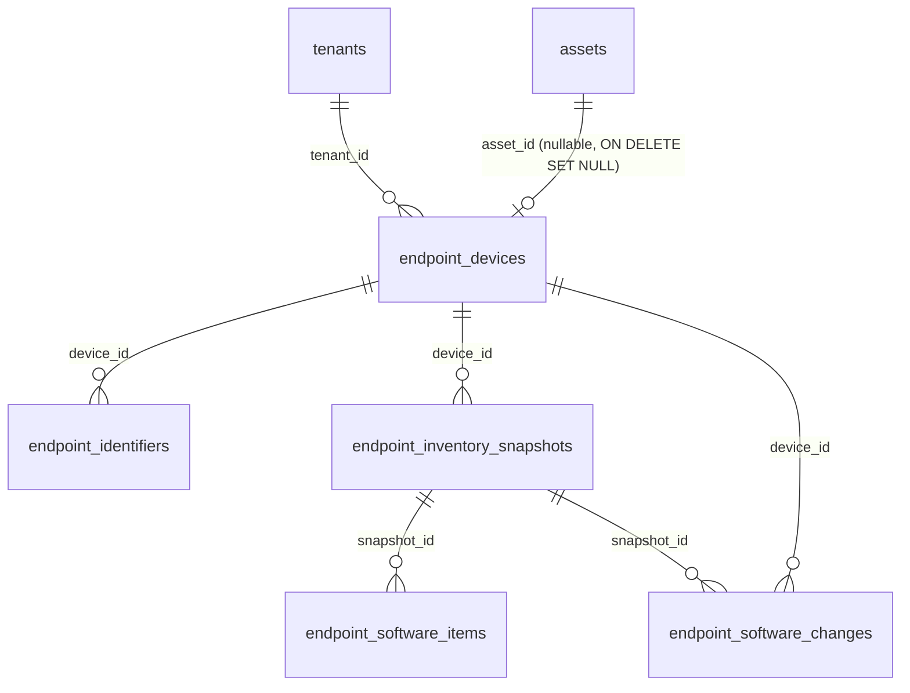
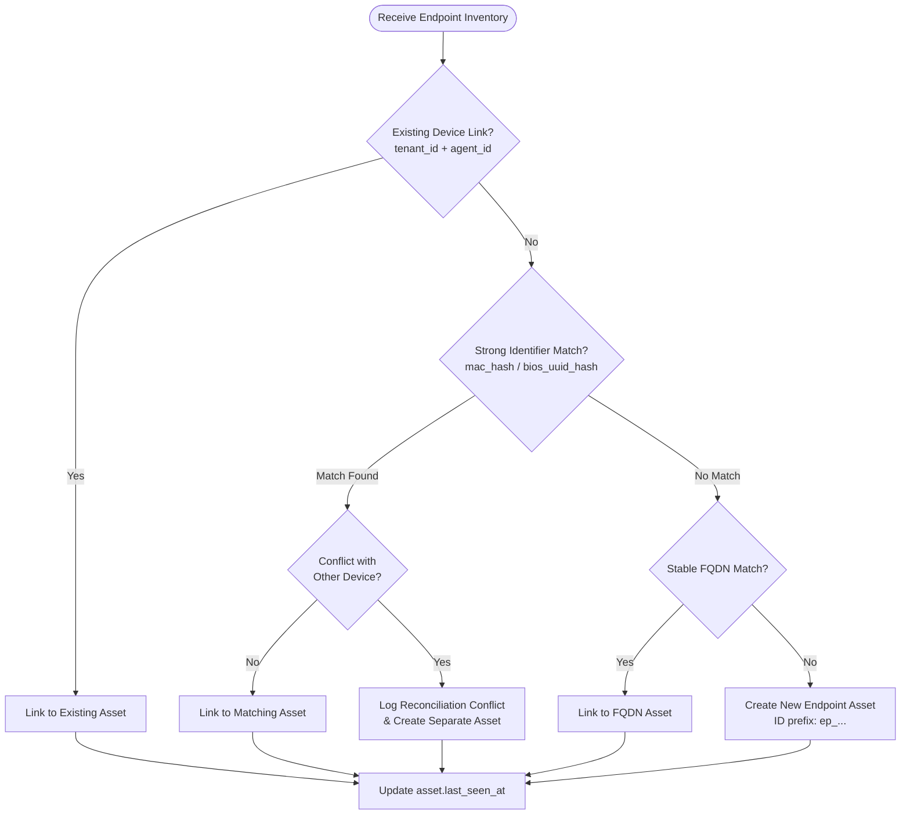

# Shapoclyack — Endpoint Inventory Integration Plan & Design Record

> Integration architecture, technical specifications, and delivery backlog for the Lariska endpoint inventory.
> For operator documentation, see [docs/README.md](docs/README.md) and [docs/operations.md](docs/operations.md).

**Current Status:** S1–S10 are **completed and merged to `main`** (Schema v1, database models + migrations `0004_endpoint_inventory` / `0006_endpoint_fk_cascade`, ingestion API with idempotency and limits, asset reconciliation, software diff/events, read APIs, asset card Web UI, NATS stream events `ingest.endpoint_inventory.{tenant_id}`, retention sweeps, server-side staleness checks, Prometheus metrics, and comprehensive E2E lifecycle test suite).

---

## Table of Contents

- [1. Goal & Platform Component Ecosystem](#1-goal--platform-component-ecosystem)
  - [1.1 Component Matrix & Dependencies (Pulse, Scanner, Lariska, API)](#11-component-matrix--dependencies-pulse-scanner-lariska-api)
  - [1.2 Sourcing and Installing the Pulse Module](#12-sourcing-and-installing-the-pulse-module)
- [2. Definition of Done](#2-definition-of-done)
- [3. Architectural Decisions](#3-architectural-decisions)
  - [3.1 Protocol Separation](#31-protocol-separation)
  - [3.2 Tenant Identity Ownership](#32-tenant-identity-ownership)
  - [3.3 HTTP Boundary](#33-http-boundary)
  - [3.4 Contract Versioning](#34-contract-versioning)
- [4. API Specifications](#4-api-specifications)
  - [4.1 Inventory Ingestion](#41-inventory-ingestion)
  - [4.2 Device & Inventory Query APIs](#42-device--inventory-query-apis)
- [5. Data Model](#5-data-model)
  - [5.1 `endpoint_devices`](#51-endpoint_devices)
  - [5.2 `endpoint_identifiers`](#52-endpoint_identifiers)
  - [5.3 `endpoint_inventory_snapshots`](#53-endpoint_inventory_snapshots)
  - [5.4 `endpoint_software_items`](#54-endpoint_software_items)
  - [5.5 `endpoint_software_changes`](#55-endpoint_software_changes)
- [6. Asset Reconciliation](#6-asset-reconciliation)
- [7. Ingestion Pipeline & Service Behavior](#7-ingestion-pipeline--service-behavior)
- [8. Validation, Normalization & Limits](#8-validation-normalization--limits)
- [9. Software Diff & Change Calculation](#9-software-diff--change-calculation)
- [10. Optional NATS Integration (Deferred)](#10-optional-nats-integration-deferred)
- [11. Web UI Integration](#11-web-ui-integration)
- [12. Security & Privacy](#12-security--privacy)
- [13. Testing Strategy](#13-testing-strategy)
- [14. Observability & Metrics](#14-observability--metrics)
- [15. Rollout & Compatibility](#15-rollout--compatibility)
- [16. Implementation Phases (S1–S10)](#16-implementation-phases-s1s10)
- [17. Architecture Decision Records (ADRs)](#17-architecture-decision-records-adrs)
- [18. Implementation Guidelines](#18-implementation-guidelines)

---

## 1. Goal & Platform Component Ecosystem

Add a secure, tenant-isolated endpoint inventory ingestion path for the **Lariska** endpoint agent without modifying, breaking, or overloading Shapoclyack's existing remote network-scanner agent protocol.

### 1.1 Component Matrix & Dependencies (Pulse, Scanner, Lariska, API)

The Shapoclyack architecture consists of cooperating subsystems with clearly separated responsibilities and boundaries:

| Component | Repository / Location | Role & Protocols | Dependencies & Sourcing |
|---|---|---|---|
| **Lariska Endpoint Agent** | External / `lariska` | In-guest endpoint inventory agent; collects OS metrics, installed packages, and hardware identity hashes. Submits snapshots via HTTPS `POST /api/v1/endpoint/inventory`. | Authenticates via provisioning key / JWT exchange at `/api/auth/agent/token`. |
| **Shapoclyack Scanner Worker** | [`agent/worker.py`](agent/worker.py) & [`scanner/`](scanner/) | Remote or local network scan worker; polls/claims scan jobs and executes network reconnaissance, service discovery, and vulnerability checks. | Pulls jobs via HTTP polling (`/api/agent/jobs/claim`) or NATS JetStream (`jobs.scan`). Uses Pulse, Nmap, Nuclei. |
| **Pulse Probe Engine** | **[onixus/GenDec](https://github.com/onixus/GenDec)** | High-performance OS fingerprinting, service banner grabbing, and CVE correlation engine. Primary default backend for the scanner pipeline (`service_probe.backend: pulse`). | Sourced from `onixus/GenDec` via [`scripts/install-pulse.sh`](scripts/install-pulse.sh). Documentation in [`docs/pulse-backend.md`](docs/pulse-backend.md). |
| **Control Plane API** | [`api/`](api/) | Central FastAPI service; manages RBAC, tenant isolation, scan scheduling, endpoint ingestion, asset reconciliation, and retention lifecycle. | Backed by PostgreSQL and optional NATS broker. |
| **Scanner Core Pipeline** | [`scanner/pipeline/`](scanner/pipeline/) | Python orchestration pipeline executing scan stages: port discovery, service probe ([`pulse_probe.py`](scanner/pipeline/pulse_probe.py), [`nse.py`](scanner/pipeline/nse.py)), TLS posture, Nuclei. | Invokes local CLI binaries (`pulse`, `nmap`, `nuclei`). |
| **Message Broker & Job Queue** | NATS JetStream | Dispatches scan jobs (`jobs.scan`, stream `JOBS`) and optional internal endpoint events (`ingest.endpoint_inventory.{tenant_id}`). | NATS server with JetStream enabled. |
| **Primary Database** | PostgreSQL | Authoritative relational store for tenants, assets, vulnerabilities, endpoint devices, software items, and change events. | Managed migrations via Alembic (`api/db/migrations/`). |
| **Web Console UI** | [`web-next/`](web-next/) | Next.js operator dashboard; provides vulnerability management, asset cards with endpoint/software panels, and system health status. | Communicates via authenticated REST APIs (`/api/*`). |

### 1.2 Sourcing and Installing the Pulse Module

The **Pulse** module is an external native binary probe engine developed in the **[GenDec repository](https://github.com/onixus/GenDec)**. It replaces or enhances Nmap NSE in Shapoclyack's scanner stage.

#### How to Obtain and Install Pulse:

1. **Pre-built Release Binary (Recommended):**
   Automated via [`scripts/install-pulse.sh`](scripts/install-pulse.sh):
   ```bash
   # Download and install specific version from onixus/GenDec GitHub Releases
   PULSE_VERSION=v1.1.0 scripts/install-pulse.sh

   # If using a private repository or authenticated token:
   GITHUB_TOKEN=ghp_... scripts/install-pulse.sh
   ```
   Target binary location defaults to `/usr/local/bin/pulse`.

2. **Building from Source (Rust / Cargo):**
   ```bash
   # Build directly from a local clone of GenDec
   PULSE_REPO=/path/to/GenDec scripts/install-pulse.sh

   # Or compile from git clone
   PULSE_FROM_SOURCE=1 scripts/install-pulse.sh
   ```

3. **Runtime Configuration:**
   Configured in [`scanner/config/default.yaml`](scanner/config/default.yaml) or environment variables:
   - `OCTO_SERVICE_BACKEND=pulse` (Default mode — fast banner, OS, and CVE probing)
   - `OCTO_SERVICE_BACKEND=hybrid` (Pulse probe followed by Nmap NSE)
   - `OCTO_SERVICE_BACKEND=nmap` (Legacy NSE fallback)
   - `OCTO_PULSE_SHADOW=1` (Shadow mode: runs both Pulse and Nmap, producing diff coverage artifact `diff_pulse_nmap.json`)

Detailed usage, benchmark timings, and profile tuning are documented in [`docs/pulse-backend.md`](docs/pulse-backend.md).

---

## 2. Definition of Done

Server integration is considered complete when:

1. **Authentication:** Lariska authenticates via the existing provisioning-key JWT exchange (`/api/auth/agent/token`).
2. **Ingestion:** Authenticated agents can submit versioned inventory snapshots (`POST /api/v1/endpoint/inventory`).
3. **Tenant Scoping:** Tenant and agent identities are derived solely from verified JWT/registration state, not request bodies.
4. **Idempotency:** Duplicate deliveries with identical digests are processed idempotently.
5. **Asset Linking:** Endpoint devices link deterministically to the core asset inventory.
6. **Queryability:** Current and historical software inventory can be queried via authenticated REST APIs.
7. **Change Tracking:** `software_installed`, `software_removed`, and `software_updated` events are automatically computed and persisted.
8. **UI Visibility:** Asset detail view displays endpoint summary, software inventory table, and change events.
9. **Operations:** Body size limits, retention pruning, RBAC, migrations, and operational metrics are implemented and documented.
10. **Backward Compatibility:** Existing scan agent workflows and APIs remain 100% backward compatible.

---

## 3. Architectural Decisions

### 3.1 Protocol Separation

Do not multiplex endpoint software inventory into scanner agent channels:
- Network scanner routes: `/api/agent/jobs/{job_id}/results`
- Network scan NATS subjects: `ingest.raw_results`, `ingest.results.{tenant}`

Endpoint inventory uses dedicated HTTP endpoints (`/api/v1/endpoint/inventory`) and an optional dedicated internal event stream.

### 3.2 Tenant Identity Ownership

The API enforces tenant boundaries via the `require_agent` dependency:
- Derive `tenant_id` exclusively from `AgentPrincipal`.
- Never trust `tenant_id` provided in request bodies.
- Verify `agent_id` against the JWT and registered agent database records.
- Reject cross-tenant access attempts immediately with `403 Forbidden`.

### 3.3 HTTP Boundary

Lariska communicates exclusively via HTTPS with the Shapoclyack API. Endpoint devices are not granted direct NATS broker credentials. Internal event streaming (if enabled) is performed by the API service post-persistence.

### 3.4 Contract Versioning

Request payloads must specify `schema_version`. Version `1` is enforced (`Literal[1]`). Unsupported schema versions are rejected with `422 Unprocessable Entity`. Golden test fixtures are maintained across repositories.

---

## 4. API Specifications

### 4.1 Inventory Ingestion

`POST /api/v1/endpoint/inventory`

- **Authentication:** Bearer Agent JWT (`Authorization: Bearer <agent_jwt>`)
- **Headers:**
  - `Content-Type: application/json`
  - `Idempotency-Key: <snapshot_id>`
  - `Content-Length: <bytes>` (Required; missing length returns `411 Length Required`)

#### Response Codes

| Status Code | Description | Condition |
|---|---|---|
| `201 Created` | Snapshot accepted | New snapshot processed and committed |
| `200 OK` | Idempotent replay | Snapshot ID already accepted with matching payload digest |
| `401 Unauthorized` | Invalid authentication | Missing, malformed, or expired JWT |
| `403 Forbidden` | Authorization error | Revoked provisioning key, disabled tenant, or agent mismatch |
| `409 Conflict` | Idempotency conflict | Re-used `snapshot_id` with a different payload digest |
| `411 Length Required` | Missing header | Request missing `Content-Length` |
| `413 Payload Too Large` | Limit exceeded | Body exceeds 15 MiB or entry count exceeded |
| `422 Unprocessable Entity` | Validation error | Schema version mismatch or malformed structure |
| `429 Too Many Requests` | Rate limited | Submissions per agent per hour limit exceeded |

#### Ingestion Response Format

```json
{
  "snapshot_id": "018f3a5b-6c7d-7e8f-9a0b-1c2d3e4f5a6b",
  "status": "accepted",
  "device_id": "dev_018f3a5b6c7d7e8f",
  "asset_id": "asset_018f3a5b6c7d7e8f",
  "software_count": 142,
  "changes": {
    "installed": 3,
    "removed": 1,
    "updated": 2
  }
}
```

### 4.2 Device & Inventory Query APIs

All query routes require authenticated user credentials with at least `viewer` role permissions. Tenant isolation is enforced at the database query layer.

- `GET /api/assets/{asset_id}/software` — Installed software items for an asset.
- `GET /api/endpoint/devices` — List endpoint devices with filtering (`device_status`, pagination).
- `GET /api/endpoint/devices/{device_id}` — Endpoint device detail.
- `GET /api/endpoint/devices/{device_id}/snapshots` — Historical snapshots for a device.
- `GET /api/endpoint/devices/{device_id}/changes` — Software change history (installed/removed/updated).

---

## 5. Data Model

Implemented in Postgres via SQLAlchemy ([api/db/models.py](api/db/models.py)) and Alembic migrations (`0004_endpoint_inventory`, `0006_endpoint_fk_cascade`).



### 5.1 `endpoint_devices`

Tracks physical/virtual endpoints reporting to the system.

| Field | Type | Constraints / Description |
|---|---|---|
| `device_id` | String | Primary Key |
| `tenant_id` | String | Foreign Key (`tenants.tenant_id`, ON DELETE CASCADE), Indexed |
| `agent_id` | String | Unique within tenant: `uq_endpoint_devices_tenant_agent (tenant_id, agent_id)` |
| `asset_id` | String | Nullable Foreign Key (`assets.asset_id`, ON DELETE SET NULL) |
| `hostname` | String | Hostname reported by agent |
| `os_family` | String | Normalized OS family (e.g. `linux`, `windows`, `darwin`) |
| `os_name` | String | Full OS distribution / release name |
| `os_version` | String | OS build / version string |
| `os_architecture` | String | System architecture (e.g. `x86_64`, `arm64`) |
| `agent_version` | String | Version of reporting Lariska agent |
| `labels` | JSONB | Structured device labels |
| `first_seen_at` | Timestamp | Initial registration timestamp |
| `last_seen_at` | Timestamp | Last contact / heartbeat timestamp |
| `last_inventory_at` | Timestamp | Timestamp of most recent accepted snapshot |
| `latest_snapshot_id` | String | Reference to latest snapshot |

### 5.2 `endpoint_identifiers`

Hardware and platform identifiers used for cross-run asset reconciliation. Raw identifiers are never stored; only one-way cryptographic hashes are persisted.

| Field | Type | Constraints / Description |
|---|---|---|
| `identifier_id` | String | Primary Key |
| `device_id` | String | Foreign Key (`endpoint_devices.device_id`, ON DELETE CASCADE) |
| `tenant_id` | String | Tenant scope |
| `identifier_type` | Enum | `mac_hash`, `serial_hash`, `bios_uuid_hash`, `tpm_ek_hash` |
| `value_hash` | String | SHA-256 hash of normalized hardware identifier |
| `first_seen_at` | Timestamp | First observed timestamp |
| `last_seen_at` | Timestamp | Last observed timestamp |

**Constraint:** `UNIQUE (tenant_id, identifier_type, value_hash)`

### 5.3 `endpoint_inventory_snapshots`

Represents an immutable snapshot of software state submitted by an endpoint.

| Field | Type | Constraints / Description |
|---|---|---|
| `snapshot_id` | String | Primary Key (Client-generated UUID) |
| `device_id` | String | Foreign Key (`endpoint_devices.device_id`, ON DELETE CASCADE) |
| `tenant_id` | String | Tenant scope |
| `schema_version` | Integer | Contract version (`1`) |
| `payload_digest` | String | Canonical SHA-256 digest of normalized payload |
| `software_count` | Integer | Total software records contained |
| `collector_warnings` | JSON / Text | Warnings reported by agent collectors |
| `collected_at` | Timestamp | Timestamp captured by agent |
| `received_at` | Timestamp | Timestamp received and stored by API |

**Constraint:** `UNIQUE (tenant_id, snapshot_id)`

### 5.4 `endpoint_software_items`

Normalized software items installed on a device at the time of a snapshot.

| Field | Type | Constraints / Description |
|---|---|---|
| `item_id` | String | Primary Key |
| `snapshot_id` | String | Foreign Key (`endpoint_inventory_snapshots.snapshot_id`, ON DELETE CASCADE) |
| `comparison_key` | String | SHA-256 of `(name + publisher + architecture + source)` |
| `name` | String | Product / package display name |
| `version` | String | Version string |
| `publisher` | String | Software vendor / publisher |
| `architecture` | String | Binary architecture |
| `source` | String | Package manager / discovery source (`deb`, `rpm`, `msi`, etc.) |
| `install_location` | String | Optional installation path |

### 5.5 `endpoint_software_changes`

Audit trail of software lifecycle events between consecutive accepted snapshots.

| Field | Type | Constraints / Description |
|---|---|---|
| `change_id` | String | Primary Key |
| `device_id` | String | Foreign Key (`endpoint_devices.device_id`, ON DELETE CASCADE) |
| `tenant_id` | String | Tenant scope |
| `snapshot_id` | String | Snapshot in which the change was observed |
| `change_type` | Enum | `software_installed`, `software_removed`, `software_updated` |
| `comparison_key` | String | Normalized software product key |
| `name` | String | Display name of software |
| `old_version` | String | Previous version (for `updated` / `removed`) |
| `new_version` | String | New version (for `installed` / `updated`) |
| `observed_at` | Timestamp | Ingestion timestamp |

---

## 6. Asset Reconciliation

Endpoint records link deterministically into Shapoclyack's unified `assets` table.



### Reconciliation Rules

1. **Rule 1 — Direct Link:** Existing `(tenant_id, agent_id)` mapping takes precedence.
2. **Rule 2 — Strong Identifier:** Match on verified `bios_uuid_hash`, `tpm_ek_hash`, or `mac_hash` within tenant boundaries.
3. **Rule 3 — Strict Collision Guard:** Never auto-merge assets based on hostname alone.
4. **Rule 4 — Provenance Preservation:** Maintain agent provenance; do not overwrite manual business metadata.
5. **Rule 5 — Conflict Containment:** In case of conflicting hardware identities, log diagnostic details and isolate records rather than silently merging.
6. **Rule 6 — Decommission Safety:** Deleting or archiving an asset sets `endpoint_devices.asset_id = NULL` without destroying inventory snapshot history.

---

## 7. Ingestion Pipeline & Service Behavior

Implemented in [api/services/endpoint_inventory.py](api/services/endpoint_inventory.py) and [api/routes/endpoint_inventory.py](api/routes/endpoint_inventory.py).

```
1. Authenticate Request
   └── Verify agent JWT via require_agent; extract tenant_id and agent_id.

2. Enforce Pre-Parse Limits
   ├── Verify Content-Length header presence (missing -> 411).
   └── Check body size <= OCTO_ENDPOINT_INVENTORY_MAX_BODY_BYTES (default 15 MiB) -> 413.

3. Validate Schema & Structure
   ├── Enforce schema_version == 1 -> 422.
   └── Check bounding limits (software items <= 5000, labels <= 32, string lengths <= 512).

4. Canonicalize & Digest
   ├── Normalize strings (strip whitespace, NFC unicode, lowercase enum values).
   └── Compute SHA-256 payload digest.

5. Idempotency Check
   ├── If snapshot_id exists with identical digest -> Return original result (200 OK).
   └── If snapshot_id exists with different digest -> Return 409 Conflict.

6. Database Transaction
   ├── Upsert endpoint_devices record (update last_seen_at, last_inventory_at).
   ├── Reconcile/link to assets table.
   ├── Upsert endpoint_identifiers.
   ├── Insert endpoint_inventory_snapshots row.
   ├── Bulk insert endpoint_software_items.
   ├── Compute diff against previous snapshot -> Insert endpoint_software_changes.
   └── Commit transaction (atomic; failure rolls back entire submission).

7. Post-Commit Actions
   ├── Emit Prometheus metrics (octo_endpoint_inventory_submissions_total, latency, counts).
   └── (Deferred S8) Publish fail-soft internal event.
```

---

## 8. Validation, Normalization & Limits

Configured in [api/settings.py](api/settings.py) and enforced in ingestion pipelines:

| Setting | Default | Description |
|---|---|---|
| `OCTO_ENDPOINT_INVENTORY_MAX_BODY_BYTES` | `15728640` (15 MiB) | Maximum uncompressed HTTP body size |
| `endpoint_inventory_max_software_items` | `5000` | Maximum software items per snapshot |
| `endpoint_inventory_max_identifiers` | `16` | Maximum hardware identifiers per device |
| `endpoint_inventory_max_labels` | `32` | Maximum metadata labels per device |
| `endpoint_inventory_max_string_length` | `512` | Maximum character length for string fields |
| `OCTO_ENDPOINT_STALE_HOURS` | `48` | Hours without inventory before device is marked stale |
| `OCTO_ENDPOINT_INVENTORY_SNAPSHOT_RETENTION_DAYS` | `90` | Retention window for full software item snapshots |
| `OCTO_ENDPOINT_INVENTORY_CHANGE_RETENTION_DAYS` | `365` | Retention window for software change audit events |
| `OCTO_ENDPOINT_RETENTION_INTERVAL_SECONDS` | `86400` (24h) | Frequency of background retention sweep |

### Normalization Rules

- **Strings:** Trim leading/trailing whitespace; normalize Unicode (NFC).
- **Comparison Keys:** Compute SHA-256 of `lowercase(name) + '\0' + lowercase(publisher) + '\0' + lowercase(arch) + '\0' + lowercase(source)`.
- **Security:** Agent-supplied strings are strictly parameterized in SQL and escaped in HTML templates.

---

## 9. Software Diff & Change Calculation

Software changes are calculated by comparing the newly submitted snapshot with the immediate previous accepted snapshot for the same `device_id`:

1. **First Snapshot Suppression:** When a device submits its initial snapshot, all items are stored without emitting `software_installed` events, avoiding noise on enrollment.
2. **Deterministic Comparison:**
   - **`software_installed`:** Comparison key present in new snapshot but absent in previous.
   - **`software_removed`:** Comparison key present in previous snapshot but absent in new.
   - **`software_updated`:** Comparison key present in both snapshots, but `version` string differs.
3. **Version Ordering:** No semantic version ordering or upgrade/downgrade inference is assumed; version transitions are recorded as `old_version -> new_version`.
4. **Idempotency Guarantee:** Changes are committed transactionally with the snapshot.

---

## 10. Optional NATS Integration (Deferred)

> [!NOTE]
> Implementation Phase S8 is deferred. Database persistence remains authoritative.

When enabled, the API publishes a lightweight summary event to NATS JetStream:

- **Subject:** `ingest.endpoint_inventory.{tenant_id}`
- **Message Deduplication ID:** Derived from `{tenant_id}:{snapshot_id}:{payload_digest}`
- **Payload Contents:** Bounded summary metadata only (tenant ID, device ID, asset ID, snapshot ID, digest, counts, timestamps).
- **Safety Rule:** Never publish credentials, JWTs, raw hardware IDs, or unbounded software lists to NATS.
- **Resilience:** NATS publication failures are fail-soft after durable database commit.

---

## 11. Web UI Integration

Delivered in [`web-next/src/app/(dashboard)/assets/view/page.tsx`](<web-next/src/app/(dashboard)/assets/view/page.tsx>) and [`web-next/src/hooks/use-endpoint-inventory.ts`](web-next/src/hooks/use-endpoint-inventory.ts):

- **Device Banner:** Displays device hostname, OS details, Lariska agent version, last inventory timestamp, and stale indicator.
- **Software Inventory Table:** Sortable and searchable table with columns for product name, version, publisher, architecture, and source.
- **Change Log:** Displays installed, removed, and updated software events since previous snapshot.
- **Security:** All agent-supplied metadata fields are rendered with strict context-aware escaping.

---

## 12. Security & Privacy

1. **Authentication & Token Lifecycle:** Leverages short-lived agent JWTs exchanged via provisioning keys. Revoked keys immediately reject subsequent submissions.
2. **Tenant Isolation:** Tenant boundary is injected into every SQL query. No cross-tenant reads or writes are possible.
3. **Hardware ID Privacy:** Raw MAC addresses, BIOS UUIDs, and serial numbers are SHA-256 hashed before persistence.
4. **Auditability:** Snapshot submissions, reconciliation changes, and configuration alterations generate structured audit log entries.
5. **Cascading Deletion:** Database foreign keys use `ON DELETE CASCADE` down the endpoint hierarchy and `ON DELETE SET NULL` on `asset_id` ([migration 0006](api/db/migrations/versions/0006_endpoint_fk_cascade.py)).

---

## 13. Testing Strategy

| Test Suite | Scope | Key Test Files |
|---|---|---|
| **Unit Tests** | Schema validation, digest computation, diff engine, normalization | [tests/test_endpoint_inventory_service.py](tests/test_endpoint_inventory_service.py) |
| **API & Auth Tests** | JWT validation, tenant isolation, rate limits, status codes | [tests/test_api_system.py](tests/test_api_system.py) |
| **Database & Migration Tests** | Constraints, indexes, foreign key cascades, migration 0004/0006 | [tests/test_endpoint_retention.py](tests/test_endpoint_retention.py) |
| **Retention Tests** | Snapshot pruning, batching, preserving current device snapshot | [tests/test_endpoint_retention.py](tests/test_endpoint_retention.py) |
| **Regression Tests** | Existing scanner agent jobs, uploads, heartbeat, and scans | [tests/test_agent_worker.py](tests/test_agent_worker.py), [tests/test_api_agents.py](tests/test_api_agents.py) |

---

## 14. Observability & Metrics

Prometheus metrics exposed in [api/services/metrics.py](api/services/metrics.py):

- `octo_endpoint_inventory_submissions_total{status="accepted|rejected|conflict"}` — Submission volume and outcomes.
- `octo_endpoint_inventory_duration_seconds` — Ingestion processing and database latency.
- `octo_endpoint_inventory_software_items` — Histogram of software item counts per snapshot.
- `octo_endpoint_devices{status="active|stale"}` — Current endpoint device counts.
- `octo_endpoint_retention_pruned_total` — Number of expired software items pruned by retention sweeps.

---

## 15. Rollout & Compatibility

1. **Feature Flag:** Rollout gated by `OCTO_ENDPOINT_INVENTORY_ENABLED` (default: `true`).
2. **Zero-Downtime Migrations:** Migrations `0004_endpoint_inventory` and `0006_endpoint_fk_cascade` are non-blocking.
3. **Backward Compatibility:** Agent API (`/api/agent/*`) and scanner worker behavior remain completely untouched.

---

## 16. Implementation Phases (S1–S10)

| Phase | Title | Scope Summary | Status |
|---|---|---|---|
| **S1** | Contract & Shared Fixtures | Architecture specification, Schema v1, golden test fixtures | **Done** |
| **S2** | Database Schema & Migrations | Models, indexes, constraints, migration `0004_endpoint_inventory` | **Done** |
| **S3** | Inventory Ingestion API | Authenticated endpoint, limits, idempotency, transactional write | **Done** |
| **S4** | Asset Reconciliation | Endpoint-to-asset matching, hardware ID hash indexing, conflict handling | **Done** |
| **S5** | Software Diff & Events | Comparison key calculation, installed/removed/updated event generator | **Done** |
| **S6** | Read APIs | Asset software & device query endpoints with tenant filters and RBAC | **Done** |
| **S7** | Web UI Integration | Asset card Endpoint/Software section, query hooks, change indicators | **Done** |
| **S8** | NATS Stream Integration | Optional event publish to `ingest.endpoint_inventory.{tenant_id}` | **Done** |
| **S9** | Retention, Ops & Metrics | Pruning sweeps, 15 MiB body cap, staleness tracking, Prometheus metrics | **Done** |
| **S10** | Cross-Repo E2E Tests | Automated cross-repository integration tests with Lariska fixtures | **Done** |

---

## 17. Architecture Decision Records (ADRs)

*Decisions formally closed on 2026-07-24:*

1. **Request Body Cap:** Enforced hard cap of 15 MiB (`OCTO_ENDPOINT_INVENTORY_MAX_BODY_BYTES = 15728640`) in [api/middleware.py](api/middleware.py) before parsing. Requests without `Content-Length` receive `411 Length Required`.
2. **Retention Policy:** 90 days for full software snapshot items (`OCTO_ENDPOINT_INVENTORY_SNAPSHOT_RETENTION_DAYS = 90`), 365 days for software change events (`OCTO_ENDPOINT_INVENTORY_CHANGE_RETENTION_DAYS = 365`). The current snapshot for an active device is never pruned.
3. **Machine Identifiers:** Strictly hashed via SHA-256 (`mac_hash`, `serial_hash`, `bios_uuid_hash`, `tpm_ek_hash`). Raw hardware values are never accepted or stored.
4. **Software Comparison Key:** SHA-256 of normalized `(name + publisher + architecture + source)`. Version is excluded from the key and tracked separately.
5. **Collector Warnings:** Stored verbatim on the snapshot as informational data (`collector_warnings: list[str]`). Warnings do not cause snapshot rejection.
6. **Compression:** Compression is not supported over HTTP. Payload bounds keep uncompressed payloads well within network budgets.
7. **Endpoint Staleness:** Server-side staleness evaluated at 48 hours (`OCTO_ENDPOINT_STALE_HOURS = 48`) via [api/services/endpoint_inventory.py](api/services/endpoint_inventory.py).
8. **Unified Asset Presence:** Endpoint-backed assets appear in all asset views with prefix `ep_...` and are queryable identically to network-scanned assets.
9. **Tenant Deletion Cascades:** Migration `0006_endpoint_fk_cascade` establishes `ON DELETE CASCADE` across all child endpoint tables and `ON DELETE SET NULL` on `asset_id`.
10. **Schema & Agent Versioning:** Schema version is strictly enforced as `Literal[1]`. Agent version remains informational metadata until a future schema v2 is defined.

---

## 18. Implementation Guidelines

When extending or maintaining endpoint inventory code:

1. **Verify Contracts First:** Inspect [api/schemas.py](api/schemas.py) and ensure any changes adhere to Schema v1.
2. **Tenant Scoping:** Never rely solely on route-level guards; always include `tenant_id` filters in core service queries.
3. **PostgreSQL Compatibility:** Validate constraint and cascade behavior on PostgreSQL.
4. **Regression Safety:** Ensure existing scanner worker unit/integration tests ([tests/test_agent_worker.py](tests/test_agent_worker.py)) continue to pass.
5. **Keep Documentation Synchronized:** When modifying configuration keys or behavior, update [docs/configuration.md](docs/configuration.md) and [docs/operations.md](docs/operations.md).
