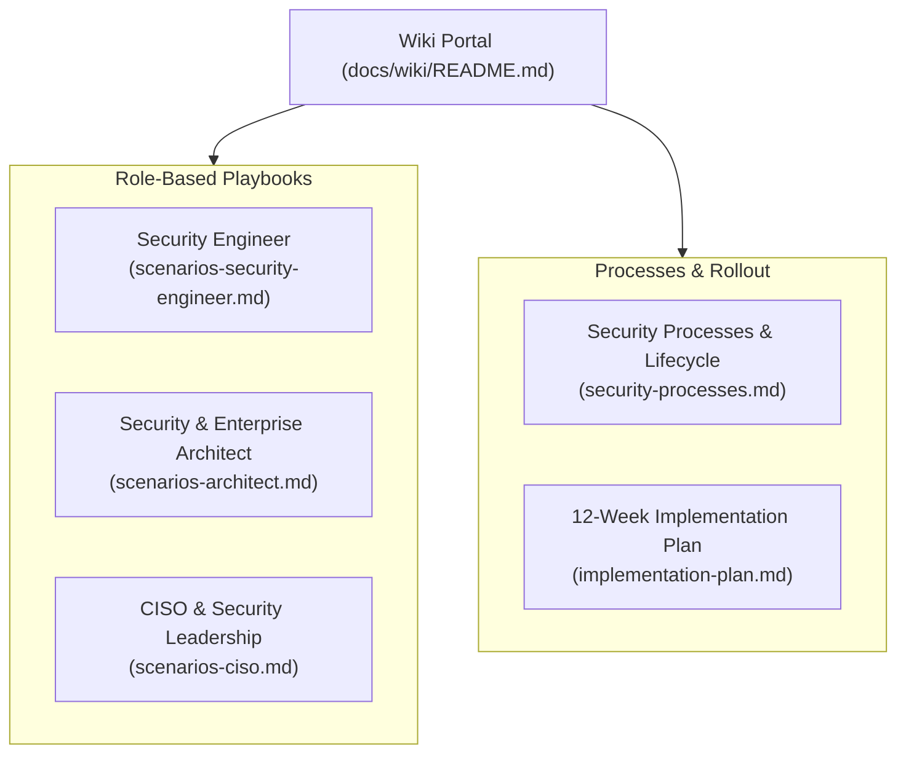
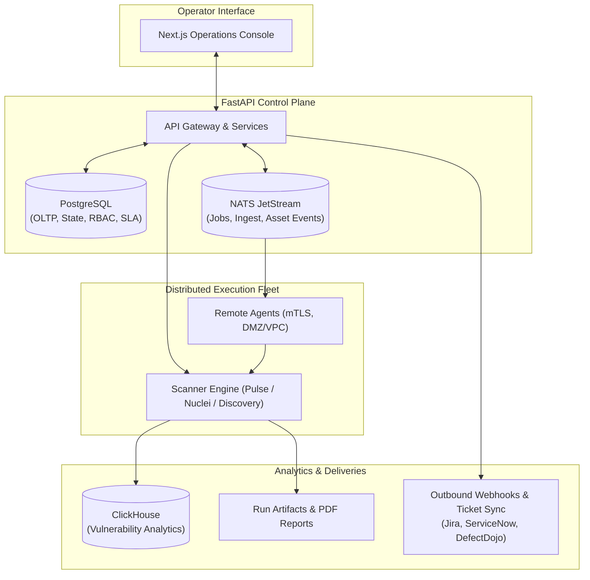

# Shapoclyack

**Self-hosted External Attack Surface Discovery & Risk-Based Vulnerability Management Platform (EASM · CAASM · RBVM).**

[](https://github.com/onixus/Shapoclyack/releases/latest)
[](https://github.com/onixus/Shapoclyack/blob/main/requirements.txt)
[](k8s/README.md)
[](https://github.com/onixus?tab=packages&repo_name=Shapoclyack)
[](LICENSE)
[](docs/wiki/README.md)

Shapoclyack bridges the gap between raw network reconnaissance, asset inventory, and verifiable risk reduction. It unifies staged network discovery, distributed remote agents, an asset-centric data model that survives IP/DHCP drift, distribution-accurate endpoint patch gap analysis, dual-axis risk scoring under NIST SP 800-30 Rev. 1, and mechanical re-verification of remediated flaws — deployed as a Kubernetes application or a single all-in-one container.

**[Русская версия](README.ru.md)** · [Enterprise Wiki (База знаний)](docs/wiki/README.md) 🇷🇺 · [Getting Started](docs/getting-started.md) · [Architecture](docs/architecture.md) · [Web UI Guide](docs/ui.md) · [Documentation Index](docs/README.md) · [Kubernetes](k8s/README.md) · [Changelog](CHANGELOG.md) · [Roadmap](ROADMAP.md) · [Security Policy](.github/SECURITY.md)

> [!WARNING]
> **Scanning touches live external systems.** Operate Shapoclyack only against networks and infrastructure you own or are explicitly authorized to assess. A fresh installation deliberately executes no scans until an administrator reviews and approves an authorized scanning scope for the tenant.

---

## The Problem Shapoclyack Solves

Traditional vulnerability scanners and legacy vulnerability management tools suffer from fundamental structural failures in modern environments:

1. **Unusable Scanner Noise & Theoretical Severity**: Blind CVSS 10.0 rankings flag thousands of theoretical vulnerabilities without exploit code or exposure context, causing alert fatigue and laundering inaction as triage.
2. **Ephemeral Identity & IP Drift**: Cloud environments, Kubernetes ingresses, and DHCP lease rotations constantly shift IP addresses. Traditional scanners lose tracking history, duplicate assets, and reopen closed tickets whenever an IP changes.
3. **Rubber-Stamping & Unverified Closures**: Security tickets are routinely marked "resolved" in Jira or ServiceNow based on human assertion or passive absence of detection, without mechanical proof that the fix actually worked.
4. **Distro Package Backport False Positives**: Upstream CPE version matching against NVD flags thousands of phantom CVEs on long-term support distributions (Debian, Ubuntu, RHEL), because vendor security backports do not increment upstream version numbers.
5. **Disconnected Compliance Evidence**: Compliance audits (PCI DSS, CIS Controls, ISO 27001) require manual spreadsheets and subjective questionnaires instead of continuous, defensible evidence tied directly to technical observations.

**Shapoclyack replaces scanner noise with mechanical proof, verifiable remediation workflows, distro-aware patch gaps, and defensible risk decisions.**

---

## Core Architectural Differentiators

### 1. Asset-Centric Identity (Defeating IP & DHCP Drift)
Network IP addresses are ephemeral attributes in cloud and dynamic DHCP infrastructures. Shapoclyack anchors all observations, vulnerability lifecycles, SLAs, and ownership context to persistent **Asset** records (`asset_id`), correlated via cryptographic identities, FQDNs, and TLS certificate hashes. When a host reboots with a new DHCP lease or rotates an IP behind a load balancer, its remediation history, open tickets, and accepted exceptions remain intact without creating ghost assets or resurrected findings.  
*See [Asset Identity](docs/asset-identity.md) and [Asset Business Context](docs/asset-context.md).*

### 2. Dual-Axis Risk Scoring (NIST SP 800-30 Rev. 1)
Shapoclyack rejects one-dimensional CVSS sorting. Risk is evaluated strictly as a two-dimensional matrix:

$$\text{Risk} = f(\text{Likelihood}, \text{Impact})$$

transcribed verbatim from **NIST SP 800-30 Rev. 1 Table I-2**:
* **Likelihood Ceilings & Floors**: Computed from CVSS vector reachability (`AV`/`AC`), 30-day exploitation probability (EPSS), network exposure, and compensating controls (WAF/CDN). Crucially, Likelihood is bounded by **Exploit Maturity**:
  - `attacked` (CISA KEV — active exploitation in the wild): hard floor of **96–100**;
  - `weaponized` (reusable exploit in Metasploit/frameworks): floor of **80–100**;
  - `proof_of_concept` (public code available): **40–95**;
  - `theoretical` (no public exploit found): **strict ceiling of 20**, preventing panic over non-weaponized CVEs.
* **Impact**: Grounded in business asset criticality (levels 0–4) assigned by system owners or imported from CMDB.  
*See [Risk Scoring](docs/risk-scoring.md).*

### 3. Mechanical Re-Verification (No Rubber-Stamping)
A vulnerability cannot be marked resolved on an operator's say-so or a closed task tracker ticket. 
* **Network Findings**: Moving a finding from `FIXING` to `CLOSED` requires triggering a targeted re-scan (`POST /api/vulnerabilities/{id}/verify`). The engine dispatches a focused check against that exact host, port, and detection script. Only if the vulnerability is mechanically proven gone does it close with `machine_verified = true` (`closure_reason = verified_remediated`). If the flaw is re-observed, it bounces back to `FIXING` with an audit event.
* **Endpoint Software Findings**: Closed only when the next accepted inventory snapshot from an endpoint agent confirms the vulnerable package has been upgraded to a non-vulnerable version.
* **Audit Transparency**: Manual closures by administrators are explicitly marked with `machine_verified = false`, exposing unverified closures on adoption dashboards.  
*See [Vulnerability Lifecycle & SLA](docs/vulnerability-lifecycle.md).*

### 4. Distro-Aware Vendor Advisory Matching (Zero Upstream False Positives)
Debian, Ubuntu, and enterprise Linux distributions backport security fixes into stable package versions without updating the upstream version number (e.g., OpenSSL `1.1.1f-1ubuntu2.16` on Ubuntu 20.04 retains `1.1.1f`). Naive NVD CPE matching marks every host permanently vulnerable to every historical CVE.  
Shapoclyack matches installed packages against **official vendor security trackers** (Ubuntu USN, Debian Security Tracker) using native distribution Epoch-Version-Release (EVR) logic. It aggregates vulnerabilities into **Patch Gaps** providing copy-paste remediation commands (`apt-get install --only-upgrade <pkg>=<version>`), saving hundreds of hours of manual triage.  
*See [Software → CVE Matching](docs/software-cve-matching.md).*

### 5. Auditor-Ready Compliance Signals (PCI DSS 4.0, CIS v8, ISO 27001)
Technical findings and estate metadata are evaluated against a closed vocabulary of compliance signals (`unpatched_cve`, `overdue_remediation`, `known_exploited`, `exposed_admin_service`, `weak_cryptography`, `unowned_asset`, etc.). Controls use multi-signal conjunctions (e.g., administrative service *and* external network exposure) to eliminate bogus failures, providing auditor-defensible control evaluations for:
* **PCI DSS 4.0** (Controls 1.2.1, 6.3.3, 11.3.1, 11.3.2, etc.)
* **CIS Critical Security Controls v8** (Controls 4.1, 4.6, 7.1, 7.4, etc.)
* **ISO/IEC 27001:2022** (Controls A.8.8, A.8.19, A.8.20, etc.)  
*See [Reports and Compliance Mapping](docs/reports-and-compliance.md).*

### 6. Distributed Remote Agents (NATS JetStream & Zero Inbound Ports)
Scan segmented VPCs, private clouds, and DMZ enclaves without exposing internal networks. Remote scanner agents pull tenant-scoped jobs over **NATS JetStream** with mTLS encryption. Agents require **zero inbound listening ports**, communicate entirely outbound, and feature heartbeat leases, distributed claim serialization (`SELECT ... FOR UPDATE SKIP LOCKED`), and automatic orphan recovery.  
*See [Architecture](docs/architecture.md).*

### 7. Branded Multi-Tenant Report Factory
Generate polished, executive-ready artifacts delivered automatically via cron schedules or on-demand:
* **Executive Summaries**: Estate risk posture, NIST SP 800-30 breakdown, CISA KEV exposure, SLA adherence.
* **Technical Remediation Registers**: Comprehensive finding details, evidence strings, package patch gaps, and verification logs.
* **Compliance Auditor Packages**: Control status, evidence matrices, and asset gap analysis in PDF, HTML, or JSON.
* Supports tenant-specific white-labeling (logos, custom themes, confidentiality notices).  
*See [Reports and Compliance Mapping](docs/reports-and-compliance.md).*

### 8. Adoption & Noise Metrics (Proving Outcomes)
Built-in `/adoption` telemetry tracks whether the security program is reducing real exposure:
* **Outcome KPIs**: Percentage of closures verified by automated re-scans, Mean Time to Remediation (MTTR), and SLA compliance rates by severity.
* **Coverage Metrics**: Scanned asset share, vulnerability-assessed percentage, and inventory coverage.
* **Noise Reduction**: Tracking suppressed false positives, active exception policies, and identifying top noisy detection scripts.  
*See [Web Interface](docs/ui.md).*

---

## 🧭 Enterprise Knowledge Base (Wiki) & Role Guides

A comprehensive Enterprise Knowledge Base is available under [`docs/wiki/`](docs/wiki/README.md) (in Russian), providing role-specific playbooks, formal security processes, and a 12-week deployment roadmap:



| Resource | Target Audience & Scope |
|---|---|
| [**Wiki Portal & Architecture Principles**](docs/wiki/README.md) | Central entry point: concepts, asset-centric paradigm, NIST SP 800-30, mechanical verification |
| [**Security Engineer Playbook**](docs/wiki/scenarios-security-engineer.md) | Daily operations: scan profiling, finding triage, remediation kanban, mechanical re-verification, patch gaps, noise reduction |
| [**Architect Playbook**](docs/wiki/scenarios-architect.md) | Perimeter mapping, Shadow IT discovery, CMDB/Active Directory integration, remote agents in DMZ/VPC, CI/CD DevSecOps, compliance controls |
| [**CISO & Executive Guide**](docs/wiki/scenarios-ciso.md) | Strategic governance: Risk Overview dashboard, estate risk score, CISA KEV tracking, SLA & MTTR metrics, adoption KPIs, board reporting |
| [**Formal Security Processes**](docs/wiki/security-processes.md) | End-to-end VM lifecycle, continuous EASM, 0-day emergency response (KEV), and IT/DevOps SLA collaboration with 2-way ticket sync |
| [**12-Week Implementation Roadmap**](docs/wiki/implementation-plan.md) | 4-phase rollout (Pilot → Production Scale), deployment topologies, RACI responsibility matrix, and measurable KPIs |

---

## System Architecture & Pipeline

Shapoclyack separates the control plane, distributed scan execution, analytical storage, and the operator console:



The core scanner execution pipeline follows a deterministic, staged workflow:

```text
targets → resolve → discovery → hostnames → ports → NSE/Nuclei → enrich → report
```

1. **Targets**: Ingest CIDRs, IP lists, domain names, or cloud organization profiles.
2. **Resolve**: Rapid parallel DNS resolution and target sanitization against authorized scopes.
3. **Discovery**: Active ICMP/ARP/TCP discovery, passive Certificate Transparency (CT) log querying, and ASN enumeration.
4. **Hostnames**: Reverse DNS lookup, TLS certificate Subject Alternative Name (SAN) extraction.
5. **Ports & Services**: High-speed TCP/UDP probing and service fingerprinting via the built-in Pulse backend.
6. **Vulnerability Checks**: Targeted Nuclei templates and safe NSE scripts.
7. **Enrich**: Enrichment overlays with CVSS v4, EPSS, CISA KEV, GeoIP, ASN, and TLS posture.
8. **Report & Ingest**: Generation of run artifacts, ClickHouse time-series ingest, and diff generation against prior states.

---

## Platform Capabilities

| Domain | What Shapoclyack Delivers |
|---|---|
| **External Attack Surface (EASM)** | CIDR, IP, and FQDN discovery; passive Certificate Transparency (CT) monitoring, DNS hygiene, ASN mapping, cloud-resource enumeration, and domain takeover detection. |
| **Cyber Asset Management (CAASM)** | Persistent asset inventory keyed to canonical assets; tracks IP drift, ownership metadata, environment tags, business criticality, and hardware/OS lifecycle. |
| **Risk-Based VM (RBVM)** | Full lifecycle state machine (`OPEN` → `FIXING` → `VERIFYING` → `CLOSED`); SLA timers by severity; NIST SP 800-30 Rev. 1 risk scoring with exploit maturity ceilings. |
| **Mechanical Verification** | Automated re-scans via `POST /api/vulnerabilities/{id}/verify` validate that network flaws are remediated before closing. Prevents unverified ticket closures. |
| **Endpoint Patch Gaps** | Endpoint software matched against distribution vendor advisories (Ubuntu USN, Debian Security Tracker); generates actionable package upgrade commands. |
| **Threat Intelligence** | Integrated feeds for CISA KEV (Known Exploited Vulnerabilities), EPSS (Exploit Prediction Scoring System), CVSS v4/v3.1, GeoIP, and autonomous system data. |
| **Compliance Signals** | Continuous posture monitoring and audit-ready evidence for **PCI DSS 4.0**, **CIS Controls v8**, and **ISO/IEC 27001:2022**. |
| **Adoption & Outcome Metrics** | Telemetry on verified closures, SLA compliance, Mean Time to Remediation (MTTR), scan coverage, and false-positive suppression rates. |
| **Branded Report Factory** | Automated generation of Executive, Technical, and Compliance reports in PDF, HTML, and JSON, with scheduled email and webhook delivery. |
| **Distributed Fleet** | Scalable worker fleet managed over NATS JetStream; agents require zero inbound ports and operate securely across DMZs and private VPCs. |
| **Enterprise Platform** | Multi-tenancy with strict data isolation, role-based access control (RBAC), OIDC single sign-on, non-interactive service tokens, PostgreSQL OLTP, and ClickHouse analytics. |

---

## Quick Start

### Local Evaluation with Kubernetes (kind)

Requirements: Docker, [kind](https://kind.sigs.k8s.io/), and `kubectl`, with at least 4 GB of free memory.

```bash
git clone https://github.com/onixus/Shapoclyack.git
cd Shapoclyack

scripts/dev-up.sh
```

The script initializes a local `kind` cluster, builds the all-in-one image, loads it into the cluster, and applies the `k8s/shapoclyack/overlays/kind-dev` overlay (FastAPI control plane, Next.js console, PostgreSQL, NATS, ClickHouse, and scanner Job/CronJob).

Open your browser at **<http://127.0.0.1:8080>** and authenticate:

```text
Username: operator
Password: operator-change-me
```

> [!NOTE]
> Always access via `127.0.0.1` rather than `localhost`: `kind` binds NodePorts to IPv4 only, and on macOS `localhost` resolves to IPv6 `::1` first, which will be refused.

A fresh installation scans nothing until an administrator approves a scanning scope for the tenant. Follow [Step 6 of Getting Started](docs/getting-started.md#6-approve-a-scanning-scope) to configure your targets.

To stop and remove the local cluster:

```bash
scripts/dev-down.sh
```

For complete target configuration, scan profiling, and production hardening, see the [Getting Started Guide](docs/getting-started.md).

---

## Web Interface Overview

The Next.js operations console provides specialized operational surfaces for operators, analysts, and leadership:

| Surface | URL Route | Core Functionality | Minimum Role |
|---|---|---|---|
| **Risk Overview** | `/` | Estate risk index (NIST SP 800-30), SLA health, active CISA KEV threats, unassigned findings | Viewer |
| **Vulnerability Center** | `/vulnerabilities` | Searchable finding inventory, lifecycle filters, ownership, SLA countdown, and export | Viewer |
| **Finding Detail** | `/vulnerabilities/view` | Technical evidence, exploit maturity, ticket links, risk acceptance, mechanical verify button | Operator |
| **Remediation Kanban** | `/remediation` | Visual lifecycle board (`OPEN` → `TRIAGED` → `FIXING` → `VERIFYING` → `CLOSED`) | Operator |
| **Asset Inventory** | `/assets` | Persistent asset registry, business context, criticality, IP drift history, open risk count | Viewer |
| **Endpoint Software** | `/endpoints` | Managed devices, installed software packages, distro CVE matches, and patch gap commands | Viewer |
| **Attack Surface Graph** | `/attack-surface` | Interactive domain → host → IP → port → service topology visualization | Viewer |
| **Threat Center** | `/threats` | Real-time overview of actively exploited vulnerabilities in your estate (CISA KEV) | Viewer |
| **Scan Operations** | `/scans` | External and internal scan launchers, scheduled profiles, active jobs, and execution logs | Operator |
| **Report Factory** | `/reports` | Branded report generation (Executive, Technical, Compliance) in PDF/HTML and schedule management | Operator |
| **Compliance Posture** | `/compliance` | Control pass/fail evidence mapping for PCI DSS 4.0, CIS Controls v8, and ISO 27001 | Viewer |
| **Adoption & Noise** | `/adoption` | Verification rates, MTTR, SLA adherence, scanner noise analytics, detector suppression tracking | Viewer |
| **Integrations** | `/integrations` | Outbound HMAC webhooks and two-way ticket synchronization (Jira, ServiceNow, DefectDojo) | Operator |
| **Agent Fleet** | `/agents` | Health tiles and management for distributed remote scanner workers across VPCs and DMZs | Operator |

For UI screenshots and walkthroughs, see [Web Interface Documentation](docs/ui.md).

---

## Deployment Options

| Deployment Mode | Recommended For | Architecture & Dependencies |
|---|---|---|
| **All-in-One Local (`kind-dev`)** | Local evaluation, testing, CI | Single pod or container with embedded API, Web UI, and scanner engine; includes PostgreSQL, NATS, and ClickHouse. |
| **Production Kubernetes (`overlays/prod`)** | Enterprise production deployments | Scaled FastAPI replicas, persistent PostgreSQL cluster, clustered NATS JetStream, ClickHouse analytics, and ingress controllers. |
| **Distributed Remote Agents** | Segmented networks, DMZs, multi-VPC, multi-cloud | Outbound-only agent workers polling NATS JetStream via mTLS; zero inbound open ports required on agents. |
| **Standalone Scanner CLI** | Ad-hoc audits, single-shot scans, pipeline automation | Headless container execution outputting structured JSON, CSV, and PDF artifacts directly to local disk. |

Detailed guides:
* [Kubernetes Deployment Guide](k8s/README.md)
* [System Architecture Specification](docs/architecture.md)
* [Configuration & Scanning Profiles](docs/configuration.md)
* [Operations, Backups & Data Retention](docs/operations.md)

---

## API, RBAC & Integrations

The FastAPI control plane exposes a REST API rooted at `/api`. Interactive OpenAPI documentation is served at `/docs` only where `OCTO_API_DOCS=enabled` — the default for `OCTO_ENV=dev`, and off in production, where the schema would be a map of the installation for anyone who can reach it.

### Role-Based Access Control (RBAC)
Every request is scoped to a verified tenant context using JWT bearer tokens:
* `viewer`: Read-only access to assets, vulnerabilities, scans, reports, compliance, and metrics.
* `operator`: Viewer privileges plus launching scans, managing remediation kanban, triggering mechanical verification, and updating asset context.
* `admin`: Operator privileges plus managing tenants, approving scan scopes, configuring SSO/OIDC, issuing service tokens, and accepting risk.

### Enterprise Integrations
* **Two-Way Ticket Synchronization**: Seamlessly bi-directionally sync findings with Jira, ServiceNow, and DefectDojo. Resolving a ticket triggers mechanical re-verification.
* **Asset Event Webhooks**: Subscribed endpoints receive signed HMAC payloads for events (`new_asset`, `new_open_port`, `new_cve`, `cert_expiring`, `decommissioned_host`) over a durable JetStream fan-out queue.

See [API and RBAC Documentation](docs/api-and-rbac.md) for endpoint details and token authentication.

---

## Repository Layout

```text
├── scanner/               # Staged discovery, scanning, enrichment, diff, and reporting engine
├── api/                   # FastAPI control plane: auth, RBAC, inventory, jobs, SLA, and lifecycle
├── agent/                 # Remote worker daemon claiming jobs over NATS JetStream
├── web-next/              # Next.js 14 operations console (static export served by API)
├── recon/                 # High-performance Go discovery worker foundation
├── k8s/shapoclyack/       # Kubernetes manifests, Kustomize base, and environment overlays
├── bench/                 # Benchmark harnesses for discovery and scanner performance
├── tests/                 # Unit, integration, end-to-end, and scale test suites
└── docs/                  # Technical documentation, architecture specs, and Enterprise Wiki
```

---

## Development & Testing

### Python Backend & Scanner
```bash
# Run unit and integration tests
python -m pytest

# Run linter and formatting checks
ruff check .
```

### Next.js Operations Console
The frontend requires Node.js 26 or newer:
```bash
cd web-next
npm ci
npm run typecheck
npm run test
npm run build
```

See the [Development Guide](docs/development.md) for full setup instructions and contribution checklists.

---

## Documentation Directory

| Topic | Guide |
|---|---|
| **Getting Started** | [Local deployment, target setup, first scan](docs/getting-started.md) |
| **Enterprise Wiki 🇷🇺** | [Role playbooks, security processes, 12-week rollout plan](docs/wiki/README.md) |
| **Architecture** | [Component design, trust boundaries, NATS JetStream, ClickHouse](docs/architecture.md) |
| **Risk Scoring** | [NIST SP 800-30 model, exploit maturity ceilings, asset criticality](docs/risk-scoring.md) |
| **Vulnerability Lifecycle** | [State machine, SLA policies, mechanical verification](docs/vulnerability-lifecycle.md) |
| **Software CVE Matching** | [Distro vendor advisory matching, EVR comparison, patch gaps](docs/software-cve-matching.md) |
| **Reports & Compliance** | [Report factory, PCI DSS 4.0, CIS v8, and ISO 27001 mapping](docs/reports-and-compliance.md) |
| **Asset Identity & Context** | [Identity correlation across IP drift, CMDB business context](docs/asset-identity.md) · [Context](docs/asset-context.md) |
| **Web Interface** | [Full route directory, workflow guides, screenshot catalog](docs/ui.md) |
| **Configuration** | [Scan profiles, rate limits, enrichment sources, safe overrides](docs/configuration.md) |
| **Kubernetes** | [Kustomize production deployment, overlays, secrets](k8s/README.md) |
| **Operations** | [Backups, disaster recovery, retention rules, Prometheus SLOs](docs/operations.md) |
| **Troubleshooting** | [Diagnostics, database migrations, scanner debugging](docs/troubleshooting.md) |

---

## Releases & Container Images

Documented release: [`shapoclyack-0.44-0907`](https://github.com/onixus/Shapoclyack/releases/tag/shapoclyack-0.44-0907).

| Image | Description |
|---|---|
| `ghcr.io/onixus/shapoclyack-aio` | All-in-one container: FastAPI, Web UI, and Scanner engine |
| `ghcr.io/onixus/shapoclyack-api` | Control plane container: FastAPI backend and Web UI console |
| `ghcr.io/onixus/shapoclyack-scanner` | Worker container: Scanner engine and remote agent runtime |

Pin explicit release tags in production. Do not use `latest` in mission-critical environments.

---

## Security & Licensing Notes

* **Security Policy**: For vulnerability disclosure guidelines and supported versions, consult [`.github/SECURITY.md`](.github/SECURITY.md).
* **Third-Party Components**: For third-party software licenses and redistribution terms, consult [`docs/third-party.md`](docs/third-party.md).
* **License**: Shapoclyack is licensed under the [Apache License, Version 2.0](LICENSE).
* **Nmap Redistribution Note**: The default container images (`INSTALL_NMAP=0`) ship with **Pulse** as the default port probing backend and contain no Nmap binaries or NSE data, ensuring clean licensing compliance. If legacy NSE scripts are specifically required, use the separate `-nmap` image tag (`INSTALL_NMAP=1`) or supply your own Nmap binary in compliance with the Nmap Public Source License (NPSL).
