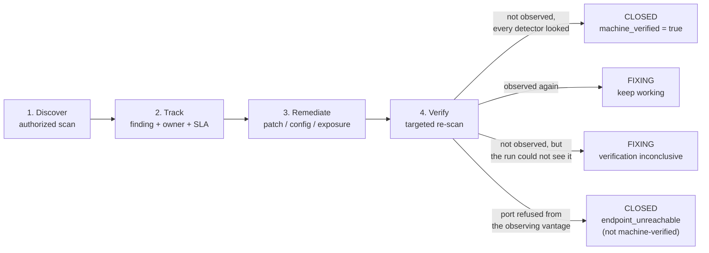
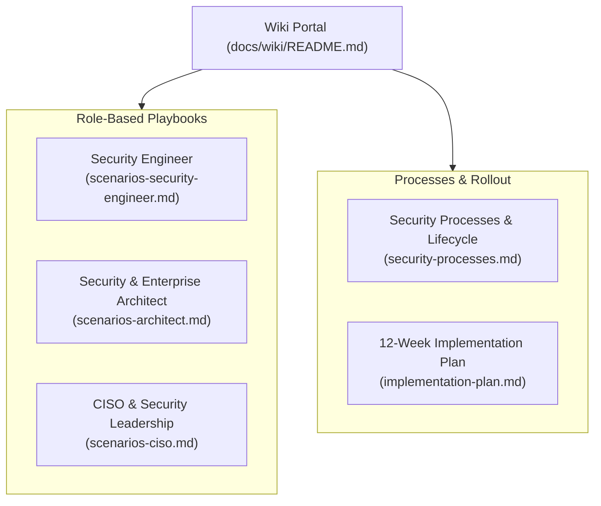
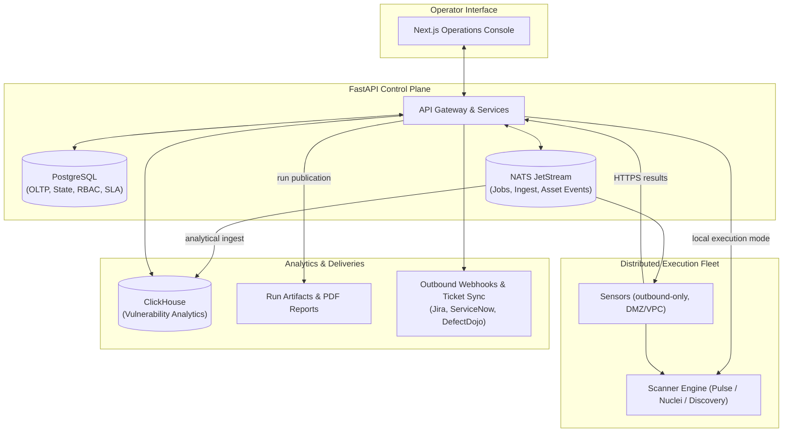

# Shapoclyack

**Self-hosted External Attack Surface Discovery & Risk-Based Vulnerability Management Platform (EASM · CAASM · RBVM).**

[](https://github.com/onixus/Shapoclyack/releases/latest)
[](https://github.com/onixus/Shapoclyack/blob/main/requirements.txt)
[](k8s/README.md)
[](https://github.com/onixus?tab=packages&repo_name=Shapoclyack)
[](LICENSE)

Shapoclyack turns external discovery into a verifiable remediation workflow. It keeps vulnerability history attached to persistent assets instead of transient IP addresses, understands distribution security backports, makes scanning scope explicit and fail-closed, and can mechanically re-check whether a remediation actually worked.

**[Getting Started](docs/getting-started.md)** · **[Closed-loop Demo](docs/demo-remediation-loop.md)** · **[Architecture](docs/architecture.md)** · **[Web UI](docs/ui.md)** · **[Documentation](docs/README.md)** · **[Русская версия](README.ru.md)** · **[Changelog](CHANGELOG.md)** · **[Roadmap](ROADMAP.md)**

> Documentation describes `main`, including changes after the latest published
> release `shapoclyack-0.46-0922` (checked 2026-10-06). See
> [version scope](docs/README.md#version-scope) and `Unreleased` in the changelog
> before applying these instructions to a release installation.

## Closed-loop remediation at a glance


```mermaid
flowchart LR
    A["1. Discover<br/>authorized scan"] --> B["2. Track<br/>finding + owner + SLA"]
    B --> C["3. Remediate<br/>patch / config / exposure"]
    C --> D["4. Verify<br/>targeted re-scan"]
    D -->|not observed,<br/>every detector looked| E["CLOSED<br/>machine_verified = true"]
    D -->|observed again| F["FIXING<br/>keep working"]
    D -->|not observed, but<br/>the run could not see it| G["FIXING<br/>verification inconclusive"]
    D -->|port refused from<br/>the observing vantage| H["CLOSED<br/>endpoint_unreachable<br/>(not machine-verified)"]
```

Shapoclyack does not treat a closed ticket as proof that a network finding is gone. The verification step re-tests the observation that created the finding — with the detectors that found it — and closes it as verified only when the run shows each of them looked again. A run that could not have seen it (nuclei missing, a template not loaded, an older Pulse ruleset) is **inconclusive**, not a fix. **[Run the end-to-end demo →](docs/demo-remediation-loop.md)**

## Why Shapoclyack

- **Asset-centric identity** — findings and remediation history survive DHCP/IP drift.
- **Evidence over ticket state** — network findings can be closed through targeted re-verification, not only operator assertion.
- **Vendor-aware patch gaps** — Ubuntu and Debian package backports are evaluated with distribution-native version logic.
- **Risk with context** — likelihood and impact are kept as separate axes rather than collapsed into a single CVSS queue.
- **Distributed scanning** — remote sensors can claim tenant-scoped work outbound, without exposing inbound scanner ports.

## Quick start

For a server installation **without building on the server**, use the
[standalone installer](docs/server-install.ru.md):
`sudo python3 scripts/install-server.py install --url https://scan.example.com`.
It requires Docker Compose, Python 3 and an HTTPS reverse proxy.

For a local evaluation cluster:

```bash
git clone https://github.com/onixus/Shapoclyack.git
cd Shapoclyack
scripts/dev-up.sh
curl --fail --cacert .dev-tls/ca.crt https://127.0.0.1:8080/api/health
```

Trust the generated `.dev-tls/ca.crt` in your browser, then open **https://127.0.0.1:8080**. The local `kind` setup, demo accounts, approved-scope workflow and first scan are documented step by step in [Getting Started](docs/getting-started.md).

**See the differentiator end to end:** [run the closed-loop remediation demo](docs/demo-remediation-loop.md) to take a real network finding through remediation, targeted re-scan, and either `machine_verified = true` or a return to `FIXING`.

> [!WARNING]
> **Scanning touches live external systems.** Operate Shapoclyack only against networks and infrastructure you own or are explicitly authorized to assess. A fresh installation deliberately executes no scans until an administrator reviews and approves an authorized scanning scope for the tenant.

---

## The Problem Shapoclyack Solves

Traditional vulnerability scanners and legacy vulnerability management tools suffer from fundamental structural failures in modern environments:

1. **Unusable Scanner Noise & Theoretical Severity**: Blind CVSS 10.0 rankings flag thousands of theoretical vulnerabilities without exploit code or exposure context, causing alert fatigue and laundering inaction as triage.
2. **Ephemeral Identity & IP Drift**: Cloud environments, Kubernetes ingresses, and DHCP lease rotations constantly shift IP addresses. Traditional scanners lose tracking history, duplicate assets, and reopen closed tickets whenever an IP changes.
3. **Rubber-Stamping & Unverified Closures**: Security tickets are routinely marked "resolved" in Jira or ServiceNow based on human assertion or passive absence of detection, without mechanical proof that the fix actually worked.
4. **Distro Package Backport False Positives**: Upstream CPE version matching against NVD flags thousands of phantom CVEs on long-term support distributions (Debian, Ubuntu, RHEL), because vendor security backports do not increment upstream version numbers.
5. **Disconnected Compliance Evidence**: Compliance audits (PCI DSS, CIS Controls, ISO 27001, FSTEC orders, GOST R 57580.1) require manual spreadsheets and subjective questionnaires instead of continuous, defensible evidence tied directly to technical observations.

**Shapoclyack replaces scanner noise with mechanical proof, verifiable remediation workflows, distro-aware patch gaps, and defensible risk decisions.**

---

## Core Architectural Differentiators

### 1. Asset-Centric Identity (Defeating IP & DHCP Drift)
Network IP addresses are ephemeral attributes in cloud and dynamic DHCP infrastructures. Shapoclyack attaches observations, vulnerability lifecycles, SLAs, and ownership context to persistent **Asset** records (`asset_id`). Identifiers on one host record share an asset; separate IP and FQDN records merge only when forward DNS and the certificate on that IP corroborate a unique pair. Shared hosting is kept separate. History follows the retained asset and its known identifiers; an address change without corroborating identity is not automatically linked.
*See [Asset Identity](docs/asset-identity.md) and [Asset Business Context](docs/asset-context.md).*

### 2. Dual-Axis Risk Scoring (NIST SP 800-30 Rev. 1)
Shapoclyack rejects one-dimensional CVSS sorting. Risk is evaluated strictly as a two-dimensional matrix:

$$\text{Risk} = f(\text{Likelihood}, \text{Impact})$$

transcribed verbatim from **NIST SP 800-30 Rev. 1 Table I-2**:
* **Likelihood Ceilings & Floors**: Computed from CVSS vector reachability (`AV`/`AC`), 30-day exploitation probability (EPSS), network exposure, and compensating controls (WAF/CDN). Crucially, Likelihood is bounded by **Exploit Maturity**:
  - `attacked` (CISA KEV — active exploitation in the wild): hard floor of **96–100**;
  - `weaponized` (reusable exploit in Metasploit/frameworks): floor of **80–100**;
  - `proof_of_concept` (public code available): **40–95**;
  - `theoretical` (no public exploit found): **strict ceiling of 20**, preventing panic over non-weaponized CVEs.
* **Impact**: Grounded in business asset criticality (levels 0–4) assigned by system owners or imported from CMDB.  
*See [Risk Scoring](docs/risk-scoring.md).*

### 3. Mechanical Re-Verification (No Rubber-Stamping)
A vulnerability cannot be marked resolved on an operator's say-so or a closed task tracker ticket. 
* **Network Findings**: Moving a finding from `FIXING` to `CLOSED` requires triggering a targeted re-scan (`POST /api/vulnerabilities/{id}/verify`). The engine re-scans the host and port the finding was observed on, with the detectors that found it — the nuclei templates pinned by id, Pulse with CVE matching. It closes with `machine_verified = true` (`closure_reason = verified_remediated`) only when the finding was not observed **and** the run shows every detector re-checked that endpoint. Re-observed, it bounces back to `FIXING`; not observed but not demonstrably looked for, it returns to `FIXING` as `verification_inconclusive`; a port whose connection was refused on every attempt, from the one vantage that observed the finding, closes it as `endpoint_unreachable` — **not machine-verified**, exposure or CVE, since a `REJECT` rule in front of a listening port is refused the same way (a dropped port proves nothing, a finding seen from two places is inconclusive). A finding only an NSE script saw is not re-checked by name — the re-scan's NSE profile names categories — so it is bounced or inconclusive, never closed by silence.
* **Endpoint Software Findings**: Closed only when the next accepted inventory snapshot from the Agent (Lariska, the in-guest endpoint inventory agent) confirms the vulnerable package has been upgraded to a non-vulnerable version.
* **Audit Transparency**: Manual closures by administrators are explicitly marked with `machine_verified = false`, exposing unverified closures on adoption dashboards.  
*See [Vulnerability Lifecycle & SLA](docs/vulnerability-lifecycle.md).*

### 4. Distro-Aware Vendor Advisory Matching (Backports, Not Upstream Versions)
Debian, Ubuntu, and enterprise Linux distributions backport security fixes into stable package versions without updating the upstream version number (e.g., OpenSSL `1.1.1f-1ubuntu2.16` on Ubuntu 20.04 retains `1.1.1f`). Naive NVD CPE matching marks every host permanently vulnerable to every historical CVE.  
Shapoclyack matches installed packages against **official vendor security trackers** (Ubuntu USN, Debian Security Tracker; Red Hat, SUSE and Amazon Linux advisories for explicitly bound products and channels — that half is merged and still awaiting feed acceptance, [#358](https://github.com/onixus/Shapoclyack/issues/358)) using native distribution Epoch-Version-Release (EVR) logic, and reports a package as `unknown` rather than clean when no advisory data covers the host's release. Windows hosts are assessed on a different axis — the **operating system build** (`10.0.<build>.<ubr>`) against Microsoft's Security Update Guide remediations, because a Microsoft advisory is written about a build rather than a package version; third-party Windows products are reported as inventory and explicitly not matched. It aggregates vulnerabilities into **Patch Gaps** providing copy-paste remediation commands (`apt-get install --only-upgrade <pkg>=<version>`), saving hundreds of hours of manual triage.  
*See [Software → CVE Matching](docs/software-cve-matching.md).*

### 5. Auditor-Ready Compliance Signals (PCI DSS 4.0, CIS v8, ISO 27001, FSTEC, GOST R 57580.1)
Technical findings and estate metadata are evaluated against a closed vocabulary of compliance signals (`unpatched_cve`, `overdue_remediation`, `known_exploited`, `exposed_admin_service`, `weak_cryptography`, `unowned_asset`, etc.). Controls use multi-signal conjunctions (e.g., administrative service *and* external network exposure) to eliminate bogus failures, providing auditor-defensible control evaluations for:
* **PCI DSS 4.0** (Controls 1.2.1, 6.3.3, 11.3.1, 11.3.2, etc.)
* **CIS Critical Security Controls v8** (Controls 4.1, 4.6, 7.1, 7.4, etc.)
* **ISO/IEC 27001:2022** (Controls A.8.8, A.8.19, A.8.20, etc.)
* **FSTEC of Russia orders 117 (state systems), 21 (personal data) and 239 (critical infrastructure)** and **GOST R 57580.1-2017** (financial organisations), keyed to the regulators' own measure codes (АНЗ.1, АУД.2, ЦЗИ.8, …) and to FSTEC's remediation windows (24 h / 7 d / 4 w / 4 m) rather than the tenant's SLA  
*See [Reports and Compliance Mapping](docs/reports-and-compliance.md).*

### 6. Distributed Sensors (NATS JetStream & Zero Inbound Ports)
Scan segmented VPCs, private clouds, and DMZ enclaves without exposing internal networks. Sensors — remote scanning nodes (API resource `agents`, `agent_kind = scanner`) — pull tenant-scoped jobs over **NATS JetStream** or, without a broker, by claiming them over HTTPS from the API. Both are outbound connections authenticated by a per-sensor JWT bound to the sensor's identity. TLS to NATS is opt-in (`tls://` plus `OCTO_NATS_TLS_*`). **Sensor client certificates** (mTLS to the API) are opt-in too — `OCTO_AGENT_MTLS_MODE=optional|required`, off by default: the certificate must name the token's sensor, and the API can issue, rotate and revoke them. Lariska endpoint Agents cannot present a certificate yet, and revocation is the API's own list (no CRL/OCSP). Sensors require **zero inbound listening ports**, communicate entirely outbound, and feature heartbeat leases, distributed claim serialization (`SELECT ... FOR UPDATE SKIP LOCKED`), and automatic orphan recovery. Jobs carry a **priority**, and a tenant can be held to a number of concurrent and queued scans (a full queue answers `429`).  
**Signed sensor updates:** a native sensor installs a new release only from a bundle whose manifest verifies against the release key pinned in the installed package, never a downgrade, with an atomic swap and rollback on a failed health check. Updating is operator-run (`scripts/update-agent.sh`); it becomes automatic only with a timer you install and `OCTO_AGENT_AUTO_UPDATE=true`.  
*See [Architecture](docs/architecture.md), [Sensor client certificates](docs/operations.md#sensor-client-certificates) and [Sensor bundle updates](docs/operations.md#sensor-bundle-updates).*

### 7. Branded Multi-Tenant Report Factory
Generate polished, executive-ready artifacts delivered automatically via cron schedules or on-demand:
* **Executive Summaries**: Estate risk posture, NIST SP 800-30 breakdown, CISA KEV exposure, SLA adherence.
* **Technical Remediation Registers**: Comprehensive finding details, evidence strings, package patch gaps, and verification logs.
* **Compliance Auditor Packages**: Control status, evidence matrices, and asset gap analysis in PDF, HTML, or JSON.
* Supports tenant-specific white-labeling (logos, custom themes, confidentiality notices).  
*See [Reports and Compliance Mapping](docs/reports-and-compliance.md).*

### 8. Adoption & Noise Metrics (Proving Outcomes)
Built-in `/adoption` telemetry tracks whether the security program is reducing real exposure:
* **Outcome KPIs**: Percentage of closures verified by automated re-scans, Mean Time to Remediation (MTTR), and SLA compliance rates by severity.
* **Coverage Metrics**: Scanned asset share, vulnerability-assessed percentage, and inventory coverage.
* **Noise Reduction**: Tracking suppressed false positives, active exception policies, and identifying top noisy detection scripts.  
*See [Web Interface](docs/ui.md).*

---

## 🧭 Enterprise Knowledge Base (Wiki) & Role Guides

A comprehensive Enterprise Knowledge Base is available under [`docs/wiki/`](docs/wiki/README.md) (in Russian), providing role-specific playbooks, formal security processes, and a 12-week deployment roadmap:


```mermaid
graph TD
    Wiki["Wiki Portal (docs/wiki/README.md)"]
    
    subgraph Roles ["Role-Based Playbooks"]
        SE["Security Engineer<br/>(scenarios-security-engineer.md)"]
        ARCH["Security & Enterprise Architect<br/>(scenarios-architect.md)"]
        CISO["CISO & Security Leadership<br/>(scenarios-ciso.md)"]
    end
    
    subgraph Ops ["Processes & Rollout"]
        PROC["Security Processes & Lifecycle<br/>(security-processes.md)"]
        PLAN["12-Week Implementation Plan<br/>(implementation-plan.md)"]
    end
    
    Wiki --> Roles
    Wiki --> Ops
```

| Resource | Target Audience & Scope |
|---|---|
| [**Wiki Portal & Architecture Principles**](docs/wiki/README.md) | Central entry point: concepts, asset-centric paradigm, NIST SP 800-30, mechanical verification |
| [**Security Engineer Playbook**](docs/wiki/scenarios-security-engineer.md) | Daily operations: scan profiling, finding triage, remediation kanban, mechanical re-verification, patch gaps, noise reduction |
| [**Architect Playbook**](docs/wiki/scenarios-architect.md) | Perimeter mapping, Shadow IT discovery, CMDB/AD export import (`POST /api/assets/import`, CSV/JSON with a dry-run report) your sync job posts to — ServiceNow and LDAP/AD connectors are still [#350](https://github.com/onixus/Shapoclyack/issues/350) — sensors in DMZ/VPC, CI/CD DevSecOps, compliance controls |
| [**CISO & Executive Guide**](docs/wiki/scenarios-ciso.md) | Strategic governance: Risk Overview dashboard, estate risk score, CISA KEV tracking, SLA & MTTR metrics, adoption KPIs, board reporting |
| [**Formal Security Processes**](docs/wiki/security-processes.md) | End-to-end VM lifecycle, continuous EASM, 0-day emergency response (KEV), and IT/DevOps SLA collaboration with 2-way ticket sync |
| [**12-Week Implementation Roadmap**](docs/wiki/implementation-plan.md) | 4-phase rollout (Pilot → Production Scale), deployment topologies, RACI responsibility matrix, and measurable KPIs |

---

## System Architecture & Pipeline

Shapoclyack separates the control plane, distributed scan execution, analytical storage, and the operator console:


```mermaid
flowchart TD
    subgraph UI ["Operator Interface"]
        W["Next.js Operations Console"]
    end

    subgraph ControlPlane ["FastAPI Control Plane"]
        A["API Gateway & Services"]
        P[("PostgreSQL\n(OLTP, State, RBAC, SLA)")]
        N[("NATS JetStream\n(Jobs, Ingest, Asset Events)")]
    end

    subgraph Workers ["Distributed Execution Fleet"]
        G["Sensors (outbound-only, DMZ/VPC)"]
        S["Scanner Engine (Pulse / Nuclei / Discovery)"]
    end

    subgraph Storage ["Analytics & Deliveries"]
        C[("ClickHouse\n(Vulnerability Analytics)")]
        R["Run Artifacts & PDF Reports"]
        F["Outbound Webhooks & Ticket Sync\n(Jira, ServiceNow, DefectDojo)"]
    end

    W <--> A
    A <--> P
    A <--> N
    N --> G
    A -->|local execution mode| S
    G --> S
    G -->|HTTPS results| A
    A -->|run publication| R
    N -->|analytical ingest| C
    A --> C
    A --> F
```

The core scanner execution pipeline follows a deterministic, staged workflow:

```text
targets → resolve → discovery → hostnames → ports → NSE/Nuclei → enrich → report
```

1. **Targets**: Ingest CIDRs, IP lists, domain names, or cloud organization profiles.
2. **Resolve**: Rapid parallel DNS resolution and target sanitization against authorized scopes.
3. **Discovery**: Active ICMP/ARP/TCP discovery, passive Certificate Transparency (CT) log querying, and ASN enumeration.
4. **Hostnames**: Reverse DNS lookup, TLS certificate Subject Alternative Name (SAN) extraction.
5. **Ports & Services**: High-speed TCP/UDP probing and service fingerprinting via the built-in Pulse backend.
6. **Vulnerability Checks**: Targeted Nuclei templates and safe NSE scripts.
7. **Enrich**: Enrichment overlays with CVSS v4, EPSS, CISA KEV, GeoIP, ASN, and TLS posture.
8. **Report & Ingest**: Generation of run artifacts, ClickHouse time-series ingest, and diff generation against prior states.

---

## Platform Capabilities

| Domain | What Shapoclyack Delivers |
|---|---|
| **External Attack Surface (EASM)** | CIDR, IP, and FQDN discovery; passive Certificate Transparency (CT) monitoring, DNS hygiene, ASN mapping, cloud-resource enumeration, and domain takeover detection. |
| **Cyber Asset Management (CAASM)** | Persistent asset inventory keyed to canonical assets; tracks IP drift, ownership metadata, environment tags, business criticality, and first/last seen and decommissioned state; business context from a CMDB/AD export file (`POST /api/assets/import`). |
| **Risk-Based VM (RBVM)** | Full lifecycle state machine (`OPEN` → `ACKNOWLEDGED` → `PLANNED` → `FIXING` → `VERIFYING` → `CLOSED`); SLA timers by severity; NIST SP 800-30 Rev. 1 risk scoring with exploit maturity ceilings. |
| **Mechanical Verification** | Automated re-scans via `POST /api/vulnerabilities/{id}/verify` validate that network flaws are remediated before closing. Prevents unverified ticket closures. |
| **Endpoint Patch Gaps** | Endpoint software matched against distribution vendor advisories (Ubuntu USN, Debian Security Tracker; RHEL, SLES and Amazon Linux RPM advisories pending feed acceptance) and Windows hosts against Microsoft's Security Update Guide; generates actionable package upgrade commands. |
| **Threat Intelligence** | Integrated feeds for CISA KEV (Known Exploited Vulnerabilities), EPSS (Exploit Prediction Scoring System), CVSS v4/v3.1, GeoIP, and autonomous system data. |
| **Compliance Signals** | Continuous posture monitoring and audit-ready evidence for **PCI DSS 4.0**, **CIS Controls v8**, **ISO/IEC 27001:2022**, **FSTEC orders 117 / 21 / 239** and **GOST R 57580.1-2017**. |
| **Adoption & Outcome Metrics** | Telemetry on verified closures, SLA compliance, Mean Time to Remediation (MTTR), scan coverage, and false-positive suppression rates. |
| **Branded Report Factory** | Automated generation of Executive, Technical, and Compliance reports in PDF, HTML, and JSON, with scheduled email and webhook delivery. |
| **Distributed Fleet** | Sensor fleet fed over NATS JetStream or HTTPS claim polling, with zero inbound ports; opt-in client certificates bound to each sensor; signed, downgrade-proof updates that roll back on failure (operator-run unless you enable a timer); scan priority and per-tenant concurrent/queued-scan limits. |
| **Enterprise Platform** | Multi-tenancy with database row-level security behind the tenant predicates, RBAC with named permissions and tenant-defined roles, OIDC single sign-on with an optional IdP-authoritative mode and SCIM 2.0 provisioning, TOTP and passkey MFA required by global role or by a permission held in any tenant, step-up on sensitive operations, non-interactive service tokens, PostgreSQL OLTP, and ClickHouse analytics. No SAML or LDAP yet ([#317](https://github.com/onixus/Shapoclyack/issues/317)). |

---

## Quick Start

### Local Evaluation with Kubernetes (kind)

Requirements: Docker, [kind](https://kind.sigs.k8s.io/), `kubectl`, OpenSSL,
and at least 4 GB of free memory. Local image builds also need `GITHUB_TOKEN`
or an authenticated `gh` CLI with access to the Pulse release repository.
See [Getting started](docs/getting-started.md#prerequisites).

```bash
git clone https://github.com/onixus/Shapoclyack.git
cd Shapoclyack

scripts/dev-up.sh
```

The script initializes a local `kind` cluster, builds the all-in-one image, loads it into the cluster, and applies the `k8s/shapoclyack/overlays/kind-dev` overlay (FastAPI control plane, Next.js console, PostgreSQL, NATS, ClickHouse, and the scanner-executor — the in-cluster sensor, in a namespace of its own; see [Kubernetes hardening](docs/k8s-hardening.md)).

Trust `.dev-tls/ca.crt` in your browser, open **<https://127.0.0.1:8080>** and authenticate:

```text
Username: operator
Password: operator-change-me
```

> [!NOTE]
> Always access via `127.0.0.1` rather than `localhost`: `kind` binds NodePorts to IPv4 only, and on macOS `localhost` resolves to IPv6 `::1` first, which will be refused.

A fresh installation scans nothing until an administrator approves a scanning scope for the tenant. Follow [Step 6 of Getting Started](docs/getting-started.md#6-approve-a-scanning-scope) to configure your targets.

To stop and remove the local cluster:

```bash
scripts/dev-down.sh
```

For complete target configuration, scan profiling, and production hardening, see the [Getting Started Guide](docs/getting-started.md).

---

## Web Interface Overview

The Next.js operations console provides specialized operational surfaces for operators, analysts, and leadership:

| Surface | URL Route | Core Functionality | Minimum Role |
|---|---|---|---|
| **Risk Overview** | `/` | Estate risk index (NIST SP 800-30), SLA health, active CISA KEV threats, unassigned findings | Viewer |
| **Vulnerability Center** | `/vulnerabilities` | Searchable finding inventory, lifecycle filters, ownership, SLA countdown, and export | Viewer |
| **Finding Detail** | `/vulnerabilities/view` | Technical evidence, exploit maturity, ticket links, risk acceptance, mechanical verify button | Operator |
| **Remediation Kanban** | `/remediation` | Visual lifecycle board (`OPEN` → `ACKNOWLEDGED` → `PLANNED` → `FIXING` → `VERIFYING` → `CLOSED`) | Operator |
| **Asset Inventory** | `/assets` | Persistent asset registry, business context, criticality, IP drift history, open risk count | Viewer |
| **Endpoint Software** | `/endpoints` | Endpoints (hosts running the Agent), installed software packages, distro CVE matches, and patch gap commands | Viewer |
| **Attack Surface Graph** | `/attack-surface` | Interactive domain → host → IP → port → service topology visualization | Viewer |
| **Threat Center** | `/threats` | Real-time overview of actively exploited vulnerabilities in your estate (CISA KEV) | Viewer |
| **Scan Operations** | `/scans` | External and internal scan launchers, scheduled profiles, active jobs, and execution logs | Operator |
| **Report Factory** | `/reports` | Branded report generation (Executive, Technical, Compliance) in PDF/HTML and schedule management | Operator |
| **Compliance Posture** | `/compliance` | Control pass/fail evidence mapping for PCI DSS 4.0, CIS Controls v8, ISO 27001, FSTEC orders 117 / 21 / 239 and GOST R 57580.1 | Viewer |
| **Adoption & Noise** | `/adoption` | Verification rates, MTTR, SLA adherence, scanner noise analytics, detector suppression tracking | Viewer |
| **Integrations** | `/integrations` | Outbound HMAC webhooks and two-way ticket synchronization — transitions pushed to the tracker, the tracker's status polled back onto findings (Jira, ServiceNow, DefectDojo) | Operator |
| **Sensors** | `/agents` | Health tiles and management for the sensor fleet across VPCs and DMZs (page title "Sensor Fleet"; the route keeps its historic name) | Operator |

For UI screenshots and walkthroughs, see [Web Interface Documentation](docs/ui.md).

---

## Deployment Options

| Deployment Mode | Recommended For | Architecture & Dependencies |
|---|---|---|
| **All-in-One Local (`kind-dev`)** | Local evaluation, testing, CI | Single pod or container with embedded API, Web UI, and scanner engine; includes PostgreSQL, NATS, and ClickHouse. |
| **Production Kubernetes (`overlays/prod`)** | Single-site production deployments | One API replica, in-cluster PostgreSQL on a PVC, nightly `pg_dump`; NATS and ClickHouse are switched off by empty URLs. A node drain is an outage. |
| **High availability (`overlays/prod-ha`)** | Deployments that must survive a node loss | API ≥ 2 replicas spread across nodes with an HPA and a PDB, 3-node NATS JetStream with R3 streams, ClickHouse enabled, external managed PostgreSQL. Requires a managed database and somewhere both API pods can reach the artifacts — either object storage (`OCTO_ARTIFACT_BACKEND=s3`, [#336](https://github.com/onixus/Shapoclyack/issues/336)) or a ReadWriteMany storage class — see [high-availability.md](docs/high-availability.md). |
| **Distributed Sensors** | Segmented networks, DMZs, multi-VPC, multi-cloud | Outbound-only sensors, pulling from NATS JetStream or claiming over HTTPS; zero inbound open ports required on sensors. NATS TLS is opt-in (`tls://` plus `OCTO_NATS_TLS_*`, see [configuration.md](docs/configuration.md)); enable it before crossing an untrusted segment. Sensor client certificates (mTLS) are opt-in (`OCTO_AGENT_MTLS_MODE`, cert-manager or API-issued; see [operations.md](docs/operations.md#sensor-client-certificates)). |
| **Standalone Scanner CLI** | Ad-hoc audits, single-shot scans, pipeline automation | Headless container execution outputting structured JSON, CSV, and PDF artifacts directly to local disk. |

Detailed guides:
* [Kubernetes Deployment Guide](k8s/README.md)
* [System Architecture Specification](docs/architecture.md)
* [Configuration & Scanning Profiles](docs/configuration.md)
* [Operations, Backups & Data Retention](docs/operations.md)
* [High Availability Profile](docs/high-availability.md)

---

## API, RBAC & Integrations

The FastAPI control plane exposes a REST API rooted at `/api`. Interactive OpenAPI documentation is served at `/docs` only where `OCTO_API_DOCS=enabled` — the default for `OCTO_ENV=dev`, and off in production, where the schema would be a map of the installation for anyone who can reach it.

### Role-Based Access Control (RBAC)
Every request is scoped to a verified tenant context using JWT bearer tokens:
* `viewer`: Read-only access to assets, vulnerabilities, scans, reports, compliance, and metrics.
* `operator`: Viewer privileges plus launching scans, managing remediation kanban, triggering mechanical verification, and updating asset context.
* `admin`: Operator privileges plus administering the tenant — its members, provisioning keys, service tokens and audit trail. Held globally on an account it means *platform* admin: creating tenants, setting quotas, approving scan scopes and editing the installation-wide scanner configuration.

Roles also carry **named permissions**, so duties can be separated: `auditor`
(reads the audit trail and configuration, writes nothing), `scope-approver`
(approves what may be scanned, runs no scans), `scan-operator`, `token-admin`
and `risk-approver`. Any of them can be granted per tenant on a membership, in
the console or over `PUT /api/tenants/{tenant_id}/members/{username}`; the
console reads the list from the platform's own catalogue
(`GET /api/rbac/roles`) rather than keeping a copy — see
[API and RBAC Documentation](docs/api-and-rbac.md#roles). A tenant's member
managers can also define **roles of their own** (a name, a rank and a set of
permissions); a few platform permissions, such as uploading Lariska Agent
builds, are never grantable to them.

A second factor (TOTP, security keys or passkeys) can be required by global
role (`OCTO_MFA_REQUIRED_ROLES`) or by a permission held in **any** tenant
(`OCTO_MFA_REQUIRED_PERMISSIONS`), so a tenant admin whose global role is
`viewer` is covered too; member and role administration, credential issuance
and other sensitive operations ask for a recent step-up — see
[Multi-factor authentication](docs/api-and-rbac.md#multi-factor-authentication).

### Enterprise Integrations
* **Ticket Synchronization**: Push findings to Jira, ServiceNow, and DefectDojo automatically; a background poller reads the tracker's status back onto findings (`OCTO_TICKET_SYNC_*`, [#347](https://github.com/onixus/Shapoclyack/issues/347)). Field mapping is fixed and GitLab/GitHub/Azure DevOps are not supported ([#353](https://github.com/onixus/Shapoclyack/issues/353)).
* **Identity Provisioning**: SCIM 2.0 (`/scim/v2` Users and Groups, its own `octo_scim_` token type) and an IdP-authoritative mode (`OCTO_IDP_AUTHORITATIVE`) in which every SSO login recomputes the account's role and tenant memberships from its groups — see [API and RBAC](docs/api-and-rbac.md#scim-20-provisioning).
* **CMDB/AD Context Import**: `POST /api/assets/import` takes a CSV/JSON export with a dry-run conflict report; scheduled ServiceNow and LDAP/AD connectors are not built ([#350](https://github.com/onixus/Shapoclyack/issues/350)).
* **Asset Event Webhooks**: Subscribed endpoints receive signed HMAC payloads for events (`new_asset`, `new_open_port`, `new_cve`, `cert_expiring`, `decommissioned_host`) over a durable JetStream fan-out queue.

See [API and RBAC Documentation](docs/api-and-rbac.md) for endpoint details and token authentication.

---

## Repository Layout

```text
├── scanner/               # Staged discovery, scanning, enrichment, diff, and reporting engine
├── api/                   # FastAPI control plane: auth, RBAC, inventory, jobs, SLA, and lifecycle
├── agent/                 # Sensor daemon: claims scan jobs over NATS JetStream or HTTPS, runs the scanner
├── web-next/              # Next.js 14 operations console (static export served by API)
├── recon/                 # High-performance Go discovery worker foundation
├── k8s/shapoclyack/       # Kubernetes manifests, Kustomize base, and environment overlays
├── bench/                 # Benchmark harnesses for discovery and scanner performance
├── tests/                 # Unit, integration, end-to-end, and scale test suites
└── docs/                  # Technical documentation, architecture specs, and Enterprise Wiki
```

---

## Development & Testing

### Python Backend & Scanner
```bash
# Run unit and integration tests
python -m pytest

# Run the lint CI runs (ruff over the whole tree, version pinned in requirements-dev.txt)
scripts/ci-lint.sh
```

### Next.js Operations Console
The frontend requires Node.js 26 or newer:
```bash
cd web-next
npm ci
npm run typecheck
npm run test
npm run build
```

See the [Development Guide](docs/development.md) for full setup instructions and contribution checklists.

---

## Documentation Directory

| Topic | Guide |
|---|---|
| **Getting Started** | [Local deployment, target setup, first scan](docs/getting-started.md) |
| **Enterprise Wiki 🇷🇺** | [Role playbooks, security processes, 12-week rollout plan](docs/wiki/README.md) |
| **Architecture** | [Component design, trust boundaries, NATS JetStream, ClickHouse](docs/architecture.md) |
| **Risk Scoring** | [NIST SP 800-30 model, exploit maturity ceilings, asset criticality](docs/risk-scoring.md) |
| **Vulnerability Lifecycle** | [State machine, SLA policies, mechanical verification](docs/vulnerability-lifecycle.md) |
| **Software CVE Matching** | [Distro vendor advisory matching, EVR comparison, patch gaps](docs/software-cve-matching.md) |
| **Reports & Compliance** | [Report factory, PCI DSS 4.0, CIS v8, and ISO 27001 mapping](docs/reports-and-compliance.md) |
| **Asset Identity & Context** | [Identity correlation across IP drift](docs/asset-identity.md) · [Business context and CMDB/AD file import](docs/asset-context.md) |
| **Web Interface** | [Full route directory, workflow guides, screenshot catalog](docs/ui.md) |
| **Configuration** | [Scan profiles, rate limits, enrichment sources, safe overrides](docs/configuration.md) |
| **Kubernetes** | [Kustomize production deployment, overlays, secrets](k8s/README.md) |
| **Operations** | [Backups, disaster recovery, retention rules, Prometheus SLOs](docs/operations.md) |
| **High Availability** | [Multi-replica overlay, external PostgreSQL, NATS cluster, and what it does not cover](docs/high-availability.md) |
| **Troubleshooting** | [Diagnostics, database migrations, scanner debugging](docs/troubleshooting.md) |

---

## Releases & Container Images

Documented release: [`shapoclyack-0.46-0922`](https://github.com/onixus/Shapoclyack/releases/tag/shapoclyack-0.46-0922).

| Image | Description |
|---|---|
| `ghcr.io/onixus/shapoclyack-aio` | All-in-one container: FastAPI, Web UI, and Scanner engine |
| `ghcr.io/onixus/shapoclyack-api` | Control plane container: FastAPI backend and Web UI console |
| `ghcr.io/onixus/shapoclyack-scanner` | Sensor container: Scanner engine and sensor (`python -m agent`) runtime |

Pin explicit release tags in production. Do not use `latest` in mission-critical environments.

---

## Security & Licensing Notes

* **Security Policy**: For vulnerability disclosure guidelines and supported versions, consult [`.github/SECURITY.md`](.github/SECURITY.md).
* **Third-Party Components**: For third-party software licenses and redistribution terms, consult [`docs/third-party.md`](docs/third-party.md).
* **License**: Shapoclyack is licensed under the [Apache License, Version 2.0](LICENSE).
* **Nmap Redistribution Note**: The default container images (`INSTALL_NMAP=0`) ship with **Pulse** as the default port probing backend and contain no Nmap binaries or NSE data, ensuring clean licensing compliance. If legacy NSE scripts are specifically required, use the separate `-nmap` image tag (`INSTALL_NMAP=1`) or supply your own Nmap binary in compliance with the Nmap Public Source License (NPSL).
