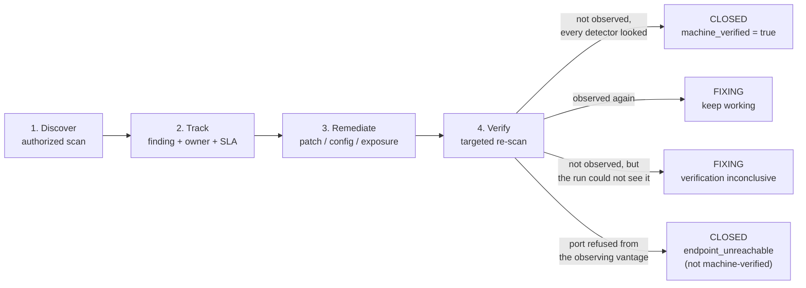

# Shapoclyack

**Self-hosted External Attack Surface Discovery & Risk-Based Vulnerability Management Platform (EASM · CAASM · RBVM).**

[](https://github.com/onixus/Shapoclyack/releases/latest)
[](https://github.com/onixus/Shapoclyack/blob/main/requirements.txt)
[](k8s/README.md)
[](https://github.com/onixus?tab=packages&repo_name=Shapoclyack)
[](LICENSE)

Shapoclyack turns external discovery into a verifiable remediation workflow. It keeps vulnerability history attached to persistent assets instead of transient IP addresses, understands distribution security backports, makes scanning scope explicit and fail-closed, and can mechanically re-check whether a remediation actually worked.

**[Getting Started](docs/getting-started.md)** · **[Closed-loop Demo](docs/demo-remediation-loop.md)** · **[Architecture](docs/architecture.md)** · **[Web UI](docs/ui.md)** · **[Documentation](docs/README.md)** · **[Русская версия](README.ru.md)** · **[Changelog](CHANGELOG.md)** · **[Roadmap](ROADMAP.md)**

> Documentation describes `main`, including changes after the documented
> release baseline `shapoclyack-0.46-0922`. See
> [version scope](docs/README.md#version-scope) and the
> [0.47-1009-rc1 candidate notes](docs/releases/0.47-1009-rc1.md)
> before applying these instructions to a release installation.

## Why Shapoclyack

- **Persistent assets:** keep findings, ownership and remediation history attached to corroborated asset identities. See [asset identity](docs/asset-identity.md).
- **Evidence of remediation:** re-check network findings with the detectors that observed them. A closed ticket alone does not establish a verified fix.
- **Vendor-aware patch gaps:** compare endpoint software with distribution advisories and Windows builds with MSRC. See [software matching](docs/software-cve-matching.md).
- **Risk with context:** keep likelihood and business impact as separate axes, with exploit maturity bounds. See [risk scoring](docs/risk-scoring.md).
- **Distributed scanning:** sensors claim tenant-scoped work outbound over NATS JetStream or HTTPS. See [network requirements](docs/network-requirements.md).

## Closed-loop remediation at a glance


```mermaid
flowchart LR
    A["1. Discover<br/>authorized scan"] --> B["2. Track<br/>finding + owner + SLA"]
    B --> C["3. Remediate<br/>patch / config / exposure"]
    C --> D["4. Verify<br/>targeted re-scan"]
    D -->|not observed,<br/>every detector looked| E["CLOSED<br/>machine_verified = true"]
    D -->|observed again| F["FIXING<br/>keep working"]
    D -->|not observed, but<br/>the run could not see it| G["FIXING<br/>verification inconclusive"]
    D -->|port refused from<br/>the observing vantage| H["CLOSED<br/>endpoint_unreachable<br/>(not machine-verified)"]
```

A verified closure requires evidence that every detector looked again. Missing coverage returns the finding to `FIXING`. An unreachable endpoint can close as `endpoint_unreachable`, with `machine_verified = false`. See the [vulnerability lifecycle](docs/vulnerability-lifecycle.md) and [closed-loop demo](docs/demo-remediation-loop.md).

## Quick start

Choose an installation path; commands run from a checked repository root.

| Goal | Path | Requirements |
|---|---|---|
| Install prebuilt images on one Linux server | [Server installation](docs/server-install.ru.md) | Python 3.9+, Docker Engine, Compose v2, HTTPS reverse proxy |
| Evaluate locally with image builds | [Getting started](docs/getting-started.md) | Docker, kind, kubectl, OpenSSL, at least 4 GB free RAM; Pulse release access for builds |
| Deploy or upgrade Kubernetes workloads | [Kubernetes deployment](k8s/README.md) | Cluster, registry access, secrets and storage configured for the selected overlay |

For a server installation without building on the host:

```bash
sudo python3 scripts/install-server.py prepare --url https://scan.example.test
# Inspect /opt/shapoclyack/compose.json, then start the prepared installation:
sudo python3 scripts/install-server.py start
```

The guide explains how to copy the standalone script without cloning the project, configure TLS, obtain the initial credentials, back up and upgrade. `prepare` needs no Docker; `start` pulls images, backs up PostgreSQL, runs migrations and waits for readiness. It stops the API during this process.

For local evaluation:

```bash
git clone https://github.com/onixus/Shapoclyack.git
cd Shapoclyack
scripts/dev-up.sh
curl --fail --cacert .dev-tls/ca.crt https://127.0.0.1:8080/api/health
```

Trust `.dev-tls/ca.crt` in your browser, then open **https://127.0.0.1:8080**. Demo accounts, approved scanning scope and the first scan are in [Getting started](docs/getting-started.md). Remove the local cluster with `scripts/dev-down.sh`.

Scan only infrastructure you own or are authorized to assess. A fresh installation executes no scans until an administrator approves the tenant scanning scope.

## Platform capabilities

| Area | Authoritative guide |
|---|---|
| Discovery, inventory, asset ownership and CMDB/AD file import | [Architecture](docs/architecture.md), [asset context](docs/asset-context.md) |
| Vulnerability triage, SLA, verification, risk acceptance | [Vulnerability lifecycle](docs/vulnerability-lifecycle.md) |
| Tenants, RBAC, MFA, OIDC, SCIM and service tokens | [API and RBAC](docs/api-and-rbac.md) |
| Reports, compliance signals and signed evidence packages | [Reports and compliance](docs/reports-and-compliance.md), [custom compliance](docs/custom-compliance.md) |
| Sensor fleet and endpoint inventory | [Operations](docs/operations.md), [endpoint design record](Agent_plan.md) |
| Current console routes and workflows | [Web interface](docs/ui.md) |
| Operational acceptance and remaining product work | [Enterprise-readiness roadmap](ROADMAP.md#enterprise-readiness-review-epic-370) |

A **sensor** runs scans (`agent/worker.py`, API resource `agents`, `agent_kind = scanner`). An **Agent** is the Lariska endpoint inventory agent (`agent_kind = endpoint`); it never claims scan jobs. See [terminology](docs/README.md#terminology).

## Enterprise Knowledge Base (Wiki) & Role Guides

The [Russian enterprise wiki](docs/wiki/README.md) contains role playbooks, security processes and a 12-week rollout plan. Technical contracts live in [docs/README.md](docs/README.md); planned work lives in [ROADMAP.md](ROADMAP.md).

Wiki sources and the sidebar are reviewed in this repository. To prepare a local GitHub Wiki preview without publishing:

```bash
scripts/publish-wiki.sh --output /tmp/shapoclyack-wiki
```

See [documentation maintenance](docs/documentation-maintenance.md) for rendering and publishing.

## Repository Layout

| Directory | Purpose |
|---|---|
| `api/` | FastAPI control plane, services and database migrations |
| `scanner/` | Discovery and scanning pipeline |
| `agent/` | Remote sensor worker and updater |
| `recon/` | Go reconnaissance module |
| `web-next/` | Next.js operator console |
| `k8s/` | Kustomize deployments and examples |
| `scripts/` | Installation, development and release tooling |
| `tests/` | Python tests and integration fixtures |
| `docs/` | Operator guides, wiki and architecture decisions |

## Development & Testing

Use Python 3.11/3.12 and Node.js 26+. Follow [Development](docs/development.md) for dependency installation and infrastructure-dependent tests.

```bash
scripts/ci-lint.sh
python -m pytest tests/test_server_installer.py tests/test_agent_install_pins.py -q
```

These are focused installer checks. Full CI validation requires dedicated PostgreSQL and NATS services; see the development guide before running it.

## Releases & Container Images

Documented release: [shapoclyack-0.46-0922](https://github.com/onixus/Shapoclyack/releases/tag/shapoclyack-0.46-0922). Source features after it are recorded under `Unreleased` in [CHANGELOG.md](CHANGELOG.md).

| Image | Contents |
|---|---|
| `ghcr.io/onixus/shapoclyack-aio` | API, Web UI and scanner |
| `ghcr.io/onixus/shapoclyack-api` | API and Web UI |
| `ghcr.io/onixus/shapoclyack-scanner` | Scanner and sensor runtime (`python -m agent`) |

Use reviewed `tag@sha256:<digest>` references in production. Installer defaults are pinned; a tag alone can move. Artifact verification and release policy are in the [release contract](docs/release-contract.md).

## Security & Licensing Notes

Shapoclyack is licensed under [Apache 2.0](LICENSE). See the [security policy](.github/SECURITY.md) for disclosure and supported versions, and [third-party licences](docs/third-party.md) for dependency terms.

Default images (`INSTALL_NMAP=0`) use Pulse and contain no Nmap binaries or NSE data. The optional `-nmap` image or your own Nmap installation is subject to NPSL; see [Pulse backend](docs/pulse-backend.md).
