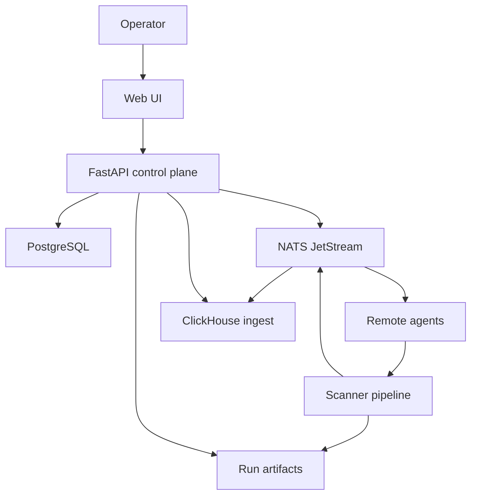

# Architecture

Shapoclyack separates control-plane state, scan execution, analytical results,
and the operator interface. Optional services are activated by configuration;
the scanner can still run as a standalone process.

## Components

| Component | Responsibility | Persistent data |
|---|---|---|
| Web UI | Operator workflows and visualization | Browser JWT only |
| FastAPI API | Auth, tenant scope, jobs, schedules, assets, reports, config | PostgreSQL and run artifacts |
| Scanner | Discovery, probing, enrichment, diff, and report generation | Run and checkpoint directories |
| Remote agent | Claim jobs, execute scanner, upload results | Local temporary work |
| PostgreSQL | OLTP state, tenants, inventory, schedules, overrides | Database volume |
| NATS JetStream | Job and ingest messaging with durable delivery | JetStream volume |
| ClickHouse | Vulnerability and port analytics across runs | ClickHouse volume |

## Data flow

In local execution mode, the API launches the scanner without the NATS job
path. In agent mode, a worker claims the tenant-scoped job and reports
completion through the API or configured broker.

## Scanner stages

The main pipeline is intentionally staged so partial output can be inspected and
long-running work can resume:

1. validate input contract and configuration;
2. resolve domains and normalize targets;
3. discover alive hosts;
4. collect hostnames and optional passive discoveries;
5. scan TCP/UDP ports;
6. run service, OS, NSE, and optional Nuclei checks;
7. enrich vulnerabilities and assets;
8. calculate run and asset changes;
9. write reports, notifications, and export artifacts.

Optional discovery modules can identify candidates or findings without merging
them into active scan scope. Read the configuration comments before enabling
third-party or shared-infrastructure probes.

## Identity and tenancy

- User JWTs carry a username and role.
- Agent JWTs carry agent identity and `tenant_id`.
- The API is authoritative for tenant scope.
- Jobs, assets, schedules, provisioning keys, and agent claims are
  tenant-bound.
- Asset identity is stable across runs and derives from tenant plus primary
  identifiers.

The current UI displays a default global tenant context. API clients must still
send and validate tenant scope explicitly where the endpoint contract requires
it.

## Storage boundaries

PostgreSQL is the primary transactional store. ClickHouse is an optional
analytical projection, not the source of truth for users, tenants, or asset
lifecycle. Run artifacts remain on the filesystem/PVC so operators can inspect
raw tool output and downloadable reports.

## Trust boundaries

| Boundary | Main controls |
|---|---|
| Browser → API | JWT, role checks, TLS at ingress, no secrets in system-status responses |
| Agent → API/broker | Provisioning-key exchange, short-lived agent JWT, tenant match |
| API → databases | Dedicated credentials, network policy, least privilege |
| Scanner → targets | Explicit allowlist, rate caps, timeouts, isolated workers |
| Artifacts → UI | Path validation, authorization, binary-safe download endpoint |
| External enrichment | Opt-in providers, candidate caps, timeouts, fail-soft parsing |

## Deployment topology

The all-in-one image packages scanner tools, API, and static Web UI. The thin API
image excludes scanner execution tools and is appropriate for results-only or
remote-agent deployments. Kubernetes overlays add agents, enrichment storage,
read-only API behavior, and production resource settings without changing the
base manifests.
