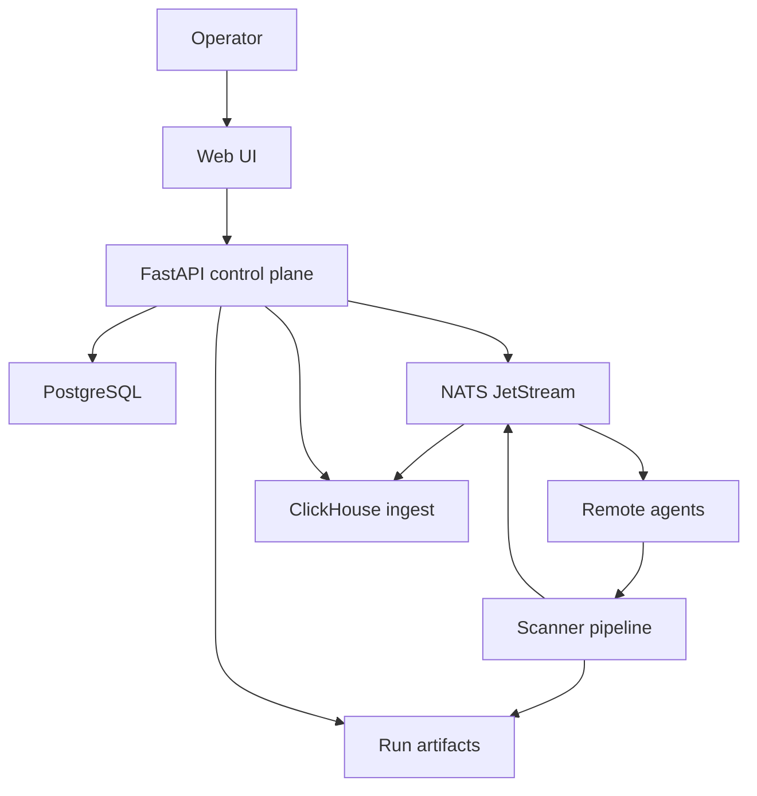

# Architecture

Shapoclyack separates control-plane state, scan execution, analytical results,
and the operator interface. Optional services are activated by configuration;
the scanner can still run as a standalone process.

## Components

| Component | Responsibility | Persistent data |
|---|---|---|
| Web UI | Operator workflows and visualization | Browser JWT only |
| FastAPI API | Auth, tenant scope, jobs, schedules, assets, reports, config | PostgreSQL and run artifacts |
| Scanner | Discovery, probing, enrichment, diff, and report generation | Run and checkpoint directories |
| Remote agent | Claim jobs, execute scanner, upload results | Local temporary work |
| PostgreSQL | OLTP state, tenants, inventory, schedules, overrides | Database volume |
| NATS JetStream | Job and ingest messaging with durable delivery | JetStream volume |
| ClickHouse | Vulnerability and port analytics across runs | ClickHouse volume |

## Data flow


```mermaid
flowchart TD
    U["Operator"] --> W["Web UI"]
    W --> A["FastAPI control plane"]
    A --> P["PostgreSQL"]
    A --> N["NATS JetStream"]
    N --> G["Remote agents"]
    G --> S["Scanner pipeline"]
    S --> R["Run artifacts"]
    S --> N
    N --> C["ClickHouse ingest"]
    A --> R
    A --> C
```

In local execution mode, the API launches the scanner without the NATS job
path. In agent mode, a worker claims the tenant-scoped job and reports
completion through the API or configured broker.

## Control-plane state

Jobs and the agent registry are rows in PostgreSQL (`jobs`, `agents`), not
process memory. Any API replica therefore sees the same queue and the same
fleet, and a restart does not lose in-flight state. Claims are serialized in
the database (`SELECT … FOR UPDATE SKIP LOCKED`), so two agents claiming at
the same moment receive different jobs regardless of which replica each one
talks to.

### Job lifecycle

A job holds one of six states, and the moves between them are validated on
every write (`api/services/job_states.py`) rather than assigned:

```text
queued ─┬─→ claimed ─┬─→ running ──→ succeeded | failed
        │            └─→ succeeded | failed
        ├─→ running ──→ succeeded | failed        (local execution)
        └─→ cancelled                             (nothing has taken it yet)

claimed | running ──→ queued                      (lease expired, see below)
```

- `claimed` means an agent has taken the job but has not yet reported working
  on it; the agent's first heartbeat naming the job promotes it to `running`.
  Local jobs skip the state — the API process is the worker.
- `cancelled` is set by `POST /api/jobs/{job_id}/cancel` and is only available
  while the job is still `queued`. Once an agent has claimed a job it starts
  scanning without asking the API again, and nothing can stop a scan in flight,
  so cancelling a `claimed` or `running` job would show a stop that never
  happened while the targets were still being scanned — the API answers 409
  instead. A job abandoned by its agent is handled by the lease sweep below.
- Terminal states never move again, so a result upload retried after a network
  timeout cannot rewrite the outcome. Such a retry is recognised as a replay
  and answered with the stored result (see below), not with an error.

### Idempotency

Both writes that create work accept a client-supplied key, because the failure
that matters is not a duplicate *request* but a lost *response*:

- `POST /api/jobs` with an `Idempotency-Key` header creates at most one job per
  (tenant, key). Uniqueness is a database constraint, not a read-then-insert —
  two replicas serving the same retry would both read "no such key".
- `POST /api/agent/jobs/{id}/results` with an `idempotency_key` field returns
  the stored outcome when the same completion is uploaded twice, and 409 when a
  second upload contradicts the first. Without a key, the natural key (same
  agent, same job, same exit code) serves the same purpose for older agents.

The schedule dispatcher uses the first of these: it keys each dispatch on the
schedule's own due time, so replicas that all wake for the same tick produce
one job rather than one each. That bounds the damage of having no leader
election, but does not replace it — see the dispatcher note below.

### Leases

Every job handed to an executor carries a deadline (`claimed_until`) that the
executor must keep pushing forward: agents on each heartbeat, local jobs from a
renewal thread running beside the scan. A lapsed lease therefore means the
executor is gone rather than slow — it had the whole window, several renewal
intervals, to say otherwise.

A background sweep (`OCTO_JOB_REAPER_INTERVAL_SECONDS`, default 60s) acts on
what it finds:

- **agent** jobs go back to `queued` for another worker, until
  `OCTO_JOB_MAX_ATTEMPTS` hand-outs are used up; past that they are failed, so
  a target that kills whatever picks it up cannot cycle through the fleet;
- **local** jobs are failed outright — their only executor was a thread in the
  process that died, so no other replica would ever pick the row up.

The sweep runs in every replica and needs no leader election: expiry is a
property of the row, and candidates are taken with `FOR UPDATE SKIP LOCKED`.
`octo_job_lease_expired_total{outcome}` counts what it did. Tune the lease with
`OCTO_JOB_LEASE_SECONDS` (default 300) — it must stay comfortably above the
agent heartbeat interval, or live scans get reaped.

One property still binds a job to one process: a **local-mode** job executes in
a thread inside the replica that accepted it. That replica is recorded as the
job's owner (`OCTO_INSTANCE_ID`, defaulting to the hostname), and on startup a
replica fails only its *own* orphaned local jobs. A local job orphaned by a
replica that never comes back under the same identity is caught by the lease
sweep above instead.

### Schedule dispatcher leadership

The dispatcher thread starts in every replica, but only the one holding a
Postgres **session-scoped advisory lock** dispatches; the rest re-try the lock
each tick and do nothing else (`api/services/leader_lock.py`, ROADMAP P1.6).
`octo_scheduler_is_leader` is 1 on exactly one replica — a fleet-wide `sum()`
that is not 1 is the signal something is wrong.

A session lock rather than a leader row with a lease: the lock lives in the
connection, so a leader that crashes, is OOM-killed, or is partitioned away has
its lock dropped by Postgres when its backend ends. There is no expiry to wait
out and no lease duration to tune wrong — a follower's next tick simply
succeeds. The cost is one connection held out of the pool per replica, and one
caveat: **the lock is not a fence**. Between a leader's backend dying and the
leader's own process noticing, two replicas can briefly believe they lead. The
P1.5 idempotency key on each dispatch (keyed on the schedule's due time) is what
makes that overlap a no-op instead of a second scan, so it stays load-bearing.

On SQLite — the fallback `postgres_url` for tests and no-DB deployments — there
are no advisory locks and no second replica to coordinate with, so the process
always leads.

Installations upgrading from a release that kept `state/api_jobs.json` and
`state/api_agents.json` need no manual step: the API imports each file once at
startup and renames it to `*.imported`.

## Scanner stages

The main pipeline is intentionally staged so partial output can be inspected and
long-running work can resume:

1. validate input contract and configuration;
2. resolve domains and normalize targets;
3. discover alive hosts;
4. collect hostnames and optional passive discoveries;
5. scan TCP/UDP ports;
6. run service, OS, NSE, and optional Nuclei checks;
7. enrich vulnerabilities and assets;
8. calculate run and asset changes;
9. write reports, notifications, and export artifacts.

Optional discovery modules can identify candidates or findings without merging
them into active scan scope. Read the configuration comments before enabling
third-party or shared-infrastructure probes.

## Identity and tenancy

- User JWTs carry a username and role.
- Agent JWTs carry agent identity and `tenant_id`.
- The API is authoritative for tenant scope.
- Jobs, assets, schedules, provisioning keys, and agent claims are
  tenant-bound.
- Asset identity is stable across runs and derives from tenant plus primary
  identifiers.

The current UI displays a default global tenant context. API clients must still
send and validate tenant scope explicitly where the endpoint contract requires
it.

## Asset events

A finished run's `diff.json` carries a normalized list of asset-level changes
(`new_asset`, `new_open_port`, `new_cve`, `cert_expiring`). The API publishes
each of them to JetStream on `events.asset.{tenant_id}.{kind}`, together with
`decommissioned_host` when an operator decommissions an asset through
`PATCH /assets/{id}`. Consumers subscribe per tenant (`events.asset.acme.>`) or
per kind across tenants (`events.asset.*.new_cve`).

Publishing happens in the API rather than in the scanner because the tenant is
a property of the job, not of the scan: the scanner is also the agent's
payload, so publishing there would mean handing broker credentials to every
remote worker and having it guess at a tenant the API already authorized. Both
execution paths converge on the same post-run hook, so a locally executed scan
and an agent upload emit the same events.

Delivery is best-effort and never fails a scan. An event that could not be
published is counted on `octo_asset_events_published_total{outcome="skipped"}`
(broker off or unreachable) or `{outcome="error"}`, and its payload is still in
the run's `diff.json` — a broker outage costs notifications, not data.

Event ids are derived from tenant, run, kind, host, port and CVE rather than
randomised, so a results upload replayed through the idempotency path
republishes identical ids and JetStream's duplicate window drops them. The run
id is deliberately part of that identity: the same finding seen by a later run
is a genuine re-occurrence, and collapsing it would suppress the signal that
something came back after remediation.

## Storage boundaries

PostgreSQL is the primary transactional store. ClickHouse is an optional
analytical projection, not the source of truth for users, tenants, or asset
lifecycle. Run artifacts remain on the filesystem/PVC so operators can inspect
raw tool output and downloadable reports.

## Trust boundaries

| Boundary | Main controls |
|---|---|
| Browser → API | JWT, role checks, TLS at ingress, no secrets in system-status responses |
| Agent → API/broker | Provisioning-key exchange, short-lived agent JWT, tenant match |
| API → databases | Dedicated credentials, network policy, least privilege |
| Scanner → targets | Explicit allowlist, rate caps, timeouts, isolated workers |
| Artifacts → UI | Path validation, authorization, binary-safe download endpoint |
| External enrichment | Opt-in providers, candidate caps, timeouts, fail-soft parsing |

## Deployment topology

The all-in-one image packages scanner tools, API, and static Web UI. The thin API
image excludes scanner execution tools and is appropriate for results-only or
remote-agent deployments. Kubernetes overlays add agents, enrichment storage,
read-only API behavior, and production resource settings without changing the
base manifests.
