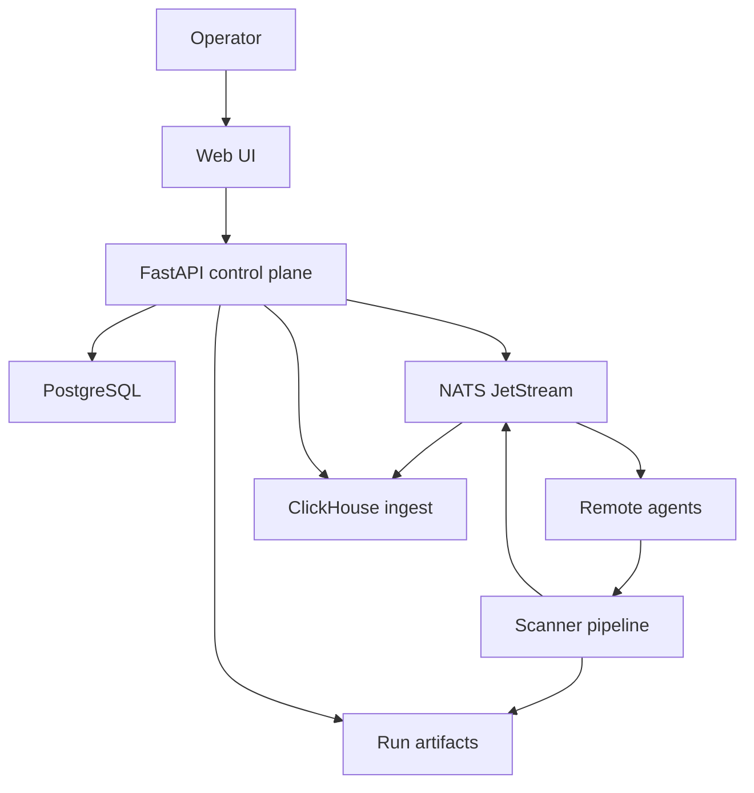

# Architecture

Shapoclyack separates control-plane state, scan execution, analytical results, and the operator interface. Optional services are activated by configuration; the scanner can still run as a standalone process.

## Components

| Component | Responsibility | Persistent data |
|---|---|---|
| Web UI | Operator workflows, tenant selection, and visualization | Browser JWT only |
| FastAPI API | Auth, tenant scope, jobs, schedules, assets, reports, config | PostgreSQL and run artifacts |
| Scanner | Discovery, probing, enrichment, diff, and report generation | Run and checkpoint directories |
| Remote agent | Claim jobs, execute scanner, upload results | Local temporary work |
| PostgreSQL | OLTP state, tenants, memberships, jobs, agents, inventory, schedules, overrides | Database volume |
| NATS JetStream | Job, ingest, and optional event messaging with durable delivery | JetStream volume |
| ClickHouse | Vulnerability and port analytics across runs | ClickHouse volume |

## Data flow


```mermaid
flowchart TD
    U["Operator"] --> W["Web UI"]
    W --> A["FastAPI control plane"]
    A --> P["PostgreSQL"]
    A --> N["NATS JetStream"]
    N --> G["Remote agents"]
    G --> S["Scanner pipeline"]
    S --> R["Run artifacts"]
    S --> N
    N --> C["ClickHouse ingest"]
    A --> R
    A --> C
```

In local execution mode, the API launches the scanner without the NATS job path. In agent mode, a worker claims the tenant-scoped job and reports completion through the API or configured broker.

## Control-plane state

Jobs and the agent registry are rows in PostgreSQL (`jobs`, `agents`), not process memory. Any API replica therefore sees the same queue and fleet, and a restart does not lose persisted control-plane state. Claims are serialized with `SELECT … FOR UPDATE SKIP LOCKED`, so concurrent agents receive different jobs across replicas.

### Job lifecycle

A job holds one of six states, and transitions are validated by `api/services/job_states.py`:

```text
queued ─┬─→ claimed ─┬─→ running ──→ succeeded | failed
        │            └─→ succeeded | failed
        ├─→ running ──→ succeeded | failed        (local execution)
        └─→ cancelled                             (nothing has taken it yet)

claimed | running ──→ queued                      (eligible expired agent lease)
```

- `claimed` means an agent has taken the job but has not yet reported active work.
- `cancelled` is available only before execution has started. The API does not claim to stop work that is already running.
- terminal outcomes are not rewritten by late retries.

### Idempotency and fencing

`POST /api/jobs` accepts `Idempotency-Key`, scoped per tenant. Repeating a successful creation request returns the existing job rather than creating another one.

Agent result uploads can carry both an idempotency key and the claim `attempt`. The attempt acts as a fencing token: a stale worker cannot overwrite the result of a later lease/claim after its own lease expired.

Scheduled dispatch also uses deterministic idempotency keys derived from the schedule due time. This remains a defense-in-depth control even though dispatcher leadership is now implemented.

### Leases and orphan recovery

Jobs handed to executors carry `claimed_until`. Agents renew through heartbeats; local-mode jobs renew from the API process that owns the scan.

The reaper acts on expired leases:

- agent jobs can be requeued until the configured maximum number of attempts is reached;
- local jobs are failed because no other replica owns their in-process executor.

The reaper runs on every replica and coordinates through row locking rather than leader election.

### Schedule dispatcher leadership

The schedule dispatcher starts in every API replica, but only the replica holding a PostgreSQL session-scoped advisory lock dispatches schedules. Followers retry acquisition on later ticks. The metric `octo_scheduler_is_leader` should be `1` on exactly one healthy dispatcher replica.

The advisory lock is intentionally not treated as a fencing token. A brief overlap can exist while a failed leader notices that its database session is gone, so the schedule idempotency key remains necessary to make duplicate dispatch attempts harmless.

SQLite fallback deployments do not provide distributed advisory locking and are treated as single-process execution environments.

Installations upgrading from older file-backed job/agent state import the legacy JSON state once and rename it to `*.imported`.

## Scanner stages

The pipeline is staged so partial output can be inspected and long-running work can resume:

1. validate input contract and configuration;
2. resolve domains and normalize targets;
3. discover alive hosts;
4. collect hostnames and optional passive discoveries;
5. scan TCP/UDP ports;
6. run service, OS, NSE, and optional Nuclei checks;
7. enrich vulnerabilities and assets;
8. calculate run and asset changes;
9. write reports, notifications, and export artifacts.

Optional discovery modules can identify candidates or findings without automatically expanding active scan scope. Read configuration guidance before enabling third-party or shared-infrastructure probes.

## Finding and risk model

Findings are not all equivalent. The normalized finding contract can carry a class, confidence, confirmation requirement, evidence, EPSS/KEV context, contextual score, decision, and a human-readable risk explanation.

Confirmed vulnerabilities and lower-confidence exposure/hypothesis records therefore remain distinguishable through the pipeline and UI. The scoring layer must not promote an unconfirmed observation above a confirmed high-risk vulnerability solely because a text pattern resembled a CVE.

The current model provides contextual prioritization for run findings. The broader product roadmap extends this toward asset-level risk, SLA, remediation lifecycle, and business context; those planned capabilities are documented in `docs/ui-ux-redesign-roadmap.md`, not assumed to exist here.

## Identity and tenancy

- Console credentials are configured separately from tenant memberships.
- Server-side membership rows determine which tenants a console user may act in and the role inside each tenant.
- Platform admins may use fleet-wide views where the API explicitly permits them.
- Agent JWTs carry agent identity and tenant context.
- The API is authoritative for tenant scope; a client-provided `tenant_id` is only a selector among tenants already granted to the principal.
- Jobs, assets, schedules, runs, provisioning keys, endpoint inventory, and agent claims are tenant-bound.
- Direct lookup of another tenant's resource returns `404` where revealing existence would leak information.
- The Web UI exposes a global tenant switcher and clears cached query data when tenant context changes.

Completed run directories carry `tenant.json`. Historical/direct scanner runs without that marker are treated as belonging to `default` for backward compatibility.

See [API and RBAC](api-and-rbac.md) for endpoint-level authorization behavior.

## Storage boundaries

PostgreSQL is the primary transactional store. ClickHouse is an analytical projection, not the source of truth for users, memberships, jobs, or asset lifecycle. Run artifacts remain on filesystem/PVC storage so operators can inspect raw tool output and downloadable reports.

NATS JetStream is a messaging layer, not the authoritative database for job state. Durable streams support asynchronous work and optional integration/event delivery, while business state remains persisted in PostgreSQL or run artifacts as appropriate.

## Trust boundaries

| Boundary | Main controls |
|---|---|
| Browser → API | JWT, server-side tenant/role checks, TLS at ingress, no secret values in status responses |
| Agent → API/broker | Provisioning exchange, short-lived agent JWT, tenant match, claim fencing |
| API → databases | Dedicated credentials, network policy, least privilege |
| API → external integrations | Explicit configuration, bounded retries/timeouts, secret handling, destination validation |
| Scanner → targets | Explicit scope, rate caps, timeouts, isolated workers |
| Artifacts → UI | Path validation, tenant authorization, binary-safe download endpoint |
| External enrichment | Opt-in providers, candidate caps, timeouts, fail-soft parsing |

## Deployment topology

The all-in-one image packages scanner tools, API, and static Web UI. The thin API image excludes scanner execution tools and is appropriate for results-only or remote-agent deployments. Kubernetes overlays add agents, enrichment storage, read-only API behavior, and production resource settings without changing the base manifests.

For deployable topology and exact manifest behavior, [k8s/README.md](../k8s/README.md) and rendered Kustomize output are authoritative.
