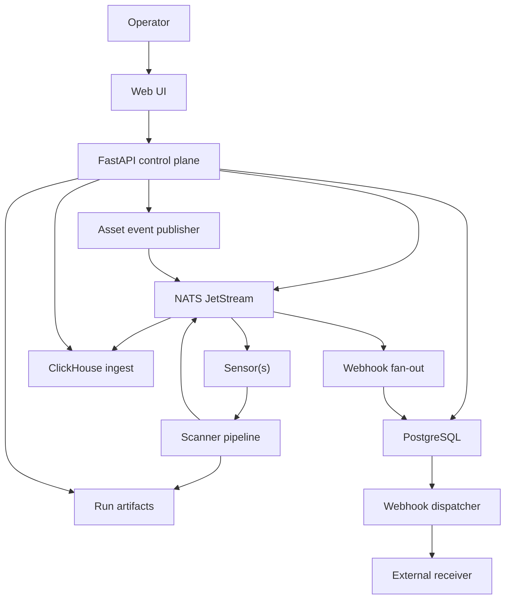

# Architecture

Shapoclyack separates control-plane state, scan execution, analytical results, and the operator interface. Optional services are activated by configuration; the scanner can still run as a standalone process.

## Components

| Component | Responsibility | Persistent data |
|---|---|---|
| Web UI | Operator workflows, tenant selection, and visualization | Browser JWT only |
| FastAPI API | Auth, tenant scope, jobs, schedules, assets, reports, webhooks, config | PostgreSQL and run artifacts |
| Scanner | Discovery, probing, enrichment, diff, and report generation | Run and checkpoint directories |
| Sensor(s) | Claim scan jobs, execute the scanner, upload results (API resource `agents`, `agent_kind = scanner`) | Local temporary work |
| Agent (Lariska) | In-guest endpoint inventory agent on managed hosts; submits snapshots to `POST /api/endpoint/inventory`, never claims jobs (`agent_kind = endpoint`) | None on the control plane beyond the registry row and its snapshots |
| PostgreSQL | OLTP state, tenants, memberships, jobs, sensor/Agent registry (`agents`), endpoint inventory, schedules, webhook queue/audit, overrides | Database volume |
| NATS JetStream | Job, ingest, asset-event, and integration messaging with durable delivery | JetStream volume |
| ClickHouse | Vulnerability and port analytics across runs | ClickHouse volume |

## Data flow


```mermaid
flowchart TD
    U["Operator"] --> W["Web UI"]
    W --> A["FastAPI control plane"]
    A --> P["PostgreSQL"]
    A --> N["NATS JetStream"]
    N --> G["Sensor(s)"]
    G --> S["Scanner pipeline"]
    S --> R["Run artifacts"]
    S --> N
    N --> C["ClickHouse ingest"]
    A --> R
    A --> C
    A --> E["Asset event publisher"]
    E --> N
    N --> F["Webhook fan-out"]
    F --> P
    P --> D["Webhook dispatcher"]
    D --> X["External receiver"]
```

In local execution mode (`OCTO_JOB_EXECUTION_MODE=local`, the default), the API launches the scanner without the NATS job path. In agent mode (`OCTO_JOB_EXECUTION_MODE=agent`), a sensor claims the tenant-scoped job — pulled from NATS JetStream or polled over `POST /api/agent/jobs/claim` — and reports completion through the API.

## Control-plane state

Jobs and the sensor registry are rows in PostgreSQL (`jobs`, `agents`), not process memory. Sensors and Agents (Lariska) share the same `agents` registry and are told apart by `agent_kind` (`scanner` vs `endpoint`); only `scanner` rows may claim jobs. Any API replica therefore sees the same queue and fleet, and a restart does not lose persisted control-plane state. Claims are serialized with `SELECT … FOR UPDATE SKIP LOCKED`, so concurrent sensors receive different jobs across replicas.

### Job service boundaries

`api/services/jobs.py` is the compatibility facade for the job API, not the
implementation boundary. New job behavior belongs to the service that owns the
corresponding invariant:

- `scan_admission.py` decides whether a scan may enter the queue and where it
  may run: tenant state, quota, maintenance windows, approved scope, scan policy,
  promoted domains and agent-group placement.
- `job_submission.py` creates jobs, applies start idempotency, materializes the
  admitted request and hands it to the selected executor.
- `job_repository.py` owns queue reads, summaries, legacy import and startup
  reconciliation; `job_store.py` owns lifecycle writes, transition validation,
  terminal metrics and failure events.
- `job_control.py` owns agent claim, heartbeat promotion, queued-policy
  tightening and cancellation; `job_leases.py` owns lease and ingest-fence
  primitives; `job_reaper.py` owns abandoned-work recovery.
- `job_results.py` owns the agent result-upload protocol and durable
  publication intent. `run_publisher.py` makes an accepted run visible and
  `run_completion.py` updates derived projections after publication.
- `job_inputs.py` owns job-scoped files and object-store mirroring;
  `local_scan_executor.py` owns subprocess/process-group lifecycle and
  `local_job_runner.py` owns the state transitions around a local execution.
- `job_dispatch.py` publishes the optional NATS wake-up hint. PostgreSQL
  remains the queue; a broker failure cannot erase or transfer ownership of a
  job.

Admission runs both scope barriers before any job-scoped file exists, and in
this order: the target parse answers **syntax before entitlement**, and
`assert_scan_allowed` follows it. Hoisting the entitlement check above the
parse turns a typo into `403 outside the approved scan scope` instead of
`422 invalid scan targets`, telling the operator to request access they already
have. `tests/test_api_targets.py::test_api_rejects_invalid_targets_with_422`
holds that line.

The dependency direction is intentionally one-way: these services do not import
`jobs.py`. Routes and older internal callers may continue to use the facade,
but adding a new policy or side effect there would recreate the dependency hub
this split removed. A name on the facade is a forwarding entry, not a seam:
the services call each other directly, so tests patch the owning module.
`tests/test_job_architecture.py` enforces both — no facade imports in the
services, and every facade function a single forwarding call.

### Job lifecycle

A job holds one of seven states, and transitions are validated by `api/services/job_states.py`:

```text
queued ─┬─→ claimed ─┬─→ running ──→ succeeded | failed
        │            └─→ succeeded | failed
        ├─→ running ──→ succeeded | failed        (local execution)
        └─→ cancelled                             (nothing has taken it yet)

claimed | running ──→ cancelling ──→ cancelled    (sensor confirmed, or grace expired)
                          └────────→ succeeded | failed   (finished before the stop landed)

claimed | running ──→ queued                      (eligible expired sensor lease)
```

- `claimed` means a sensor has taken the job but has not yet reported active work.
- `cancelled` straight from `queued` is a stop nothing had to be told about: the job is simply never handed out.
- `cancelling` is an operator asking a sensor to put a running scan down. The request travels on the sensor's next heartbeat response; the sensor signals its scanner's process group and uploads whatever the run produced as a cancelled result. If no confirmation arrives within `OCTO_JOB_CANCEL_GRACE_SECONDS` the job is finished as `cancelled` anyway, with the silence recorded in `error`. A `cancelling` job is deliberately outside the lease set, so the reaper never hands it to a second sensor while the first is stopping — and asking for the same job again while it is there is a no-op, not a second decision: terminalizing it would report a stop no sensor has confirmed and clear the flag before it was read.
- a local scan that has already started cannot be cancelled: it is a subprocess inside one API replica, which is not necessarily the replica answering the request, so the API refuses rather than reporting a stop that did not happen.
- terminal outcomes are not rewritten by late retries.

### Idempotency and fencing

`POST /api/jobs` accepts `Idempotency-Key`, scoped per tenant. Repeating a successful creation request returns the existing job rather than creating another one.

Sensor result uploads can carry both an idempotency key and the claim `attempt`.
The API checks the attempt against the current claim when completion starts;
uploads arriving with an already superseded attempt are rejected. The field is
optional for legacy sensors.

The entry check is not the fence. Archive processing happens outside that
transaction and can outlast the lease, so the first transaction also takes an
**ingest lease** on the row: `ingest_token`, `ingest_attempt`, `ingest_agent_id`
and `ingest_started_at`, plus `claimed_until` pushed out by
`OCTO_JOB_INGEST_LEASE_SECONDS` — an upload being processed is proof of life,
and the sensor keeps heartbeating (`stage=uploading`) for the whole transfer.
The terminal status write is conditional on `(job_id, attempt, owner, ingest
token)` still matching; if the lease lapsed and the reaper gave the job to
another attempt, the upload is refused with `409` and the sensor reports a
rejected result rather than a failed upload.

Artifacts follow the same boundary, and they do not cross it at all. An upload
is extracted into a staging directory named after its ingest token, beside the
run directory rather than inside it, and nothing there is visible to any
listing, key prefix or subject. The terminal write is the commit point: it
records the outcome **and**, in the same transaction, one `run_publications`
row saying this run is accepted and owed its publication. So an upload the
fence refuses leaves nothing behind — no run directory, no store keys, no bus
message, no row — and an upload that is accepted cannot be forgotten.

Everything that makes the run visible is then done from that row by
`api/services/run_publisher.py`: the tenant marker into the staging tree, the
tree into the object store, the tree into the run directory, the latest-run
pointer, then `ingest.results.{tenant}`. It runs first in the request that
accepted the upload, so an ordinary upload is answered with the run already
published; a failure there does not fail the request, because the outcome is
committed and what is left undone is a row. A reconciler in every replica
retries it with exponential backoff up to `OCTO_RUN_PUBLICATION_MAX_ATTEMPTS`,
and each step is idempotent and resumable from what is on disk, so a replica
killed halfway is a retry rather than a repair. The archive is kept beside the
staging tree because the bus message's `Msg-Id` is its digest: a republish has
to be the same message, not a second ClickHouse insert for one scan.

Two things this is deliberately *not*. It is not the publication ordered
before the status write — that left the whole publication outside the fence,
so a lease lapsing during a large `upload_tree` produced a run directory with
two attempts' files in it (`promote_staging` merges) and two bus messages under
one run id. And it is not the publication ordered after it — that left a store
outage permanent, since the job read `succeeded` while the artifacts were
nowhere and the sensor's retry is answered as a replay of that outcome. Both
were shipped in turn; the record is in the dated
[architecture review](architecture-review-2026-09-18.ru.md).

One accepted upload is one publication. The row is inserted due immediately,
so the accepting request claims it with `FOR UPDATE SKIP LOCKED` and holds it
out of the due window, exactly as a reconciler tick holds the batch it claimed
— otherwise the next tick in any replica would find the row due and publish it
alongside the request. The hold is a floor and not a guess at the work: a
running publication **renews** it every few seconds, so a tree that takes ten
minutes is held for ten minutes, and a replica that dies stops renewing and
gives the row up one horizon later. That renewal is also the row's proof of
life — see the orphan deadline below.

Should the race happen anyway (a renewal that never reached the database, two
pods whose clocks disagree), the side that loses is harmless rather than
destructive: a failed upload rolls back **the keys it wrote itself**, and only
while nothing has yet put the run's tree in the store. Taking the run's whole
`runs/<run_id>/` prefix, as this first did, deletes a run somebody else has
just published — and while run ids were minted from a one-second clock,
somebody else's run entirely. Run ids minted by the API now carry a random
suffix as well as the timestamp.

The fence for that second condition is `run_publications.stored_at` and not the
row itself. The winner promotes the staging tree and only *then* ships the
archive to the broker, so the row that owes the publication outlives the moment
the run became readable by the length of that upload — and that is precisely
when the loser finds its staging tree gone and decides what to do with the keys
it had written. So the transfer stamps the row before it promotes the tree, and
a rollback that sees a stamp leaves the store alone.

The stamp goes on when the winner's *whole* tree is up, so for the length of
that upload it is honestly absent while the winner's keys — the same key names
the loser wrote — are already landing. A loser whose own store refused it
halfway would take those back out. So the rollback reads the claim counter as
well: every attempt claims the row before it touches the store, which makes the
other attempt visible from its first key rather than from its last.

The same two facts answer "is this run already in the store" for a replica that
has no staging tree of its own to upload. A listing alone says yes to the first
key of an upload still in progress, and a stamp alone is an upload that
finished without the local backend's promotion having moved anything, so a peer
adopting a row mid-tree would either publish a half-written run or condemn one
its owner is still working on. Both must be true: some attempt stamped the row,
and the store has the result.

Attempts are counted where a publication fails, not where its row is claimed,
so a replica killed mid-batch does not write one off for every row it was
holding. Claims are counted separately, for the other end of the same
argument: a tree large enough to kill the replica publishing it would
otherwise be claimed, die, and be claimed again forever, with nothing counting
anything. Past twice the permitted attempts in claims without one of them
reaching an outcome, the row is `dead` like any other.

A run that cannot be published at all is the bounded end of this. Past
`OCTO_RUN_PUBLICATION_MAX_ATTEMPTS` the row stays `dead` — as it does past
`OCTO_RUN_PUBLICATION_ORPHAN_DEADLINE_SECONDS` of *silence* for a row whose
staging tree is on a replica that is gone, which with the artifact cache on an
`emptyDir` is what a scaled-down pod leaves behind. Silence, not age: the
deadline runs from the last time some replica was demonstrably working on the
row (a renewal, or a recorded failure), so a pod that is alive and retrying a
slow store is not condemned by a peer that cannot see its disk. Either way:
`/api/health` reports
`run_publications` (advisory — `/readyz` is unaffected),
`octo_run_publication_backlog{status="dead"}` rises, the job's `error` says the
run was not published, and the extracted tree stays on the accepting replica's
disk for 24 hours so an operator can publish it by hand or re-scan (a run whose
replica is gone has only the second of those, and the runbook says so). A
publication that failed partway through the object store takes its own keys
back off before the failure is recorded, so a `dead` row does not normally
leave a half of a run for the other replicas to list and open. *Normally*: the
store that refused the upload can refuse the cleanup too, and then the half
stays. It is not silent — the row's reason and the note on the job both say the
run may be listed with files missing from it — but it is a case an operator
has to finish by hand. The
projections that read a published run — assets, vulnerabilities, asset events,
notifications — run when the publication lands, not when the job finishes, and
they cannot fail it: a failure there is recorded in the job's `error`.

A staging tree an ingest never finished is collected the next time this
replica takes a staging directory: past one hour of inactivity for a killed
fetch's debris, and past 24 hours for an ingest tree, which is a complete run
somebody may still want rather than a partial transfer.

The `409` on the results route carries `X-Result-Rejection`, because three
different things share the status: `stale-attempt` (the job moved on),
`conflict` (a second completion that disagrees with the first) and `in-flight`
(the sensor's own earlier upload is still being ingested). Only the first two
mean the result was declined. A sensor waits `OCTO_AGENT_UPLOAD_TIMEOUT` for
the answer, which must cover an ingest — the API replies when the ingest is
done, not when the bytes are in.

Result ingestion itself runs on a worker thread, not on the API's event loop,
and behind an admission gate (`api/services/ingest_gate.py`): a bounded number
of uploads are ingested at once and a bounded number may queue, with anything
beyond that answered `503` + `Retry-After` for the sensor to retry. The gate is
per replica and holds no state — it rations threads, database connections and
buffered archives, and it does not make ingestion resumable across a restart.

Scheduled dispatch also uses deterministic idempotency keys derived from the schedule due time. This remains a defense-in-depth control even though dispatcher leadership is now implemented.

### Leases and orphan recovery

Jobs handed to executors carry `claimed_until`. Sensors renew through heartbeats; local-mode jobs renew from the API process that owns the scan.

The reaper acts on expired leases:

- sensor jobs can be requeued until the configured maximum number of attempts is reached;
- local jobs are failed because no other replica owns their in-process executor.

The reaper runs on every replica and coordinates through row locking rather than leader election.

### Schedule dispatcher leadership

The schedule dispatcher starts in every API replica, but only the replica holding a PostgreSQL session-scoped advisory lock dispatches schedules. Followers retry acquisition on later ticks. The metric `octo_scheduler_is_leader` should be `1` on exactly one healthy dispatcher replica.

The advisory lock is intentionally not treated as a fencing token. A brief overlap can exist while a failed leader notices that its database session is gone, so the schedule idempotency key remains necessary to make duplicate dispatch attempts harmless.

SQLite fallback deployments do not provide distributed advisory locking and are treated as single-process execution environments.

Installations upgrading from older file-backed job/sensor state import the legacy JSON state once and rename it to `*.imported`.

## Scanner stages

The pipeline is staged so partial output can be inspected and long-running work can resume:

1. validate input contract and configuration;
2. resolve domains and normalize targets;
3. discover alive hosts;
4. collect hostnames and optional passive discoveries;
5. scan TCP/UDP ports;
6. run service, OS, NSE, and optional Nuclei checks;
7. enrich vulnerabilities and assets;
8. calculate run and asset changes;
9. write reports, notifications, and export artifacts.

Optional discovery modules can identify candidates or findings without automatically expanding active scan scope. Read configuration guidance before enabling third-party or shared-infrastructure probes.

## Finding and risk model

Findings are not all equivalent. The normalized finding contract can carry a class, confidence, confirmation requirement, evidence, EPSS/KEV context, contextual score, decision, and a human-readable risk explanation.

Confirmed vulnerabilities and lower-confidence exposure/hypothesis records therefore remain distinguishable through the pipeline and UI. The scoring layer must not promote an unconfirmed observation above a confirmed high-risk vulnerability solely because a text pattern resembled a CVE.

The current model provides contextual prioritization for run findings (`nist-1`)
and tracks findings as entities with lifecycle, SLA and an audit trail
([vulnerability-lifecycle.md](vulnerability-lifecycle.md)). Asset business
context (owner, service, environment, data class, exposure) and a per-asset
risk rollup live on the asset card ([asset-context.md](asset-context.md)).
Remaining product surfaces (full asset-centric view, exposure management)
are tracked in `docs/ui-ux-redesign-roadmap.md`.

## Identity and tenancy

- Console credentials are configured separately from tenant memberships.
- Server-side membership rows determine which tenants a console user may act in and the role inside each tenant.
- Platform admins may use fleet-wide views where the API explicitly permits them.
- Agent JWTs (issued to sensors and Agents alike by `POST /api/auth/agent/token`) carry the node's identity and tenant context.
- The API is authoritative for tenant scope; a client-provided `tenant_id` is only a selector among tenants already granted to the principal.
- Jobs, assets, schedules, runs, provisioning keys, endpoint inventory, sensor claims, webhook subscriptions, and webhook deliveries are tenant-bound.
- Direct lookup of another tenant's resource returns `404` where revealing existence would leak information.
- The Web UI exposes a global tenant switcher and clears cached query data when tenant context changes.

Tenant IDs created through the current API are constrained to a route- and NATS-safe representation. Legacy IDs that cannot be embedded injectively in NATS subjects use a reserved hash token rather than lossy character replacement, preventing two tenant IDs from collapsing onto one routing subject.

Completed run directories carry `tenant.json`. Historical/direct scanner runs without that marker are treated as belonging to `default` for backward compatibility.

See [API and RBAC](api-and-rbac.md) for endpoint-level authorization behavior.

## Asset events

A finished run's `diff.json` carries normalized asset-level changes: `new_asset`, `new_open_port`, `new_cve`, and `cert_expiring`. The API also emits `decommissioned_host` when an operator moves an asset to the decommissioned state.

The API publishes these events to JetStream on `events.asset.{tenant_token}.{kind}`. Publishing belongs in the control plane rather than the scanner because tenant identity is a property of the authorized job; sensors do not need broker authority merely to produce findings.

Publishing is best-effort and does not turn an otherwise successful scan into a failed job when the broker is unavailable. The full change set remains in `diff.json`, while `octo_asset_events_published_total{kind,outcome}` records published, errored, or skipped notifications.

The synchronous publish path is bounded by a batch deadline and stops after repeated broker failures. A per-run cap prioritizes actionable event kinds before truncation so a large wave of newly discovered hosts cannot crowd all `new_cve` events out of the notification budget.

Event IDs are content-derived and include tenant, run, kind, host, port, protocol, and finding identity where applicable. This makes upload retries idempotent inside JetStream's duplicate window while preserving a genuinely new occurrence in a later run.

## Outbound webhooks

Outbound webhooks are the first consumer of the asset-event stream. A tenant subscription contains routing policy such as event kinds and an optional minimum severity for event types that actually have severity.

Since [#328](https://github.com/onixus/Shapoclyack/issues/328) the same subscription may also route the administrative audit trail, published to `events.audit.{tenant_token}` after the change it describes commits. Its kinds are `audit.<action>`, with `audit.*` meaning every action — a wildcard rather than an enumeration, because the action list grows and a subscription naming today's actions would silently stop covering tomorrow's. A minimum severity does not apply to them: severity is a statement about vulnerabilities.

Since [#349](https://github.com/onixus/Shapoclyack/issues/349) the same subscription may also route the remediation *workflow*: `sla_due_soon`, `sla_breached`, `exception_expiring`, `vuln_state_changed`, `vuln_assigned`, `scan_failed`, `report_generated`, `agent_offline`. These are produced inside the API rather than by the scanner, so their emitter writes the delivery queue directly and publishes to `events.workflow.{tenant_token}.{kind}` only for consumers that are not webhooks — an installation with no broker therefore still gets them, and no third fan-out consumer has to be deployed. The four that are predicates over the clock rather than observed changes (`sla_*`, `exception_expiring`, `agent_offline`) come from a leader-locked worker and are claimed once in `workflow_event_markers`, keyed on the deadline they are about, so a repeated tick does not repeat the notification and a restarted clock does produce a new one. `agent_offline` has no deadline to be keyed on, so its claim is keyed on the sensor and released when the sensor is heartbeating properly again — one event per episode of silence, rather than one per missed beat. Like the audit trail, they are opt-in per subscription.

Two workers deliberately separate broker consumption from network delivery:

1. durable JetStream consumers (`octo-webhook-fanout` on `events.asset.>` and `octo-webhook-audit-fanout` on `events.audit.>`) validate each envelope, materialize matching deliveries in PostgreSQL, and acknowledge the message. Two consumers rather than one on `events.>` because a consumer carries a single filter subject, and widening a deployed one means resetting its cursor;
2. a dispatcher claims due rows and sends HTTP requests outside the database transaction.

This split keeps slow or broken receivers from creating JetStream consumer lag and prevents a hanging HTTP request from holding a database connection.

`webhook_deliveries` is intentionally the retry queue, dead-letter queue, and audit trail in one table. Pending rows carry `next_attempt_at`; exhausted or non-retryable rows become `dead`; delivered rows remain as delivery history until retention removes them. Replay of a dead delivery does not require the broker because the row contains the payload.

The dispatcher runs in every API replica. It does not need leader election: due rows are claimed with `FOR UPDATE SKIP LOCKED`, and a visibility timeout moves the claim deadline forward so replicas divide work and abandoned claims become eligible again. A batch is POSTed serially, so that timeout scales with the size of the claim — one `OCTO_WEBHOOK_TIMEOUT_SECONDS` per claimed row plus two of slack, never under 30 seconds — otherwise the lease expires mid-batch and a peer re-sends a delivery still in flight. A dispatcher that fails part-way through a batch releases the rows it never attempted back to the queue instead of letting them sit out that window; they keep their retry budget, because no attempt was made.

### Webhook deployment modes

The two halves are switched independently, so an installation can shape which
replicas talk to the broker and which open connections to third parties
(#153). Every mode keeps the `/api/webhooks` surface — subscriptions, the DLQ
and its replay, the audit trail — because those are rows, not threads.

| Mode | `OCTO_WEBHOOK_FANOUT_ENABLED` | `OCTO_WEBHOOK_DISPATCH_ENABLED` | What the replica does |
|------|-------------------------------|---------------------------------|-----------------------|
| Default | `true` | `true` | Consumes events and delivers; correct at any replica count |
| API-only | `false` | `false` | Serves the API; something else must run the other two |
| Fan-out worker | `true` | `false` | Turns events into delivery rows; never opens an outbound connection, so it needs no egress |
| Egress worker | `false` | `true` | Claims due rows and delivers; the only replicas that need a route to receivers |

With `OCTO_WEBHOOKS_ENABLED=false` none of it runs and the routes are not
registered, whatever the two flags say. Fan-out additionally needs
`OCTO_NATS_URL`: with no broker there is no stream to consume, and the flag
is then moot. At least one replica must run each half, or events accumulate as
consumer lag (fan-out off everywhere) or as `pending` rows (dispatch off
everywhere) — both are visible: `octo_nats_consumer_pending` for the former,
`octo_webhook_delivery_queue{status="pending"}` for the latter.

Retry classification is bounded and explicit: timeouts, 5xx, 408, and 429 retry with capped exponential backoff; other 4xx responses are dead-lettered immediately rather than replaying the same malformed request until the budget is exhausted.

Webhook payloads are signed by default with HMAC over `{timestamp}.{body}`. The secret is generated at subscription creation, returned once, stored write-only from the API perspective, and rotatable. Receivers should validate both the signature and timestamp freshness.

Webhook targets are checked for SSRF at configuration time and again before delivery. Loopback, link-local, private, metadata-style, and otherwise non-global destinations are rejected by default; redirects are not followed. `OCTO_WEBHOOK_ALLOW_PRIVATE_TARGETS=true` is an explicit deployment opt-in for trusted on-cluster receivers.

## Outbound HTTP from the scanner

Most scanner stages talk to a constant, source-literal host (RIPEstat, crt.sh,
cloud provider endpoints) over `httpx` with default redirect handling. That is
adequate precisely because the operator's input never chooses the destination.

The org profile module breaks that assumption: the `ownership` stage learns its
next hop from the IANA RDAP bootstrap file and from `rdap.org`'s 302 to the
registry server, so a remote party names the address. Those requests go through
`scanner/pipeline/safe_http.py`, which applies the same boundary the webhook
dispatcher applies outbound: HTTPS only, no userinfo, rejection when *any*
resolved A/AAAA is non-global or multicast, and a TCP connection opened to the
already-validated IP literal while SNI and certificate verification use the DNS
name. Without that pinning a target with TTL=0 can answer the validating
`getaddrinfo` and the library's connect-time lookup differently. Bodies are read
under a byte cap and a single wall-clock deadline covering the whole redirect
chain, and each `Location` is re-validated by the same code as the first hop, so
a redirect cannot downgrade to http or walk inward.

None of this is configurable — there is no setting to disable verification or
pinning. The module is a deliberate second implementation rather than an import
of `api/services/integrations/delivery.py`: the scanner ships as its own
container and does not depend on the API package.

## Storage boundaries

PostgreSQL is the primary transactional store. ClickHouse is an analytical projection, not the source of truth for users, memberships, jobs, webhook state, or asset lifecycle. Run artifacts live on filesystem/PVC storage by default (`OCTO_ARTIFACT_BACKEND=local`) or in S3-compatible object storage (`OCTO_ARTIFACT_BACKEND=s3`, [#336](https://github.com/onixus/Shapoclyack/issues/336)) so operators can inspect raw tool output and downloadable reports.

NATS JetStream is a messaging layer, not the authoritative database for job or delivery state. Durable streams carry asynchronous work and asset events; business state remains persisted in PostgreSQL or run artifacts as appropriate.

## Trust boundaries

| Boundary | Main controls |
|---|---|
| Browser → API | JWT, server-side tenant/role checks, TLS at ingress, no secret values in status responses |
| Sensor → API/broker | Provisioning exchange, short-lived agent JWT, tenant match, claim fencing |
| Agent (Lariska) → API | Same provisioning exchange and agent JWT; inventory-only routes, no job claim |
| API → databases | Dedicated credentials, network policy, least privilege |
| API → external integrations | Tenant-admin authorization for writes, signed payloads, bounded retries/timeouts, write-only secrets, destination validation |
| Scanner → targets | Explicit scope, rate caps, timeouts, isolated workers |
| Artifacts → UI | Path validation, tenant authorization, binary-safe download endpoint |
| External enrichment | Opt-in providers, candidate caps, timeouts, fail-soft parsing |

## Deployment topology

The all-in-one image packages scanner tools, API, and static Web UI. The thin API image excludes scanner execution tools and is appropriate for results-only deployments or as the control plane of a sensor fleet. Kubernetes overlays add sensors (`overlays/agents`), enrichment storage, read-only API behavior, and production resource settings without changing the base manifests.

For deployable topology and exact manifest behavior, [k8s/README.md](../k8s/README.md) and rendered Kustomize output are authoritative.
