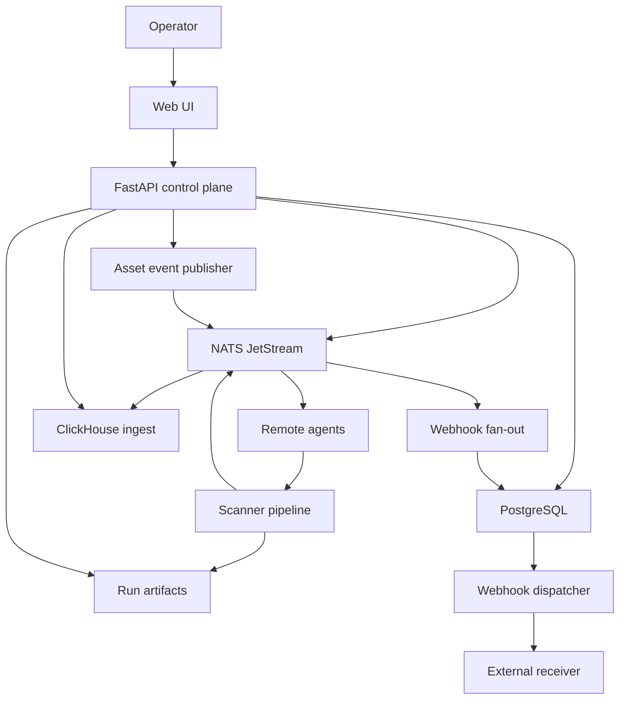

# Architecture

Shapoclyack separates control-plane state, scan execution, analytical results, and the operator interface. Optional services are activated by configuration; the scanner can still run as a standalone process.

## Components

| Component | Responsibility | Persistent data |
|---|---|---|
| Web UI | Operator workflows, tenant selection, and visualization | Browser JWT only |
| FastAPI API | Auth, tenant scope, jobs, schedules, assets, reports, webhooks, config | PostgreSQL and run artifacts |
| Scanner | Discovery, probing, enrichment, diff, and report generation | Run and checkpoint directories |
| Remote agent | Claim jobs, execute scanner, upload results | Local temporary work |
| PostgreSQL | OLTP state, tenants, memberships, jobs, agents, inventory, schedules, webhook queue/audit, overrides | Database volume |
| NATS JetStream | Job, ingest, asset-event, and integration messaging with durable delivery | JetStream volume |
| ClickHouse | Vulnerability and port analytics across runs | ClickHouse volume |

## Data flow


```mermaid
flowchart TD
    U["Operator"] --> W["Web UI"]
    W --> A["FastAPI control plane"]
    A --> P["PostgreSQL"]
    A --> N["NATS JetStream"]
    N --> G["Remote agents"]
    G --> S["Scanner pipeline"]
    S --> R["Run artifacts"]
    S --> N
    N --> C["ClickHouse ingest"]
    A --> R
    A --> C
    A --> E["Asset event publisher"]
    E --> N
    N --> F["Webhook fan-out"]
    F --> P
    P --> D["Webhook dispatcher"]
    D --> X["External receiver"]
```

In local execution mode, the API launches the scanner without the NATS job path. In agent mode, a worker claims the tenant-scoped job and reports completion through the API or configured broker.

## Control-plane state

Jobs and the agent registry are rows in PostgreSQL (`jobs`, `agents`), not process memory. Any API replica therefore sees the same queue and fleet, and a restart does not lose persisted control-plane state. Claims are serialized with `SELECT … FOR UPDATE SKIP LOCKED`, so concurrent agents receive different jobs across replicas.

### Job lifecycle

A job holds one of six states, and transitions are validated by `api/services/job_states.py`:

```text
queued ─┬─→ claimed ─┬─→ running ──→ succeeded | failed
        │            └─→ succeeded | failed
        ├─→ running ──→ succeeded | failed        (local execution)
        └─→ cancelled                             (nothing has taken it yet)

claimed | running ──→ queued                      (eligible expired agent lease)
```

- `claimed` means an agent has taken the job but has not yet reported active work.
- `cancelled` is available only before execution has started. The API does not claim to stop work that is already running.
- terminal outcomes are not rewritten by late retries.

### Idempotency and fencing

`POST /api/jobs` accepts `Idempotency-Key`, scoped per tenant. Repeating a successful creation request returns the existing job rather than creating another one.

Agent result uploads can carry both an idempotency key and the claim `attempt`. The attempt acts as a fencing token: a stale worker cannot overwrite the result of a later lease/claim after its own lease expired.

Scheduled dispatch also uses deterministic idempotency keys derived from the schedule due time. This remains a defense-in-depth control even though dispatcher leadership is now implemented.

### Leases and orphan recovery

Jobs handed to executors carry `claimed_until`. Agents renew through heartbeats; local-mode jobs renew from the API process that owns the scan.

The reaper acts on expired leases:

- agent jobs can be requeued until the configured maximum number of attempts is reached;
- local jobs are failed because no other replica owns their in-process executor.

The reaper runs on every replica and coordinates through row locking rather than leader election.

### Schedule dispatcher leadership

The schedule dispatcher starts in every API replica, but only the replica holding a PostgreSQL session-scoped advisory lock dispatches schedules. Followers retry acquisition on later ticks. The metric `octo_scheduler_is_leader` should be `1` on exactly one healthy dispatcher replica.

The advisory lock is intentionally not treated as a fencing token. A brief overlap can exist while a failed leader notices that its database session is gone, so the schedule idempotency key remains necessary to make duplicate dispatch attempts harmless.

SQLite fallback deployments do not provide distributed advisory locking and are treated as single-process execution environments.

Installations upgrading from older file-backed job/agent state import the legacy JSON state once and rename it to `*.imported`.

## Scanner stages

The pipeline is staged so partial output can be inspected and long-running work can resume:

1. validate input contract and configuration;
2. resolve domains and normalize targets;
3. discover alive hosts;
4. collect hostnames and optional passive discoveries;
5. scan TCP/UDP ports;
6. run service, OS, NSE, and optional Nuclei checks;
7. enrich vulnerabilities and assets;
8. calculate run and asset changes;
9. write reports, notifications, and export artifacts.

Optional discovery modules can identify candidates or findings without automatically expanding active scan scope. Read configuration guidance before enabling third-party or shared-infrastructure probes.

## Finding and risk model

Findings are not all equivalent. The normalized finding contract can carry a class, confidence, confirmation requirement, evidence, EPSS/KEV context, contextual score, decision, and a human-readable risk explanation.

Confirmed vulnerabilities and lower-confidence exposure/hypothesis records therefore remain distinguishable through the pipeline and UI. The scoring layer must not promote an unconfirmed observation above a confirmed high-risk vulnerability solely because a text pattern resembled a CVE.

The current model provides contextual prioritization for run findings (`nist-1`)
and tracks findings as entities with lifecycle, SLA and an audit trail
([vulnerability-lifecycle.md](vulnerability-lifecycle.md)). Asset business
context (owner, service, environment, data class, exposure) and a per-asset
risk rollup live on the asset card ([asset-context.md](asset-context.md)).
Remaining product surfaces (full asset-centric view, exposure management)
are tracked in `docs/ui-ux-redesign-roadmap.md`.

## Identity and tenancy

- Console credentials are configured separately from tenant memberships.
- Server-side membership rows determine which tenants a console user may act in and the role inside each tenant.
- Platform admins may use fleet-wide views where the API explicitly permits them.
- Agent JWTs carry agent identity and tenant context.
- The API is authoritative for tenant scope; a client-provided `tenant_id` is only a selector among tenants already granted to the principal.
- Jobs, assets, schedules, runs, provisioning keys, endpoint inventory, agent claims, webhook subscriptions, and webhook deliveries are tenant-bound.
- Direct lookup of another tenant's resource returns `404` where revealing existence would leak information.
- The Web UI exposes a global tenant switcher and clears cached query data when tenant context changes.

Tenant IDs created through the current API are constrained to a route- and NATS-safe representation. Legacy IDs that cannot be embedded injectively in NATS subjects use a reserved hash token rather than lossy character replacement, preventing two tenant IDs from collapsing onto one routing subject.

Completed run directories carry `tenant.json`. Historical/direct scanner runs without that marker are treated as belonging to `default` for backward compatibility.

See [API and RBAC](api-and-rbac.md) for endpoint-level authorization behavior.

## Asset events

A finished run's `diff.json` carries normalized asset-level changes: `new_asset`, `new_open_port`, `new_cve`, and `cert_expiring`. The API also emits `decommissioned_host` when an operator moves an asset to the decommissioned state.

The API publishes these events to JetStream on `events.asset.{tenant_token}.{kind}`. Publishing belongs in the control plane rather than the scanner because tenant identity is a property of the authorized job; remote scanner workers do not need broker authority merely to produce findings.

Publishing is best-effort and does not turn an otherwise successful scan into a failed job when the broker is unavailable. The full change set remains in `diff.json`, while `octo_asset_events_published_total{kind,outcome}` records published, errored, or skipped notifications.

The synchronous publish path is bounded by a batch deadline and stops after repeated broker failures. A per-run cap prioritizes actionable event kinds before truncation so a large wave of newly discovered hosts cannot crowd all `new_cve` events out of the notification budget.

Event IDs are content-derived and include tenant, run, kind, host, port, protocol, and finding identity where applicable. This makes upload retries idempotent inside JetStream's duplicate window while preserving a genuinely new occurrence in a later run.

## Outbound webhooks

Outbound webhooks are the first consumer of the asset-event stream. A tenant subscription contains routing policy such as event kinds and an optional minimum severity for event types that actually have severity.

Two workers deliberately separate broker consumption from network delivery:

1. a durable JetStream consumer (`octo-webhook-fanout` on `events.asset.>`) validates each envelope, materializes matching deliveries in PostgreSQL, and acknowledges the message;
2. a dispatcher claims due rows and sends HTTP requests outside the database transaction.

This split keeps slow or broken receivers from creating JetStream consumer lag and prevents a hanging HTTP request from holding a database connection.

`webhook_deliveries` is intentionally the retry queue, dead-letter queue, and audit trail in one table. Pending rows carry `next_attempt_at`; exhausted or non-retryable rows become `dead`; delivered rows remain as delivery history until retention removes them. Replay of a dead delivery does not require the broker because the row contains the payload.

The dispatcher runs in every API replica. It does not need leader election: due rows are claimed with `FOR UPDATE SKIP LOCKED`, and a visibility timeout moves the claim deadline forward so replicas divide work and abandoned claims become eligible again. A batch is POSTed serially, so that timeout scales with the size of the claim — one `OCTO_WEBHOOK_TIMEOUT_SECONDS` per claimed row plus two of slack, never under 30 seconds — otherwise the lease expires mid-batch and a peer re-sends a delivery still in flight. A dispatcher that fails part-way through a batch releases the rows it never attempted back to the queue instead of letting them sit out that window; they keep their retry budget, because no attempt was made.

### Webhook deployment modes

The two halves are switched independently, so an installation can shape which
replicas talk to the broker and which open connections to third parties
(#153). Every mode keeps the `/api/webhooks` surface — subscriptions, the DLQ
and its replay, the audit trail — because those are rows, not threads.

| Mode | `OCTO_WEBHOOK_FANOUT_ENABLED` | `OCTO_WEBHOOK_DISPATCH_ENABLED` | What the replica does |
|------|-------------------------------|---------------------------------|-----------------------|
| Default | `true` | `true` | Consumes events and delivers; correct at any replica count |
| API-only | `false` | `false` | Serves the API; something else must run the other two |
| Fan-out worker | `true` | `false` | Turns events into delivery rows; never opens an outbound connection, so it needs no egress |
| Egress worker | `false` | `true` | Claims due rows and delivers; the only replicas that need a route to receivers |

With `OCTO_WEBHOOKS_ENABLED=false` none of it runs and the routes are not
registered, whatever the two flags say. Fan-out additionally needs
`OCTO_NATS_URL`: with no broker there is no stream to consume, and the flag
is then moot. At least one replica must run each half, or events accumulate as
consumer lag (fan-out off everywhere) or as `pending` rows (dispatch off
everywhere) — both are visible: `octo_nats_consumer_pending` for the former,
`octo_webhook_delivery_queue{status="pending"}` for the latter.

Retry classification is bounded and explicit: timeouts, 5xx, 408, and 429 retry with capped exponential backoff; other 4xx responses are dead-lettered immediately rather than replaying the same malformed request until the budget is exhausted.

Webhook payloads are signed by default with HMAC over `{timestamp}.{body}`. The secret is generated at subscription creation, returned once, stored write-only from the API perspective, and rotatable. Receivers should validate both the signature and timestamp freshness.

Webhook targets are checked for SSRF at configuration time and again before delivery. Loopback, link-local, private, metadata-style, and otherwise non-global destinations are rejected by default; redirects are not followed. `OCTO_WEBHOOK_ALLOW_PRIVATE_TARGETS=true` is an explicit deployment opt-in for trusted on-cluster receivers.

## Outbound HTTP from the scanner

Most scanner stages talk to a constant, source-literal host (RIPEstat, crt.sh,
cloud provider endpoints) over `httpx` with default redirect handling. That is
adequate precisely because the operator's input never chooses the destination.

The org profile module breaks that assumption: the `ownership` stage learns its
next hop from the IANA RDAP bootstrap file and from `rdap.org`'s 302 to the
registry server, so a remote party names the address. Those requests go through
`scanner/pipeline/safe_http.py`, which applies the same boundary the webhook
dispatcher applies outbound: HTTPS only, no userinfo, rejection when *any*
resolved A/AAAA is non-global or multicast, and a TCP connection opened to the
already-validated IP literal while SNI and certificate verification use the DNS
name. Without that pinning a target with TTL=0 can answer the validating
`getaddrinfo` and the library's connect-time lookup differently. Bodies are read
under a byte cap and a single wall-clock deadline covering the whole redirect
chain, and each `Location` is re-validated by the same code as the first hop, so
a redirect cannot downgrade to http or walk inward.

None of this is configurable — there is no setting to disable verification or
pinning. The module is a deliberate second implementation rather than an import
of `api/services/integrations/delivery.py`: the scanner ships as its own
container and does not depend on the API package.

## Storage boundaries

PostgreSQL is the primary transactional store. ClickHouse is an analytical projection, not the source of truth for users, memberships, jobs, webhook state, or asset lifecycle. Run artifacts remain on filesystem/PVC storage so operators can inspect raw tool output and downloadable reports.

NATS JetStream is a messaging layer, not the authoritative database for job or delivery state. Durable streams carry asynchronous work and asset events; business state remains persisted in PostgreSQL or run artifacts as appropriate.

## Trust boundaries

| Boundary | Main controls |
|---|---|
| Browser → API | JWT, server-side tenant/role checks, TLS at ingress, no secret values in status responses |
| Agent → API/broker | Provisioning exchange, short-lived agent JWT, tenant match, claim fencing |
| API → databases | Dedicated credentials, network policy, least privilege |
| API → external integrations | Tenant-admin authorization for writes, signed payloads, bounded retries/timeouts, write-only secrets, destination validation |
| Scanner → targets | Explicit scope, rate caps, timeouts, isolated workers |
| Artifacts → UI | Path validation, tenant authorization, binary-safe download endpoint |
| External enrichment | Opt-in providers, candidate caps, timeouts, fail-soft parsing |

## Deployment topology

The all-in-one image packages scanner tools, API, and static Web UI. The thin API image excludes scanner execution tools and is appropriate for results-only or remote-agent deployments. Kubernetes overlays add agents, enrichment storage, read-only API behavior, and production resource settings without changing the base manifests.

For deployable topology and exact manifest behavior, [k8s/README.md](../k8s/README.md) and rendered Kustomize output are authoritative.
