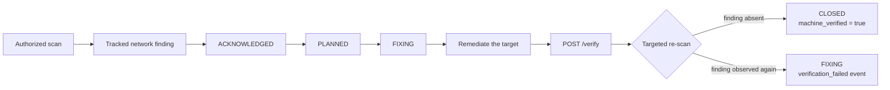

# Closed-loop remediation demo

This walkthrough demonstrates the part of Shapoclyack that is easiest to verify
from the outside: a network finding is tracked as work, remediated on the target,
and then **re-tested before it is counted as a verified closure**.

The demo uses an authorized lab target that you control. It does not require a
specific vulnerable product and does not include exploit steps: start with any
network finding that your own test environment can safely remediate by patching,
reconfiguring, or disabling the affected service.

> [!WARNING]
> Scan only systems you own or are explicitly authorized to assess. A fresh
> Shapoclyack tenant is fail-closed until an administrator approves its scan scope.

## What you will prove



The important distinction is the last step: a ticket or an operator can say that
work is done, but only the verification scan can produce
`machine_verified = true` for a network finding.

## Visual demo capture plan

The repository does not ship fabricated UI screenshots. When recording the live
demo, capture these four frames from one synthetic/authorized lab tenant so the
README, release notes, articles and video all tell the same story:

| Frame | UI surface | What must be visible | Suggested file |
|---|---|---|---|
| **1. Finding** | `/vulnerabilities/view?vulnId=…` | network finding identity, affected asset/service, risk context and current lifecycle state | `01-finding.png` |
| **2. Remediation** | `/remediation` or finding detail | the same finding in `FIXING`, with owner/SLA context; no unrelated customer data | `02-remediation.png` |
| **3. Verify** | finding detail | the **Verify** action and the transition to `VERIFYING` after a targeted re-scan is dispatched | `03-verifying.png` |
| **4. Proof** | finding detail + event timeline | `CLOSED`, `machine_verified = true`, `closure_reason = verified_remediated`, and the `verification_passed` event | `04-machine-verified.png` |

Capture rules:

- use only synthetic tenant names, users, domains and addresses;
- do not show API tokens, cookies, private IP inventories from real customers,
  ticket-system secrets or browser developer tools;
- keep the same finding visible across all four frames;
- crop tightly enough that the lifecycle change is legible at GitHub README width;
- use the default dark theme for consistency with the documented UI;
- if verification fails, keep that capture too — `verification_failed → FIXING`
  is useful evidence that the workflow does not rubber-stamp closure.

A short GIF/video should use the same sequence:
**Finding → FIXING → Verify → machine-verified closure**. Do not cut away during
the verification state; that transition is the product claim being demonstrated.

## 1. Start a local evaluation environment

Follow [Getting started](getting-started.md) through the first authorized scan.

For the local `kind` environment:

```bash
scripts/dev-up.sh
curl --fail http://127.0.0.1:8080/api/health
```

Use an authorized lab target that produces at least one **network-scan** finding.
The documentation-only example addresses in Getting Started are not expected to
produce useful findings.

## 2. Authenticate as the demo operator

The dev overlay seeds evaluation-only accounts. Do not expose these credentials
outside the local lab.

```bash
API=http://127.0.0.1:8080

TOKEN=$(curl -fsS "$API/api/auth/login" \
  -H 'Content-Type: application/json' \
  -d '{"username":"operator","password":"operator-change-me"}' \
  | python3 -c 'import json,sys; print(json.load(sys.stdin)["access_token"])')
```

## 3. Select a tracked network finding

List open findings created by the network scanner:

```bash
curl -fsS "$API/api/vulnerabilities?source=scan&open_only=true&limit=20" \
  -H "Authorization: Bearer $TOKEN" | python3 -m json.tool
```

Pick one finding that is safe to remediate in the lab and export its id:

```bash
export VULN_ID='<vuln_id>'
```

You can inspect the exact finding before changing state:

```bash
curl -fsS "$API/api/vulnerabilities/$VULN_ID" \
  -H "Authorization: Bearer $TOKEN" | python3 -m json.tool
```

## 4. Move the finding into remediation

A newly tracked finding normally starts at `OPEN`. Move it through the explicit
workflow instead of jumping straight to a closed state:

```bash
curl -fsS -X POST "$API/api/vulnerabilities/$VULN_ID/transition" \
  -H "Authorization: Bearer $TOKEN" \
  -H 'Content-Type: application/json' \
  -d '{"state":"ACKNOWLEDGED","note":"demo: triaged"}' | python3 -m json.tool

curl -fsS -X POST "$API/api/vulnerabilities/$VULN_ID/transition" \
  -H "Authorization: Bearer $TOKEN" \
  -H 'Content-Type: application/json' \
  -d '{"state":"PLANNED","note":"demo: remediation planned"}' | python3 -m json.tool

curl -fsS -X POST "$API/api/vulnerabilities/$VULN_ID/transition" \
  -H "Authorization: Bearer $TOKEN" \
  -H 'Content-Type: application/json' \
  -d '{"state":"FIXING","note":"demo: remediation in progress"}' | python3 -m json.tool
```

If the finding is already further along, continue from its current legal state.
Illegal lifecycle jumps return `409` rather than silently rewriting history.

## 5. Remediate the target

Apply the real fix **on the authorized target**, outside Shapoclyack. For example:

- install the vendor patch;
- remove or disable the affected service;
- correct the exposed configuration;
- restrict the service so the original scanner observation is no longer true.

The demo is deliberately not tied to one vulnerability. What matters is that the
same observation that created the finding can be tested again after the change.

## 6. Trigger mechanical verification

```bash
curl -fsS -X POST "$API/api/vulnerabilities/$VULN_ID/verify" \
  -H "Authorization: Bearer $TOKEN" | python3 -m json.tool
```

For a valid network finding in `FIXING`, the API dispatches a targeted re-scan
and moves the finding to `VERIFYING`. The request returns `409` if no
verification scan can be dispatched rather than leaving a fake verification in
progress.

Endpoint-software findings are intentionally different: they are verified by the
next accepted endpoint inventory snapshot, not by this route.

## 7. Read the result

Re-read the finding:

```bash
curl -fsS "$API/api/vulnerabilities/$VULN_ID" \
  -H "Authorization: Bearer $TOKEN" | python3 -m json.tool
```

There are two meaningful outcomes:

| Outcome | Meaning |
|---|---|
| `state = CLOSED`, `machine_verified = true`, `closure_reason = verified_remediated` | the targeted re-scan did not re-observe the finding |
| `state = FIXING` | the finding was observed again and remediation is not yet proven |

Inspect the immutable finding timeline as the evidence trail:

```bash
curl -fsS "$API/api/vulnerabilities/$VULN_ID/events?limit=100" \
  -H "Authorization: Bearer $TOKEN" | python3 -m json.tool
```

A successful verification records a `verification_passed` event. A failed
re-check records `verification_failed` and returns the work to `FIXING`.

## UI version of the same demo

The same flow is visible without curl:

1. **Jobs** — launch the authorized scan.
2. **Vulnerabilities** — open a tracked network finding.
3. Move it through triage/remediation states.
4. Apply the fix on the lab target.
5. Trigger **Verify** from the finding workflow.
6. Watch the finding resolve as verified or return to remediation.
7. Open **Adoption** to see verified closures separated from manual/ticket-driven closures.

For the route map and permissions, see [Web interface](ui.md) and
[API and RBAC](api-and-rbac.md). For the full state machine and closure semantics,
see [Vulnerability lifecycle](vulnerability-lifecycle.md).
