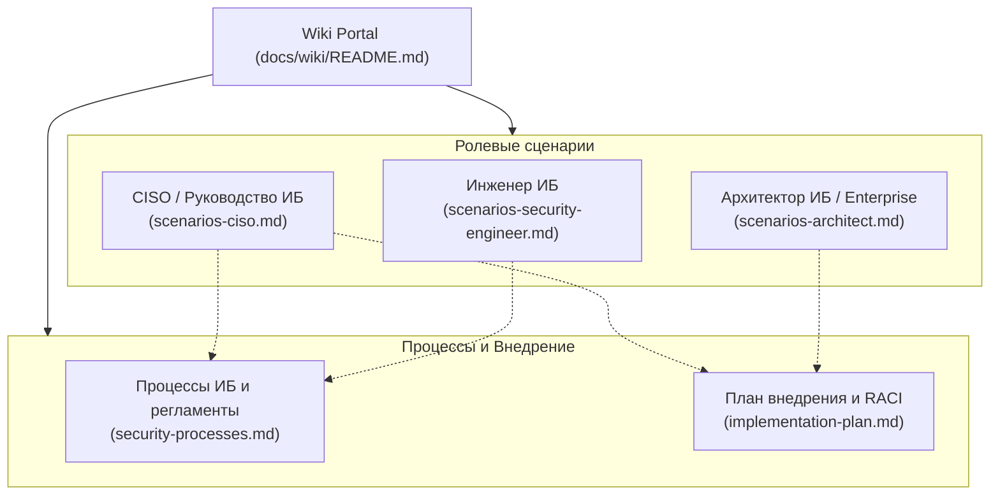

# Корпоративная база знаний (Wiki) Shapoclyack

Добро пожаловать в корпоративную базу знаний (Wiki) платформы **Shapoclyack** — современной self-hosted системы управления внешней поверхностью атаки (EASM, External Attack Surface Management) и рисками уязвимостей (RBVM, Risk-Based Vulnerability Management).

Данная база знаний систематизирует прикладные сценарии использования для ключевых участников процесса обеспечения информационной безопасности, регламентирует сквозные процессы ИБ и определяет дорожную карту промышленного внедрения платформы.

---

## 🧭 Навигация по Wiki

### 1. Ролевые сценарии использования
* [**Сценарии для Инженера ИБ**](scenarios-security-engineer.md) — операционная деятельность: запуск и профилирование сканов, углубленный триаж находок с доказательной базой, управление жизненным циклом на канбан-доске ремедиации, **инструментальная верификация закрытия**, устранение Patch Gaps на хостах и фильтрация шума.
* [**Сценарии для Архитектора (Security & Enterprise)**](scenarios-architect.md) — системная перспектива: инвентаризация и картографирование периметра, обнаружение Shadow IT, интеграция с CMDB/AD, CI/CD и SIEM/SOAR, распределенная топология remote agents (DMZ/VPC), контроль сегментации и оценка соответствия стандартам (PCI DSS, CIS, ISO 27001).
* [**Сценарии для CISO (Директора по ИБ)**](scenarios-ciso.md) — стратегическое управление: дашборд Risk Overview, метрика совокупного риска (Estate Risk по NIST SP 800-30), контроль угроз в дикой природе (CISA KEV), соблюдение SLA и MTTR, метрики зрелости и эффективности команды (Adoption), брендированная отчетность для правления и аудиторов.

### 2. Процессы и регламенты
* [**Описание операционных процессов ИБ**](security-processes.md) — регламентация сквозных процессов:
  1. *Процесс управления уязвимостями (Vulnerability Management Lifecycle)* от открытия до механической проверки;
  2. *Непрерывное управление поверхностью атаки (EASM)* и учет теневых активов;
  3. *Экстренное реагирование на 0-day и активные угрозы (Emergency Response / CISA KEV)*;
  4. *Взаимодействие ИБ и ИТ/DevOps*: двусторонняя синхронизация с таск-трекерами (Jira/DefectDojo), матрица SLA и регламент согласования исключений (Risk Acceptance).

### 3. Развертывание и внедрение
* [**Комплексный план внедрения платформы**](implementation-plan.md) — пошаговый план развертывания на 12 недель, 4 ключевые фазы (от пилота до промышленной эксплуатации), архитектурные схемы развертывания, матрица ответственности RACI и метрики эффективности (KPI).

---

## 💎 Ключевые архитектурные принципы Shapoclyack

Shapoclyack спроектирован так, чтобы преодолеть классические проблемы традиционных сканеров уязвимостей: «слепой шум», бесконечные списки некритичных CVE и отсутствие реального контроля за устранением проблем.

### 1. Первичность актива над IP-адресом (Asset-Centric)
В современной динамичной инфраструктуре (облака, Kubernetes, DHCP, балансировщики) IP-адрес является временным атрибутом. 
* В Shapoclyack история устранения уязвимостей, назначенные владельцы и контекст привязаны к сущности **Asset** (вычисляемой по комбинации FQDN, постоянных идентификаторов и сертификатов).
* При смене IP-адреса история закрытий и открытые тикеты сохраняются, исключая повторные ложные открытия при плановой смене сетевой адресации.

### 2. Двухосевая оценка риска по стандарту NIST SP 800-30 Rev. 1
Платформа отвергает одномерную сортировку по базовому баллу CVSS. Риск вычисляется строго как:
$$\text{Risk} = f(\text{Likelihood}, \text{Impact})$$

* **Likelihood (Вероятность эксплуатации):** вычисляется на базе сетевой доступности (`AV`/`AC` из вектора), вероятности EPSS, возраста уязвимости, наличия компенсирующих мер (WAF/CDN) и **фактической зрелости эксплойта (Exploit Maturity)**:
  - `attacked` (CISA KEV — эксплуатируется в реальных атаках: жесткий пол вероятности 96–100);
  - `weaponized` (эксплойт включен в Metasploit/автоматизированные фреймворки);
  - `proof_of_concept` (публичный PoC);
  - `theoretical` (эксплойта нет: верхний потолок вероятности 20, что исключает раздувание паники).
* **Impact (Ущерб):** определяется бизнес-критичностью актива (`asset_criticality` от 0 до 4), назначенной владельцем системы или импортированной из CMDB.

### 3. Инструментальная верификация закрытия (Mechanical Re-verification)
Уязвимость не может быть закрыта «на слово» оператором или простой сменой статуса в Jira.
* Для сетевых уязвимостей перевод в статус `CLOSED` требует успешного прохождения таргетированного пересканирования (`POST /api/vulnerabilities/{id}/verify`), которое запускает проверку именно того хоста, порта и скрипта NSE/Nuclei. Статус закрывается с признаком `machine_verified = true`.
* Если уязвимость обнаружена повторно — статус возвращается в `FIXING` с сохранением инцидента в аудит-логе.
* Для уязвимостей ПО хостов (Endpoint Software) закрытие подтверждается следующим принятым отчетом инвентаризации агента Lariska.
* Ручное закрытие без проверки маркируется в системе как `manual` (`machine_verified = false`) и отображается на дашборде качества работы.

### 4. Оценка применимости патчей с учетом дистрибутива (Vendor Advisory Matching)
При анализе установленного на серверах ПО Shapoclyack сопоставляет пакеты не с абстрактными диапазонами NVD CPE (которые дают колоссальный шум из-за бэкпортов в Debian, Ubuntu, RHEL), а с официальными бюллетенями безопасности дистрибутивов (Ubuntu USN, Debian Security Tracker). 
Платформа формирует **Patch Gap** — конкретный пакет и готовые консольные команды обновления (`apt-get install --only-upgrade <pkg>=<fixed_version>`), минимизируя время инженера на анализ.

### 5. Метрики результата, а не шума (Adoption & Noise Tracking)
Платформа непрерывно измеряет:
* Реальный процент подтвержденных машиной закрытий;
* Медианное время устранения (MTTR);
* Соблюдение SLA по критичности;
* Количество подавленных ложных срабатываний и «шумящих» детекторов.

---

## 🔗 Связь с технической документацией

Данная Wiki опирается на детальные технические спецификации Shapoclyack:

| Спецификация | Назначение |
|---|---|
| [docs/architecture.md](../architecture.md) | Архитектура компонентов, NATS JetStream, ClickHouse, потоки данных |
| [docs/vulnerability-lifecycle.md](../vulnerability-lifecycle.md) | Модель состояний уязвимостей, машина переходов и правила SLA |
| [docs/risk-scoring.md](../risk-scoring.md) | Детальное описание модели риска NIST SP 800-30 и формула расчета |
| [docs/software-cve-matching.md](../software-cve-matching.md) | Алгоритм сопоставления ПО с бюллетенями вендоров дистрибутивов |
| [docs/reports-and-compliance.md](../reports-and-compliance.md) | Фабрика отчетов и маппинг контролей PCI DSS, CIS v8, ISO 27001 |
| [docs/asset-context.md](../asset-context.md) | Бизнес-контекст активов (владелец, среда, классификация, интеграция с CMDB) |
| [docs/operations.md](../operations.md) | Администрирование, резервное копирование, восстановление, мониторинг |
| [docs/ui.md](../ui.md) | Полный справочник экранных форм и маршрутов веб-интерфейса |
