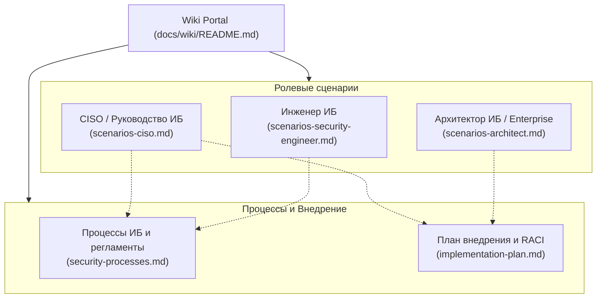

# Корпоративная база знаний (Wiki) Shapoclyack

Добро пожаловать в корпоративную базу знаний (Wiki) платформы **Shapoclyack** — современной self-hosted системы управления внешней поверхностью атаки (EASM, External Attack Surface Management) и рисками уязвимостей (RBVM, Risk-Based Vulnerability Management).

Данная база знаний систематизирует прикладные сценарии использования для ключевых участников процесса обеспечения информационной безопасности, регламентирует сквозные процессы ИБ и определяет дорожную карту промышленного внедрения платформы.

---

## 🧭 Навигация по Wiki

### 1. Ролевые сценарии использования
* [**Сценарии для Инженера ИБ**](scenarios-security-engineer.md) — операционная деятельность: запуск и профилирование сканов, углубленный триаж находок с доказательной базой, управление жизненным циклом на канбан-доске ремедиации, **инструментальная верификация закрытия**, устранение Patch Gaps на хостах и фильтрация шума.
* [**Сценарии для Архитектора (Security & Enterprise)**](scenarios-architect.md) — системная перспектива: инвентаризация и картографирование периметра, обнаружение Shadow IT, REST-контракт бизнес-контекста для синхронизации с CMDB/AD ([#350](https://github.com/onixus/Shapoclyack/issues/350)), CI/CD и SIEM/SOAR, распределенная топология remote agents (DMZ/VPC), контроль сегментации и оценка соответствия стандартам (PCI DSS, CIS, ISO 27001).
* [**Сценарии для CISO (Директора по ИБ)**](scenarios-ciso.md) — стратегическое управление: дашборд Risk Overview, метрика совокупного риска (Estate Risk по NIST SP 800-30), контроль угроз в дикой природе (CISA KEV), соблюдение SLA и MTTR, метрики зрелости и эффективности команды (Adoption), брендированная отчетность для правления и аудиторов.

### 2. Процессы и регламенты
* [**Описание операционных процессов ИБ**](security-processes.md) — регламентация сквозных процессов:
  1. *Процесс управления уязвимостями (Vulnerability Management Lifecycle)* от открытия до механической проверки;
  2. *Непрерывное управление поверхностью атаки (EASM)* и учет теневых активов;
  3. *Экстренное реагирование на 0-day и активные угрозы (Emergency Response / CISA KEV)*;
  4. *Взаимодействие ИБ и ИТ/DevOps*: синхронизация с таск-трекерами (Jira/DefectDojo; push автоматический, обратная проверка закрытия — по запросу до [#347](https://github.com/onixus/Shapoclyack/issues/347)), матрица SLA и регламент согласования исключений (Risk Acceptance).

### 3. Развертывание и внедрение
* [**Комплексный план внедрения платформы**](implementation-plan.md) — пошаговый план развертывания на 12 недель, 4 ключевые фазы (от пилота до промышленной эксплуатации), архитектурные схемы развертывания, матрица ответственности RACI и метрики эффективности (KPI).

---

## ✅ Поддерживается сейчас / 🗺️ В roadmap

Wiki описывает **платформу, которая собрана**, а не ту, которую хочется описать.
Таблица ниже — граница между этими двумя. Ссылка на issue означает: в коде и
манифестах этого сейчас нет.

**Правило для авторов Wiki:** каждое утверждение о возможности сопровождается
ссылкой на файл в репозитории (маршрут, манифест, оверлей) или на тест, который
эту возможность проверяет. Если сослаться не на что — утверждение переезжает в
правую колонку со ссылкой на issue.

| Область | ✅ Поддерживается сейчас | 🗺️ В roadmap |
|---|---|---|
| **Развертывание** | kind для стенда (`k8s/kind-config.yaml`, `scripts/dev-up.sh`); `overlays/prod` — API в одной реплике, PostgreSQL, артефакты на PVC | HA-профиль: несколько реплик, HA-Postgres, кластер NATS ([#335](https://github.com/onixus/Shapoclyack/issues/335)); объектное хранилище артефактов вместо RWO PVC ([#336](https://github.com/onixus/Shapoclyack/issues/336)); модель сайзинга ([#337](https://github.com/onixus/Shapoclyack/issues/337)); Helm-чарт ([#341](https://github.com/onixus/Shapoclyack/issues/341)); OpenShift ([#342](https://github.com/onixus/Shapoclyack/issues/342)); air-gap ([#339](https://github.com/onixus/Shapoclyack/issues/339)) |
| **Транспорт и шифрование** | HTTPS на Ingress (`k8s/shapoclyack/examples/ingress.example.yaml`); агенты — только исходящие соединения; SMTP-доставка отчетов с проверкой сертификата; TLS до Postgres, ClickHouse и NATS настраивается явно ([operations.md](../operations.md#transport-encryption)) | клиентские сертификаты агентов = настоящий mTLS ([#309](https://github.com/onixus/Shapoclyack/issues/309), [#359](https://github.com/onixus/Shapoclyack/issues/359)); шифрование секретов интеграций в БД ([#310](https://github.com/onixus/Shapoclyack/issues/310)); подпись образов и pinned digest ([#313](https://github.com/onixus/Shapoclyack/issues/313)) |
| **Аутентификация и доступ** | Локальные аккаунты в Postgres, OIDC SSO, три роли (`admin`/`operator`/`viewer`), пер-тенантные provisioning keys со сроком жизни и сервисные токены; JWT агента привязан к его `agent_id`, состояния агента `active`/`disabled`/`quarantined`, отзыв ключа при удалении агента ([#308](https://github.com/onixus/Shapoclyack/issues/308)) | Отзыв сессий ([#314](https://github.com/onixus/Shapoclyack/issues/314)); MFA ([#315](https://github.com/onixus/Shapoclyack/issues/315)); ресинхронизация ролей и SCIM ([#316](https://github.com/onixus/Shapoclyack/issues/316)); SAML 2.0 и LDAP/AD ([#317](https://github.com/onixus/Shapoclyack/issues/317)); роль аудитора и разделение обязанностей ([#318](https://github.com/onixus/Shapoclyack/issues/318)); жизненный цикл пользователей и аттестация ([#324](https://github.com/onixus/Shapoclyack/issues/324)); иерархия организаций ([#326](https://github.com/onixus/Shapoclyack/issues/326)) |
| **Аудит и наблюдаемость** | `/metrics` в формате Prometheus, SLO-правила (`examples/prometheus-slo.rules.yaml`), журнал изменений контекста активов (`asset_context_events`) | Единый административный audit trail ([#327](https://github.com/onixus/Shapoclyack/issues/327)); выгрузка в SIEM ([#328](https://github.com/onixus/Shapoclyack/issues/328)); неизменяемость журналов ([#329](https://github.com/onixus/Shapoclyack/issues/329)); JSON-логи и request-id ([#330](https://github.com/onixus/Shapoclyack/issues/330)); честный readiness ([#331](https://github.com/onixus/Shapoclyack/issues/331)); дашборды Grafana ([#334](https://github.com/onixus/Shapoclyack/issues/334)) |
| **Бизнес-контекст активов** | REST-контракт: `PATCH /api/assets/{id}`, поля владельца, среды, классификации и критичности ([asset-context.md](../asset-context.md)) | Импорт из CMDB/AD как функция платформы, а не внешний скрипт ([#350](https://github.com/onixus/Shapoclyack/issues/350)) |
| **Тикеты и рабочий процесс** | Push находок в Jira, ServiceNow, DefectDojo; кнопка проверки закрытия; вебхуки событий активов | Поллер обратной синхронизации ([#347](https://github.com/onixus/Shapoclyack/issues/347)); согласование принятия риска ([#348](https://github.com/onixus/Shapoclyack/issues/348)); события SLA-breach и истечения исключений ([#349](https://github.com/onixus/Shapoclyack/issues/349)); настраиваемый маппинг полей, GitLab/GitHub/Azure DevOps ([#353](https://github.com/onixus/Shapoclyack/issues/353)); окна обслуживания ([#352](https://github.com/onixus/Shapoclyack/issues/352)); массовые действия в консоли ([#346](https://github.com/onixus/Shapoclyack/issues/346)) |
| **Сканирование** | Внешний периметр, скоуп с юридическим утверждением, remote agents (NATS-pull или HTTPS-claim), инвентаризация ПО через агента Lariska, механическая верификация закрытия | Windows-агент и матчинг Windows/RHEL/SUSE ([#358](https://github.com/onixus/Shapoclyack/issues/358)); прокси и внутренний CA у агента ([#359](https://github.com/onixus/Shapoclyack/issues/359)); остановка запущенного скана ([#360](https://github.com/onixus/Shapoclyack/issues/360)); привязка агента к сегменту ([#361](https://github.com/onixus/Shapoclyack/issues/361)); throttle и OT/ICS-профиль ([#362](https://github.com/onixus/Shapoclyack/issues/362)); L2-обнаружение и IPv6 ([#364](https://github.com/onixus/Shapoclyack/issues/364)); приоритеты очереди ([#365](https://github.com/onixus/Shapoclyack/issues/365)); credentialed-сканирование ([#368](https://github.com/onixus/Shapoclyack/issues/368)) |
| **Отчеты и комплаенс** | PDF/HTML/JSON, брендирование по тенанту, маппинг PCI DSS / CIS v8 / ISO 27001 ([reports-and-compliance.md](../reports-and-compliance.md)) | CSV/XLSX, подпись доказательств, доставка в S3/SFTP ([#355](https://github.com/onixus/Shapoclyack/issues/355)); пользовательские фреймворки и российская нормативка ([#356](https://github.com/onixus/Shapoclyack/issues/356)); legal hold и удаление данных субъекта ([#332](https://github.com/onixus/Shapoclyack/issues/332)) |
| **Данные и восстановление** | Резервное копирование и отработанный restore-drill для PostgreSQL ([operations.md](../operations.md#backup-and-disaster-recovery)) | Доказанное восстановление ClickHouse, артефактов и JetStream ([#333](https://github.com/onixus/Shapoclyack/issues/333)); suspend/delete тенанта с удалением данных ([#325](https://github.com/onixus/Shapoclyack/issues/325)) |

Полный список: `gh issue list --label enterprise`.

---

## 💎 Ключевые архитектурные принципы Shapoclyack

Shapoclyack спроектирован так, чтобы преодолеть классические проблемы традиционных сканеров уязвимостей: «слепой шум», бесконечные списки некритичных CVE и отсутствие реального контроля за устранением проблем.

### 1. Первичность актива над IP-адресом (Asset-Centric)
В современной динамичной инфраструктуре (облака, Kubernetes, DHCP, балансировщики) IP-адрес является временным атрибутом. 
* В Shapoclyack история устранения уязвимостей, назначенные владельцы и контекст привязаны к сущности **Asset** (вычисляемой по комбинации FQDN, постоянных идентификаторов и сертификатов).
* При смене IP-адреса история закрытий и открытые тикеты сохраняются, исключая повторные ложные открытия при плановой смене сетевой адресации.

### 2. Двухосевая оценка риска по стандарту NIST SP 800-30 Rev. 1
Платформа отвергает одномерную сортировку по базовому баллу CVSS. Риск вычисляется строго как:
$$\text{Risk} = f(\text{Likelihood}, \text{Impact})$$

* **Likelihood (Вероятность эксплуатации):** вычисляется на базе сетевой доступности (`AV`/`AC` из вектора), вероятности EPSS, возраста уязвимости, наличия компенсирующих мер (WAF/CDN) и **фактической зрелости эксплойта (Exploit Maturity)**:
  - `attacked` (CISA KEV — эксплуатируется в реальных атаках: жесткий пол вероятности 96–100);
  - `weaponized` (эксплойт включен в Metasploit/автоматизированные фреймворки);
  - `proof_of_concept` (публичный PoC);
  - `theoretical` (эксплойта нет: верхний потолок вероятности 20, что исключает раздувание паники).
* **Impact (Ущерб):** определяется бизнес-критичностью актива (`asset_criticality` от 0 до 4), назначенной владельцем системы или импортированной из CMDB.

### 3. Инструментальная верификация закрытия (Mechanical Re-verification)
Уязвимость не может быть закрыта «на слово» оператором или простой сменой статуса в Jira.
* Для сетевых уязвимостей перевод в статус `CLOSED` требует успешного прохождения таргетированного пересканирования (`POST /api/vulnerabilities/{id}/verify`), которое запускает проверку именно того хоста, порта и скрипта NSE/Nuclei. Статус закрывается с признаком `machine_verified = true`.
* Если уязвимость обнаружена повторно — статус возвращается в `FIXING` с сохранением инцидента в аудит-логе.
* Для уязвимостей ПО хостов (Endpoint Software) закрытие подтверждается следующим принятым отчетом инвентаризации агента Lariska.
* Ручное закрытие без проверки маркируется в системе как `manual` (`machine_verified = false`) и отображается на дашборде качества работы.

### 4. Оценка применимости патчей с учетом дистрибутива (Vendor Advisory Matching)
При анализе установленного на серверах ПО Shapoclyack сопоставляет пакеты не с абстрактными диапазонами NVD CPE (которые дают колоссальный шум из-за бэкпортов в Debian, Ubuntu, RHEL), а с официальными бюллетенями безопасности дистрибутивов (Ubuntu USN, Debian Security Tracker). 
Платформа формирует **Patch Gap** — конкретный пакет и готовые консольные команды обновления (`apt-get install --only-upgrade <pkg>=<fixed_version>`), минимизируя время инженера на анализ.

### 5. Метрики результата, а не шума (Adoption & Noise Tracking)
Платформа непрерывно измеряет:
* Реальный процент подтвержденных машиной закрытий;
* Медианное время устранения (MTTR);
* Соблюдение SLA по критичности;
* Количество подавленных ложных срабатываний и «шумящих» детекторов.

---

## 🔗 Связь с технической документацией

Данная Wiki опирается на детальные технические спецификации Shapoclyack:

| Спецификация | Назначение |
|---|---|
| [docs/architecture.md](../architecture.md) | Архитектура компонентов, NATS JetStream, ClickHouse, потоки данных |
| [docs/vulnerability-lifecycle.md](../vulnerability-lifecycle.md) | Модель состояний уязвимостей, машина переходов и правила SLA |
| [docs/risk-scoring.md](../risk-scoring.md) | Детальное описание модели риска NIST SP 800-30 и формула расчета |
| [docs/software-cve-matching.md](../software-cve-matching.md) | Алгоритм сопоставления ПО с бюллетенями вендоров дистрибутивов |
| [docs/reports-and-compliance.md](../reports-and-compliance.md) | Фабрика отчетов и маппинг контролей PCI DSS, CIS v8, ISO 27001 |
| [docs/asset-context.md](../asset-context.md) | Бизнес-контекст активов (владелец, среда, классификация, интеграция с CMDB) |
| [docs/operations.md](../operations.md) | Администрирование, резервное копирование, восстановление, мониторинг |
| [docs/ui.md](../ui.md) | Полный справочник экранных форм и маршрутов веб-интерфейса |
