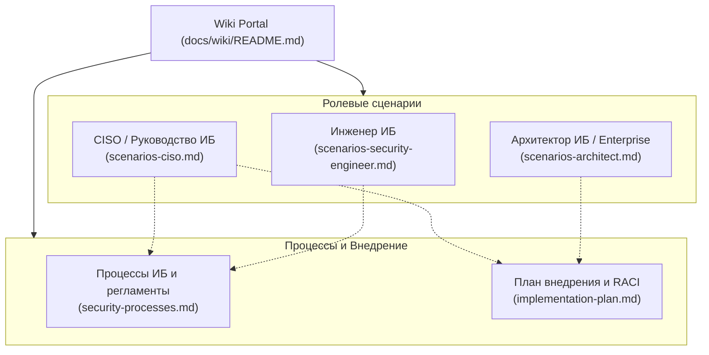

# Корпоративная база знаний (Wiki) Shapoclyack

Добро пожаловать в корпоративную базу знаний (Wiki) платформы **Shapoclyack** — современной self-hosted системы управления внешней поверхностью атаки (EASM, External Attack Surface Management) и рисками уязвимостей (RBVM, Risk-Based Vulnerability Management).

Данная база знаний систематизирует прикладные сценарии использования для ключевых участников процесса обеспечения информационной безопасности, регламентирует сквозные процессы ИБ и определяет дорожную карту промышленного внедрения платформы.

---

## 🧭 Навигация по Wiki

```mermaid
graph TD
    Wiki["Wiki Portal (docs/wiki/README.md)"]
    
    subgraph Roles ["Ролевые сценарии"]
        SE["Инженер ИБ<br/>(scenarios-security-engineer.md)"]
        ARCH["Архитектор ИБ / Enterprise<br/>(scenarios-architect.md)"]
        CISO["CISO / Руководство ИБ<br/>(scenarios-ciso.md)"]
    end
    
    subgraph Ops ["Процессы и Внедрение"]
        PROC["Процессы ИБ и регламенты<br/>(security-processes.md)"]
        PLAN["План внедрения и RACI<br/>(implementation-plan.md)"]
    end
    
    Wiki --> Roles
    Wiki --> Ops
    
    SE -.-> PROC
    ARCH -.-> PLAN
    CISO -.-> PROC
    CISO -.-> PLAN
```

### 1. Ролевые сценарии использования
* [**Сценарии для Инженера ИБ**](scenarios-security-engineer.md) — операционная деятельность: запуск и профилирование сканов, углубленный триаж находок с доказательной базой, управление жизненным циклом на канбан-доске ремедиации, **инструментальная верификация закрытия**, устранение Patch Gaps на хостах и фильтрация шума.
* [**Сценарии для Архитектора (Security & Enterprise)**](scenarios-architect.md) — системная перспектива: инвентаризация и картографирование периметра, обнаружение Shadow IT, импорт выгрузки CMDB/AD в реестр активов (коннекторы ServiceNow и LDAP/AD — [#350](https://github.com/onixus/Shapoclyack/issues/350)), CI/CD и SIEM/SOAR, распределенная топология сенсоров (DMZ/VPC), контроль сегментации и оценка соответствия стандартам (PCI DSS, CIS, ISO 27001).
* [**Сценарии для CISO (Директора по ИБ)**](scenarios-ciso.md) — стратегическое управление: дашборд Risk Overview, метрика совокупного риска (Estate Risk по NIST SP 800-30), контроль угроз в дикой природе (CISA KEV), соблюдение SLA и MTTR, метрики зрелости и эффективности команды (Adoption), брендированная отчетность для правления и аудиторов.

### 2. Процессы и регламенты
* [**Описание операционных процессов ИБ**](security-processes.md) — регламентация сквозных процессов:
  1. *Процесс управления уязвимостями (Vulnerability Management Lifecycle)* от открытия до механической проверки;
  2. *Непрерывное управление поверхностью атаки (EASM)* и учет теневых активов;
  3. *Экстренное реагирование на 0-day и активные угрозы (Emergency Response / CISA KEV)*;
  4. *Взаимодействие ИБ и ИТ/DevOps*: синхронизация с таск-трекерами (Jira/ServiceNow/DefectDojo; push автоматический, обратная вычитка статуса тикета — фоновым воркером `api/services/integrations/ticket_sync_worker.py` и кнопкой **Sync**), матрица SLA и регламент согласования исключений (Risk Acceptance).

### 3. Развертывание и внедрение
* [**Комплексный план внедрения платформы**](implementation-plan.md) — пошаговый план развертывания на 12 недель, 4 ключевые фазы (от пилота до промышленной эксплуатации), архитектурные схемы развертывания, матрица ответственности RACI и метрики эффективности (KPI).

---

## ✅ Поддерживается сейчас / 🗺️ В roadmap

Wiki описывает **платформу, которая собрана**, а не ту, которую хочется описать.
Таблица ниже — граница между этими двумя. Ссылка на issue в правой колонке
означает: в коде и манифестах этого сейчас нет; в левой — закрытая issue, по
которой это сделано. Таблица сверена с кодом `main @ 3ade4529` 2026-10-06; что
из этого ещё не вошло в релиз, см. `## Unreleased` в
[CHANGELOG.md](../../CHANGELOG.md).

**Правило для авторов Wiki:** каждое утверждение о возможности сопровождается
ссылкой на файл в репозитории (маршрут, манифест, оверлей) или на тест, который
эту возможность проверяет. Если сослаться не на что — утверждение переезжает в
правую колонку со ссылкой на issue.

| Область | ✅ Поддерживается сейчас | 🗺️ В roadmap |
|---|---|---|
| **Развертывание** | kind для стенда (`k8s/kind-config.yaml`, `scripts/dev-up.sh`); `overlays/prod` — API в одной реплике, PostgreSQL, артефакты на PVC; `overlays/prod-ha` — API от двух реплик с anti-affinity, HPA и PDB, кластер NATS из трёх узлов, внешний управляемый PostgreSQL ([high-availability.md](../high-availability.md)) | у `prod-ha` артефакты по умолчанию всё ещё на RWX-хранилище: объектное хранилище есть (`OCTO_ARTIFACT_BACKEND=s3`, [#336](https://github.com/onixus/Shapoclyack/issues/336)), но включается вручную; новые прогоны пишутся под префиксом тенанта, остаток по старым артефактам — [#311](https://github.com/onixus/Shapoclyack/issues/311); восстановление ClickHouse, артефактов и JetStream проверено локально на 10k активов ([disaster-recovery.md](../disaster-recovery.md)), кластерная приёмка — [#333](https://github.com/onixus/Shapoclyack/issues/333); модель сайзинга есть ([sizing.md](../sizing.md)), калибровка на стенде — [#337](https://github.com/onixus/Shapoclyack/issues/337); Helm-чарт ([#341](https://github.com/onixus/Shapoclyack/issues/341)); OpenShift ([#342](https://github.com/onixus/Shapoclyack/issues/342)). Air-gap закрыт: зеркала фидов и офлайн-бандл обогащения ([air-gap.md](../air-gap.md)) |
| **Транспорт и шифрование** | HTTPS на Ingress (`k8s/shapoclyack/examples/ingress.example.yaml`); сенсоры и агенты Lariska — только исходящие соединения; SMTP-доставка отчетов с проверкой сертификата; TLS до Postgres, ClickHouse и NATS настраивается явно ([operations.md](../operations.md#transport-encryption)); внутренний CA одной переменной `OCTO_CA_BUNDLE` для HTTPS, SMTP и NATS ([network-requirements.md](../network-requirements.md)); секреты интеграций (webhook-secret, токены Jira/ServiceNow/DefectDojo) шифруются в Postgres конвертным AES-256-GCM под `OCTO_MASTER_KEY` ([operations.md](../operations.md#secrets-at-rest)); клиентские сертификаты сенсоров, привязанные к токену сенсора (`OCTO_AGENT_MTLS_MODE=optional\|required`, по умолчанию `off`; выпуск через `POST /api/agent/certificate`, отзыв, `api/core/client_cert.py`, `tests/test_agent_mtls.py`, [operations.md](../operations.md#sensor-client-certificates)); подписанные обновления сенсора с откатом (`agent/update.py`, `scripts/update-agent.sh`, `tests/test_sensor_bundle.py`, [operations.md](../operations.md#sensor-bundle-updates)); образы релиза подписываются cosign и закреплены по digest ([supply-chain.md](../supply-chain.md)) | клиентский сертификат у агента Lariska (пока не умеет — режим `required` отказывает всем агентам; issue не заведена); CRL/OCSP — отзыв сейчас только собственным списком API; автоматическое обновление сенсоров по умолчанию (сейчас — только таймер оператора плюс `OCTO_AGENT_AUTO_UPDATE=true`); подпись сборок Lariska (issue не заведена); KEK во внешнем Vault Transit / KMS — `OCTO_MASTER_KEY_PROVIDER` знает имена, но реализован только `local` ([operations.md](../operations.md#vault-transit-and-cloud-kms)); производственная приёмка подписи и admission, эксплуатация ключа релиза ([#313](https://github.com/onixus/Shapoclyack/issues/313)) |
| **Аутентификация и доступ** | Локальные аккаунты в Postgres, OIDC SSO, три глобальные роли (`admin`/`operator`/`viewer`) и пять тенантных ролей разделения обязанностей (`auditor`, `scan-operator`, `scope-approver`, `token-admin`, `risk-approver`; `api/auth.py`, миграция `0049_rbac_permissions`), пер-тенантные provisioning keys со сроком жизни и сервисные токены; отзыв сессий (disable/delete/demote/смена пароля гасят выданный токен, `logout`, «завершить все сессии», ротация ключа подписи с `kid`); JWT сенсора и агента привязан к его `agent_id` (API-ресурс `agents`, `agent_kind = scanner` для сенсора и `endpoint` для агента Lariska), состояния `active`/`disabled`/`quarantined`, отзыв ключа при удалении ([#308](https://github.com/onixus/Shapoclyack/issues/308)); MFA по TOTP (RFC 6238) с кодами восстановления, политика обязательного второго фактора по ролям, step-up при выпуске учётных данных и break-glass вход по паролю при настроенном SSO, ключи безопасности и passkeys (WebAuthn) с опциональным требованием фишингоустойчивого фактора для ролей и step-up ([#315](https://github.com/onixus/Shapoclyack/issues/315)); политика MFA и step-up по правам, которые аккаунт держит в любом тенанте, а не только по глобальной роли (`OCTO_MFA_REQUIRED_PERMISSIONS`, `tests/test_mfa_tenant_policy.py`, [#504](https://github.com/onixus/Shapoclyack/issues/504)); refresh-токены с ротацией и idle timeout (миграция `0060`, `tests/test_refresh_tokens.py`, [#314](https://github.com/onixus/Shapoclyack/issues/314)); роли, которые тенант определяет сам (миграция `0070`, `tests/test_tenant_custom_roles.py`, [#318](https://github.com/onixus/Shapoclyack/issues/318)); режим, в котором IdP — источник истины для роли и членства (`OCTO_IDP_AUTHORITATIVE`, пересчёт при каждом входе через SSO), и SCIM 2.0 `/scim/v2` (`api/routes/scim.py`, `tests/test_api_scim.py`, `tests/test_idp_resync.py`, [#316](https://github.com/onixus/Shapoclyack/issues/316)); общий rate limiting и лимит тела на всех маршрутах (`api/services/rate_limit.py`, [#320](https://github.com/onixus/Shapoclyack/issues/320)) | SAML 2.0 и LDAP/AD ([#317](https://github.com/onixus/Shapoclyack/issues/317)); парольная политика и сброс пароля ([#322](https://github.com/onixus/Shapoclyack/issues/322)); ротация сервисных токенов с перекрытием и IP-allowlist ([#323](https://github.com/onixus/Shapoclyack/issues/323)); жизненный цикл пользователей и аттестация ([#324](https://github.com/onixus/Shapoclyack/issues/324)); иерархия организаций ([#326](https://github.com/onixus/Shapoclyack/issues/326)) |
| **Аудит и наблюдаемость** | `/metrics` в формате Prometheus, SLO-правила (`k8s/shapoclyack/examples/prometheus-slo.rules.yaml`), readiness `/readyz` с проверкой зависимостей (`api/app.py`, [#331](https://github.com/onixus/Shapoclyack/issues/331)), журнал изменений контекста активов (`asset_context_events`), единый административный audit trail `GET /api/audit` с экспортом CSV/NDJSON и append-only таблицей в Postgres ([#327](https://github.com/onixus/Shapoclyack/issues/327), [#329](https://github.com/onixus/Shapoclyack/issues/329)), выгрузка audit-событий в SIEM: публикация в JetStream `events.audit.{tenant}`, подписка вебхуков на `audit.*` и форвардер CEF/RFC 5424 поверх TLS ([#328](https://github.com/onixus/Shapoclyack/issues/328)); JSON-логи и request-id (`OCTO_LOG_FORMAT`, `api/logging_setup.py`, [#330](https://github.com/onixus/Shapoclyack/issues/330)); метрики парка сенсоров и пула соединений, дашборды Grafana (`overlays/prod-ha-monitoring`, [observability.md](../observability.md), [#334](https://github.com/onixus/Shapoclyack/issues/334)) | `/metrics` на самом сенсоре и проверка схемы/подписи загружаемых результатов ([#366](https://github.com/onixus/Shapoclyack/issues/366)) |
| **Бизнес-контекст активов** | REST-контракт `PATCH /api/assets/{id}` и импорт выгрузки CMDB/AD (`POST /api/assets/import`, CSV/JSON, пробный прогон, отчёт конфликтов; страница `/assets`), поля владельца, среды, классификации, критичности и теги ([asset-context.md](../asset-context.md), `tests/test_asset_import.py`; этап 1 [#350](https://github.com/onixus/Shapoclyack/issues/350)) | Коннектор ServiceNow CMDB по расписанию и синхронизация компьютеров LDAP/AD (после [#317](https://github.com/onixus/Shapoclyack/issues/317)) — остаток [#350](https://github.com/onixus/Shapoclyack/issues/350) |
| **Тикеты и рабочий процесс** | Push находок в Jira, ServiceNow, DefectDojo и фоновая вычитка статуса тикета (`OCTO_TICKET_SYNC_*`, [#347](https://github.com/onixus/Shapoclyack/issues/347)); принятие риска в два лица — запрос и решение `risk-approver` с истечением по сроку ([#348](https://github.com/onixus/Shapoclyack/issues/348), миграция `0050`); события рабочего процесса (SLA-breach, истечение исключений; `api/services/workflow_events.py`, [#349](https://github.com/onixus/Shapoclyack/issues/349)); окна обслуживания и change freeze (`/api/maintenance-windows`, [#352](https://github.com/onixus/Shapoclyack/issues/352)); массовые действия `POST /api/vulnerabilities/bulk` ([#346](https://github.com/onixus/Shapoclyack/issues/346)); вебхуки событий активов | Настраиваемый маппинг полей, GitLab/GitHub/Azure DevOps ([#353](https://github.com/onixus/Shapoclyack/issues/353)) |
| **Сканирование** | Внешний периметр, скоуп с юридическим утверждением, сенсоры (API-ресурс `agents`, `agent_kind = scanner`; получение заданий NATS-pull по `jobs.scan.{tenant}` или HTTPS-claim `POST /api/agent/jobs/claim`), группы сенсоров с привязкой задания к группе (`agent_group`, миграция `0052`, [#361](https://github.com/onixus/Shapoclyack/issues/361)), остановка запущенного скана (`POST /api/jobs/{id}/cancel`, [#360](https://github.com/onixus/Shapoclyack/issues/360)), инвентаризация ПО через агента Lariska (Linux и Windows; сопоставление Windows по сборке ОС с MSRC, миграция `0057`), механическая верификация закрытия, корпоративный прокси и внутренний CA на всех исходящих HTTP-путях, NATS на 443 через TCP-ingress или `wss://`, лимит скорости выгрузки результатов ([network-requirements.md](../network-requirements.md)); запись скоупа, ограниченная группой сенсоров (`api/services/agent_groups.py`, [#361](https://github.com/onixus/Shapoclyack/issues/361)); политика сканирования тенанта и OT-профиль, распространённые и на вторичные активные стадии (`scanner/pipeline/scan_policy.py`, [#362](https://github.com/onixus/Shapoclyack/issues/362)); L2-обнаружение и IPv6 (`scanner/pipeline/l2_discovery.py`, [#364](https://github.com/onixus/Shapoclyack/issues/364)); приоритет заданий в очереди и лимиты тенанта на одновременные и ожидающие сканы (`api/services/scan_queue.py`, миграция `0074`, [#365](https://github.com/onixus/Shapoclyack/issues/365); приоритет упорядочивает HTTP-claim, NATS-предложение остаётся FIFO); провайдеры RPM-бюллетеней RHEL/SLES/Amazon Linux (`api/services/advisories/rhel.py`, `suse.py`, `alas.py`, [rpm-advisories.md](../rpm-advisories.md)) | Приёмка фидов RHEL/SUSE/Amazon Linux на реальном парке ([#358](https://github.com/onixus/Shapoclyack/issues/358)); скриншоты — в образах нет Playwright, стадия всегда пропускается ([#367](https://github.com/onixus/Shapoclyack/issues/367)); credentialed-сканирование ([#368](https://github.com/onixus/Shapoclyack/issues/368)) |
| **Отчеты и комплаенс** | PDF/HTML/JSON, брендирование по тенанту, маппинг PCI DSS / CIS v8 / ISO 27001, приказов ФСТЭК № 117 / 21 / 239 и ГОСТ Р 57580.1 со сроками устранения по Руководству ФСТЭК ([reports-and-compliance.md](../reports-and-compliance.md)); пользовательские каталоги контролей, происхождение CVE↔БДУ ФСТЭК и подписанные пакеты доказательств ([custom-compliance.md](../custom-compliance.md), `tests/test_custom_compliance.py`, `tests/test_compliance_evidence_package.py`, [#356](https://github.com/onixus/Shapoclyack/issues/356)) | CSV/XLSX и доставка отчётов в S3/SFTP ([#355](https://github.com/onixus/Shapoclyack/issues/355)) |
| **Данные и восстановление** | Резервное копирование и отработанный restore-drill для PostgreSQL ([operations.md](../operations.md#backup-and-disaster-recovery)); резервное копирование ClickHouse и порядок восстановления всех хранилищ ([disaster-recovery.md](../disaster-recovery.md)); ретеншн по тенанту, legal hold и запросы субъектов данных ([data-retention.md](../data-retention.md), миграция `0065`, [#332](https://github.com/onixus/Shapoclyack/issues/332)); suspend/resume и удаление тенанта с журналируемой очисткой ([tenant-lifecycle.md](../tenant-lifecycle.md), миграция `0066`, [#325](https://github.com/onixus/Shapoclyack/issues/325)) | Приёмка полного восстановления на кластере и реальном хранилище, измеренные RPO/RTO ([#333](https://github.com/onixus/Shapoclyack/issues/333)) |

Полный список: `gh issue list --label enterprise`.

---

## 💎 Ключевые архитектурные принципы Shapoclyack

Shapoclyack спроектирован так, чтобы преодолеть классические проблемы традиционных сканеров уязвимостей: «слепой шум», бесконечные списки некритичных CVE и отсутствие реального контроля за устранением проблем.

### 1. Первичность актива над IP-адресом (Asset-Centric)
В современной динамичной инфраструктуре (облака, Kubernetes, DHCP, балансировщики) IP-адрес является временным атрибутом. 
* В Shapoclyack история устранения уязвимостей, назначенные владельцы и контекст привязаны к сущности **Asset** (вычисляемой по комбинации FQDN, постоянных идентификаторов и сертификатов).
* При смене IP-адреса история закрытий и открытые тикеты сохраняются, исключая повторные ложные открытия при плановой смене сетевой адресации.

### 2. Двухосевая оценка риска по стандарту NIST SP 800-30 Rev. 1
Платформа отвергает одномерную сортировку по базовому баллу CVSS. Риск вычисляется строго как:
$$\text{Risk} = f(\text{Likelihood}, \text{Impact})$$

* **Likelihood (Вероятность эксплуатации):** вычисляется на базе сетевой доступности (`AV`/`AC` из вектора), вероятности EPSS, возраста уязвимости, наличия компенсирующих мер (WAF/CDN) и **фактической зрелости эксплойта (Exploit Maturity)**:
  - `attacked` (CISA KEV — эксплуатируется в реальных атаках: жесткий пол вероятности 96–100);
  - `weaponized` (эксплойт включен в Metasploit/автоматизированные фреймворки);
  - `proof_of_concept` (публичный PoC);
  - `theoretical` (эксплойта нет: верхний потолок вероятности 20, что исключает раздувание паники).
* **Impact (Ущерб):** определяется бизнес-критичностью актива (`asset_criticality` от 0 до 4), назначенной владельцем системы или импортированной из CMDB.

### 3. Инструментальная верификация закрытия (Mechanical Re-verification)
Уязвимость не может быть закрыта «на слово» оператором или простой сменой статуса в Jira.
* Для сетевых уязвимостей перевод в статус `CLOSED` требует таргетированного пересканирования (`POST /api/vulnerabilities/{id}/verify`) того хоста и порта, где находка наблюдалась, детекторами, которые её нашли (шаблоны Nuclei по id, Pulse с сопоставлением CVE; скрипт NSE по имени не запускается — профиль безопасного режима задаёт категории). Признак `machine_verified = true` ставится, только если прогон показывает, что каждый детектор проверил адрес заново; иначе проверка неубедительна и находка возвращается в `FIXING`. Если соединение с портом отклонено на каждую попытку с той единственной точки, откуда находку видели, она закрывается как `endpoint_unreachable` — «недоступна оттуда», **не** подтверждённое машиной устранение (`machine_verified = false`, в долю подтверждённых закрытий не входит): `REJECT` перед слушающим портом отвечает так же. Подробнее: [vulnerability-lifecycle.md](../vulnerability-lifecycle.md#what-the-run-has-to-show).
* Если уязвимость обнаружена повторно — статус возвращается в `FIXING` с сохранением инцидента в аудит-логе.
* Для уязвимостей ПО хостов (`source = endpoint_software`) закрытие подтверждается следующим принятым снапшотом инвентаризации агента Lariska (Agent).
* Ручное закрытие без проверки маркируется в системе как `manual` (`machine_verified = false`) и отображается на дашборде качества работы.

### 4. Оценка применимости патчей с учетом дистрибутива (Vendor Advisory Matching)
При анализе установленного на серверах ПО Shapoclyack сопоставляет пакеты не с абстрактными диапазонами NVD CPE (которые дают колоссальный шум из-за бэкпортов в Debian, Ubuntu, RHEL), а с официальными бюллетенями безопасности дистрибутивов (Ubuntu USN, Debian Security Tracker). 
Платформа формирует **Patch Gap** — конкретный пакет и готовые консольные команды обновления (`apt-get install --only-upgrade <pkg>=<fixed_version>`), минимизируя время инженера на анализ.

### 5. Метрики результата, а не шума (Adoption & Noise Tracking)
Платформа непрерывно измеряет:
* Реальный процент подтвержденных машиной закрытий;
* Медианное время устранения (MTTR);
* Соблюдение SLA по критичности;
* Количество подавленных ложных срабатываний и «шумящих» детекторов.

---

## 🔗 Связь с технической документацией

Данная Wiki опирается на детальные технические спецификации Shapoclyack:

| Спецификация | Назначение |
|---|---|
| [docs/architecture.md](../architecture.md) | Архитектура компонентов, NATS JetStream, ClickHouse, потоки данных |
| [docs/vulnerability-lifecycle.md](../vulnerability-lifecycle.md) | Модель состояний уязвимостей, машина переходов и правила SLA |
| [docs/risk-scoring.md](../risk-scoring.md) | Детальное описание модели риска NIST SP 800-30 и формула расчета |
| [docs/software-cve-matching.md](../software-cve-matching.md) | Алгоритм сопоставления ПО с бюллетенями вендоров дистрибутивов |
| [docs/reports-and-compliance.md](../reports-and-compliance.md) | Фабрика отчетов и маппинг контролей PCI DSS, CIS v8, ISO 27001 |
| [docs/asset-context.md](../asset-context.md) | Бизнес-контекст активов (владелец, среда, классификация, интеграция с CMDB) |
| [docs/operations.md](../operations.md) | Администрирование, резервное копирование, восстановление, мониторинг |
| [docs/network-requirements.md](../network-requirements.md) | Порты и направления, корпоративный прокси и внутренний CA, NATS на 443, лимит скорости загрузки |
| [docs/ui.md](../ui.md) | Полный справочник экранных форм и маршрутов веб-интерфейса |
