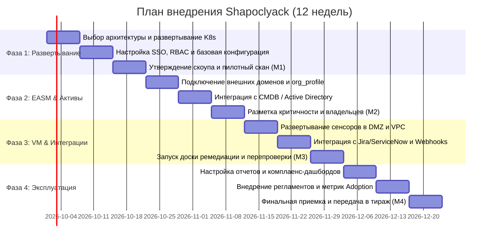

# Комплексный план внедрения платформы Shapoclyack

Данный документ представляет собой пошаговую дорожную карту внедрения платформы **Shapoclyack** в корпоративную инфраструктуру организации. Программа рассчитана на **12 недель** и разделена на 4 последовательные фазы: от пилотного развертывания до полноценной интеграции в операционные процессы ИБ и ИТ.

---

## 📅 Дорожная карта внедрения (12 недель)

---

## 🚀 Фаза 1: Архитектурное планирование и развертывание базового контура (Недели 1–3)

### Задачи этапа:
1. **Выбор архитектуры развертывания:**
   * **Вариант А (PoC / Тестовый стенд):** локальный кластер kind через `scripts/dev-up.sh` (`k8s/kind-config.yaml`; Docker Compose из репозитория удален, kind его заменил). Ориентир по ресурсам: 4 vCPU, 8 GB RAM, 50 GB SSD.
   * **Вариант Б (Production):** кластер Kubernetes, оверлей `k8s/shapoclyack/overlays/prod`. Что он разворачивает сегодня: FastAPI Control Plane **в одной реплике** (`overlays/prod/api-replicas-patch.yaml`), PostgreSQL и артефакты на PVC. NATS и ClickHouse в этом оверлее **выключены** пустыми `OCTO_NATS_URL` / `OCTO_CLICKHOUSE_URL` (`base/api-deployment.yaml:114-121`) — включаются вручную, значениями из комментариев рядом. Отказоустойчивый профиль — оверлей `overlays/prod-ha`: API от двух реплик с anti-affinity, HPA и PDB, кластер NATS из трёх узлов, внешний управляемый PostgreSQL ([docs/high-availability.md](../high-availability.md)); что в нём ещё не закрыто — [#335](https://github.com/onixus/Shapoclyack/issues/335). Объектное хранилище под артефакты сделано ([#336](https://github.com/onixus/Shapoclyack/issues/336)): `OCTO_ARTIFACT_BACKEND=s3`, включается в `overlays/prod-ha` патчем `artifacts-s3-patch.yaml`.
2. **Настройка базовой безопасности и аутентификации:**
   * Генерация криптографических секретов (JWT secret, мастер-ключи шифрования) согласно `k8s/shapoclyack/examples/api-secrets.example.yaml`;
   * Подключение корпоративного OIDC SSO (Keycloak, Okta, Microsoft Entra ID, ADFS);
   * Настройка ролевой модели RBAC: глобальные роли `admin`, `operator`, `viewer` и тенантные роли разделения обязанностей `auditor`, `scan-operator`, `scope-approver`, `token-admin`, `risk-approver` (`api/auth.py`, `/api/rbac`).
3. **Утверждение политик и областей сканирования:**
   * Создание производственного тенанта;
   * Внесение и юридическое утверждение администратором скоупа внешних IP-адресов и доменов (`scope_approval`). Без явного утверждения платформа блокирует любые сетевые воздействия.

> **🎯 Контрольная точка M1 (Конец 3-й недели):**  
> Кластер развернут и доступен по HTTPS (Ingress с `spec.tls`, см. `k8s/shapoclyack/examples/ingress.example.yaml`). Инженеры авторизуются через единый SSO. Выполнен первый валидационный скан внешнего периметра, артефакты прогона сохранены на PVC или в бакете ([#336](https://github.com/onixus/Shapoclyack/issues/336)); если ClickHouse был включен вручную, аналитический срез виден и в нем.

---

## 🔍 Фаза 2: Полномасштабный EASM и инвентаризация активов (Недели 4–6)

### Задачи этапа:
1. **Подключение всей внешней поверхности компании:**
   * Внесение всех принадлежащих организации ASN-номеров, CIDR-блоков и корневых доменов;
   * Активация модуля Организационного профиля (`org_profile`): сбор связанных доменов через RDAP/CT-логи и выявление забытых субдоменов;
   * Проверка и очистка висячих записей (Dangling CNAME) и аудит почтовой защиты (SPF/DKIM/DMARC).
2. **Синхронизация с корпоративной CMDB / Active Directory:**
   * Настройка фонового скрипта/интеграции для вызова `PATCH /api/assets/{id}`;
   * Импорт бизнес-контекста: наименование информационной системы (`business_service`), контур (`environment`), категория обрабатываемых данных (`data_classification`);
   * Назначение ответственных за системы (`owner_email`) и шкалы критичности от 0 до 4 (`asset_criticality`).
3. **Очистка данных и инвентаризация Shadow IT:**
   * Расследование всех активов со статусом `unowned_asset`;
   * Закрытие неиспользуемых тестовых стендов, обнаруженных сканером снаружи.

> **🎯 Контрольная точка M2 (Конец 6-й недели):**  
> Построена полная цифровая карта периметра организации. Доля активов без назначенного владельца снижена до <5%. Расчет совокупного риска (Estate Risk) в реальном времени учитывает бизнес-критичность систем.

---

## 🛠️ Фаза 3: Внедрение процессов VM и интеграция с ИТ/DevOps (Недели 7–9)

### Задачи этапа:
1. **Развертывание парка сенсоров** (API-ресурс `agents`, `agent_kind = scanner`; страница «Флот сенсоров», маршрут `/agents`):
   * Установка сенсоров (`python -m agent`, оверлей `k8s/shapoclyack/overlays/agents`) в закрытых сетевых сегментах (DMZ, сегменты ЦОД, облачные VPC); объединение в группы (`/api/agent-groups`), чтобы задание на сегмент брал только сенсор этого сегмента (`agent_group` в `POST /api/jobs`);
   * Проверка сетевой связности: подтверждение того, что сенсорам открыты только исходящие порты к брокеру NATS JetStream (порт 4222, либо 443 через TCP-ingress/`wss://`) и API (HTTPS 443); при пустом `OCTO_NATS_URL` сенсор работает в режиме HTTPS-claim без брокера.
2. **Инвентаризация ПО на конечных точках (Endpoints):**
   * Развертывание агента Lariska (Agent; `agent_kind = endpoint`, отдельный репозиторий) на серверах критичной инфраструктуры Linux и Windows; политики сбора и версия сборки раздаются через heartbeat (`/api/endpoint/agent/policies`, `/api/endpoint/agent/releases`);
   * Настройка сопоставления установленного ПО с бюллетенями вендоров дистрибутивов (Ubuntu USN, Debian Security Tracker; для Windows — MSRC по сборке ОС) с формированием панели Patch Gaps.
3. **Двусторонняя интеграция с таск-трекерами (Jira / ServiceNow / DefectDojo):**
   * Настройка вебхуков в разделе `/integrations`;
   * Согласование шаблона задач с ИТ-дирекцией;
   * Проверка воркера эскалации SLA (`OCTO_SLA_ESCALATION_*`) и каналов уведомлений о завершении прогонов (`/api/notification-channels`).
4. **Запуск доски ремедиации и механической перепроверки:**
   * Обучение сотрудников ИТ и ИБ работе со статусами `OPEN → PLANNED → FIXING → VERIFYING → CLOSED`;
   * Внедрение строгого правила: уязвимость переходит в `CLOSED` только после успешного вызова `POST /api/vulnerabilities/{id}/verify`.

> **🎯 Контрольная точка M3 (Конец 9-й недели):**  
> Сквозной процесс управления уязвимостями функционирует в автоматическом режиме. Задачи на исправление поступают в рабочие очереди разработчиков с готовыми рецептами устранения. Инструментальная перепроверка исключает закрытие тикетов «на честное слово».

---

## 📊 Фаза 4: Автоматизация, комплаенс и промышленная эксплуатация (Недели 10–12)

### Задачи этапа:
1. **Настройка регулярных расписаний (`/schedules`):**
   * Еженедельное сканирование внешнего периметра (intent `delta`, профиль `safe`);
   * Ежемесячное полное сканирование внутренних сетей (intent `full`, профиль `balanced`; интенты — `inventory`/`vuln`/`full`/`delta`/`org_profile`, профили — `safe`/`balanced`/`fast`, см. `api/services/scan_intents.py`);
   * Окна обслуживания и change freeze для периодов, когда сканировать нельзя (`/api/maintenance-windows`, `/api/change-freeze`);
   * Непрерывный мониторинг CT-логов и доменных зон.
2. **Запуск фабрики отчетов и комплаенс-дашбордов:**
   * Брендирование отчетов под корпоративный стиль компании (логотип, шрифты, колонтитулы);
   * Настройка автоматической рассылки Executive Summary для CISO и Правления;
   * Активация матриц комплаенса `/compliance` по стандартам PCI DSS 4.0, CIS Controls v8, ISO/IEC 27001:2022, приказам ФСТЭК № 117 / 21 / 239 и ГОСТ Р 57580.1-2017.
3. **Мониторинг качества процессов (Adoption Dashboard):**
   * Контроль ключевых метрик: доля подтвержденных закрытий (Machine-verified), среднее время исправления (MTTR), объем подавленного шума (Noise Block).
4. **Разработка регламентов и подписание акта ввода:**
   * Утверждение Регламента управления уязвимостями и матрицы SLA приказом по компании;
   * Резервное копирование PostgreSQL по отработанному restore-drill ([operations.md](../operations.md#backup-and-disaster-recovery)); восстановление ClickHouse, артефактов и JetStream пока не доказано ([#333](https://github.com/onixus/Shapoclyack/issues/333)) — документировать план DRP с этой оговоркой.

> **🎯 Контрольная точка M4 (Конец 12-й недели):**  
> Платформа принята в промышленную эксплуатацию. Процессы управления уязвимостями и внешней поверхностью атаки регламентированы, автоматизированы и подкреплены объективными метриками эффективности.

---

## 👥 Матрица ответственности (RACI)

| Этап / Задача | CISO | Архитектор ИБ | Инженер ИБ | Руководитель ИТ / DevOps | Владелец ИС |
|---|:---:|:---:|:---:|:---:|:---:|
| **Согласование архитектуры и скоупа** | **A** | **R** | C | C | I |
| **Развертывание кластера, сенсоров и агентов** | I | **A** | **R** | C | I |
| **Интеграция с CMDB и каталогами** | I | **A** | **R** | C | C |
| **Назначение критичности и владельцев**| C | C | C | C | **A / R** |
| **Триаж и приоритизация по NIST** | I | I | **A / R** | I | I |
| **Установка патчей и устранение** | I | I | C | **A / R** | C |
| **Инструментальная перепроверка** | I | I | **A / R** | C | I |
| **Согласование исключений (Risk Acceptance)**| **A** | C | C | C | **R** |
| **Аудит комплаенса и отчетность** | **A** | C | **R** | I | I |

*Легенда: **R** — Ответственный исполнитель (Responsible), **A** — Утверждающее лицо (Accountable), **C** — Консультант (Consulted), **I** — Информируемое лицо (Informed).*

---

## 📈 Критерии успеха внедрения (KPI проекта)

Проект внедрения платформы признается успешным при достижении следующих показателей в течение первого квартала промышленной эксплуатации:

| Показатель эффективности (KPI) | Целевое значение | Метод измерения |
|---|---|---|
| **Видимость внешнего периметра** | **≥ 98%** всех публичных IP и FQDN | Отсутствие неучтенных активов в регулярных сканах |
| **Покрытие бизнес-контекстом** | **≥ 95%** активов имеют владельца | Доля `unowned_assets` в дашборде Overview |
| **Доля инструментально подтвержденных закрытий** | **≥ 85%** | Метрика `machine_verified` на дашборде `/adoption` |
| **Соблюдение нормативов SLA (Critical / High)** | **≥ 90%** устранено в срок | Отчет по просроченным уязвимостям (`breached`) |
| **Сокращение времени устранения (MTTR)** | **Снижение на 35–50%** | Тренд метрики Median Time to Remediate |
| **Трудозатраты на аудит комплаенса** | **Сокращение в 3 раза** | Автоматическая генерация доказательной базы `/compliance` |
