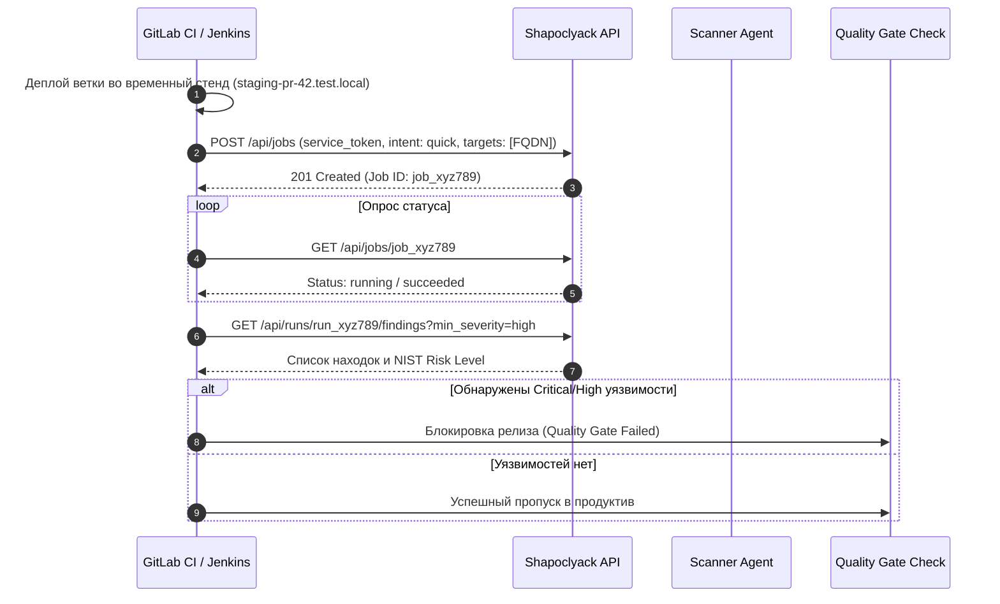

# Сценарии использования: Архитектор (Security & Enterprise Architect)

Данный документ описывает сценарии работы **Архитектора информационной безопасности** (Security Architect), **Enterprise-архитектора** и **Инфраструктурного архитектора** при проектировании периметра защиты, интеграции платформы Shapoclyack в корпоративный ландшафт и обеспечении комплаенса.

---

## 🏛️ Зона ответственности архитектора

```mermaid
graph TB
    subgraph Enterprise ["Корпоративный IT-ландшафт"]
        CMDB["CMDB / Active Directory<br/>(Владельцы, сервисы, критичность)"]
        CICD["CI/CD Pipelines<br/>(GitLab, Jenkins, ArgoCD)"]
        SIEM["SIEM / SOAR / SOC<br/>(QRadar, Splunk, MaxPatrol)"]
        Jira["Issue Tracker<br/>(Jira, ServiceNow, DefectDojo)"]
    end

    subgraph Shapoclyack ["Платформа Shapoclyack"]
        API["FastAPI Control Plane<br/>(RBAC, Multi-tenancy, Assets)"]
        NATS["NATS JetStream<br/>(Durable Event Bus)"]
        CH["ClickHouse & PostgreSQL<br/>(Аналитика & OLTP-состояние)"]
        Agents["Distributed Agents Fleet<br/>(DMZ, Private Clouds, Branch Offices)"]
    end

    CMDB -->|PATCH /api/assets/{id}| API
    CICD -->|Service Token /api/jobs| API
    API -->|Outbound Webhooks / NATS| SIEM
    API <-->|Two-way ticket sync| Jira
    API <--> NATS
    NATS <--> Agents
```

| Направление | Архитектурная задача | Реализация в Shapoclyack |
|---|---|---|
| **EASM и инвентарь периметра** | Выявление Shadow IT, учет активов, картографирование графа сервисов | Модуль `org_profile`, `/attack-surface`, `/assets` |
| **Сетевая топология и агенты** | Проектирование безопасного размещения сканеров в DMZ и VPC | Распределенный флот Remote Agents через NATS JetStream |
| **Интеграция с CMDB и каталогами** | Автоматическое обогащение активов бизнес-контекстом и владельцами | Контракт `PATCH /api/assets/{id}` (`context_source: cmdb/ad`) |
| **Встраивание в DevSecOps (CI/CD)** | Автоматизированный контроль релизных контуров и динамических сред | Сервисные токены (`/service-tokens`), REST API, Idempotency-Key |
| **SOC & Event-Driven архитектура** | Потоковая передача событий об уязвимостях и новых активах | Webhooks dispatcher, NATS JetStream asset-event streams |
| **Архитектура комплаенса** | Автоматизированный аудит контролей PCI DSS, CIS Controls, ISO 27001 | Движок сигналов и каталоги фреймворков (`/compliance`) |

---

## Сценарий 1: Картографирование периметра и контроль Shadow IT

Архитектор формирует достоверную карту внешних активов организации, выявляя скрытые домены, забытые тестовые стенды и утечки инфраструктуры.

### 1.1. Атрибуция владения и связанные домены (`org_profile`)
В модуле Организационного профиля архитектор запускает процесс анализа корневого домена компании:
1. **Анализ владения (Ownership Attribution):** система опрашивает RDAP регистраторов доменов, RIPEstat/ARIN по диапазонам ASN и собирает Organization-поля TLS-сертификатов.
2. **Поиск ассоциированных доменов (Related Domains):** платформа находит дочерние и партнерские домены компании.
3. **Граница безопасности (Promote-flow):** найденные домены **не добавляются в сканирование автоматически** во избежание юридических рисков (сканирование чужой инфраструктуры). Архитектор валидирует список в UI и утверждает доверенные домены («Promote to approved scope»).

### 1.2. Анализ графа поверхности атаки (`/attack-surface`)
Архитектор использует визуализатор графа:
$$\text{Domain / FQDN} \longrightarrow \text{IP-Address} \longrightarrow \text{Port} \longrightarrow \text{Service / Tech Stack}$$

* Выявляются аномалии: нетипичные открытые порты в DMZ (например, доступность SSH, Redis, RDP наружу);
* Проверяется наличие «висячих записей» (Dangling CNAME), создающих риск атаки Subdomain Takeover при удалении ресурсов в публичных облаках (AWS S3, Azure Blob, GitHub Pages);
* Оценивается гигиена DNS (наличие DNSSEC, CAA-записей) и почтового периметра (SPF, DKIM, DMARC-политики `reject`/`quarantine`).

---

## Сценарий 2: Архитектура распределенного флота агентов (Remote Agents)

Для сканирования изолированных сред (DMZ, сегменты обработки данных платежных карт, приватные облака AWS/GCP/Yandex Cloud) архитектор проектирует распределенную схему размещения воркеров.

```
       [ Интернет ]
            │
      ┌─────▼────────────────────────┐
      │ Балансировщик / Ingress      │
      └─────┬────────────────────────┘
            │
┌───────────▼────────────────────────────────────────────────────────┐
│ Корпоративный ЦОД / Kubernetes Cluster                             │
│                                                                    │
│  ┌────────────────────────┐         ┌───────────────────────────┐  │
│  │ FastAPI Control Plane  │ ◄─────► │ NATS JetStream Cluster    │  │
│  └───────────┬────────────┘         └─────────────▲─────────────┘  │
│              │                                    │                │
│  ┌───────────▼────────────┐                       │ (см. #309)     │
│  │ PostgreSQL & ClickHouse│                       │                │
│  └────────────────────────┘                       │                │
└───────────────────────────────────────────────────┼────────────────┘
                                                    │
             ┌──────────────────────────────────────┴──────────────┐
             │                                                     │
┌────────────▼──────────────────────┐    ┌─────────────────────────▼────────────────────────┐
│ DMZ Segment Worker                │    │ Isolated VPC / PCI DSS CDE Worker                │
│ ┌───────────────────────────────┐ │    │ ┌──────────────────────────────────────────────┐ │
│ │ Shapoclyack Remote Agent      │ │    │ │ Shapoclyack Remote Agent                     │ │
│ │ (Claiming jobs via NATS)      │ │    │ │ (Claiming jobs via NATS)                     │ │
│ └───────────────────────────────┘ │    │ └──────────────────────────────────────────────┘ │
│ Исходящее соединение:             │    │ Исходящее соединение:                            │
│ NATS:4222 / HTTPS:443 к Control   │    │ NATS:4222 / HTTPS:443 к Control Plane            │
│ НЕТ входящих сетевых портов!      │    │ НЕТ входящих сетевых портов!                     │
└───────────────────────────────────┘    └──────────────────────────────────────────────────┘
```

### 2.1. Сетевые требования и изоляция
* **Никаких входящих портов на агентах:** Remote Agent инициирует только **исходящие** сессии — к FastAPI Control Plane по HTTPS и к NATS JetStream. Аутентификация в обоих случаях — агентский JWT, полученный в обмен на пер-тенантный provisioning key; **mTLS в сборке нет**; TLS до NATS включается явно (`tls://`, `OCTO_NATS_TLS_CA/CERT/KEY/HOSTNAME`, пример серверной части — `k8s/shapoclyack/examples/nats-tls-configmap-patch.yaml`). Без TLS брокер держат внутри доверенного сегмента, а между сегментами пускают только HTTPS-режим claim'а (`OCTO_NATS_URL` пустой).
* **Транспорт до хранилищ:** Postgres и ClickHouse шифруются только если это настроено явно (`?sslmode=verify-full`, схема `https://`) — см. [operations.md § Transport encryption](../operations.md#transport-encryption).
* **Изоляция очередей тенантов:** задачи тенанта изолированы в NATS-субъектах (`shapoclyack.jobs.<tenant_id>.*`), агент одного тенанта физически не может перехватить задачи другого заказчика.
* **Защита от сбоев (Leases & Fencing):** агент получает задачу в аренду на ограниченное время (`claimed_until`). Если агент завис или потерял связь, задача возвращается в очередь без потери статуса. Токен попытки (`attempt`) предотвращает запись устаревших результатов.

---

## Сценарий 3: Интеграция с корпоративной CMDB и Active Directory

Точная оценка рисков невозможна без знания владельца и бизнес-назначения сервера. Shapoclyack дает для этого **REST-контракт бизнес-контекста актива** — модель полей ниже и `PATCH /api/assets/{id}`, — а синхронизацию с CMDB (ServiceNow, Jira Service Management, внутренние учетные системы) архитектор пишет как внешний скрипт по расписанию. Готового импортера из CMDB/AD в платформе **нет**: он в roadmap как [#350](https://github.com/onixus/Shapoclyack/issues/350). Направление одно — из CMDB в Shapoclyack; обратной записи в CMDB платформа не делает.

### 3.1. Модель данных бизнес-контекста актива
Поля сущности **Asset** в Shapoclyack:

| Поле | Допустимые значения | Влияние на систему |
|---|---|---|
| `owner_email` | email ответственного | Автоматическое назначение ответственного за устранение (`assignee`) |
| `business_unit` | Свободный текст (название департамента) | Группировка находок и отчетов по дивизионам компании |
| `business_service` | Имя ИС (например, `BillingCore`) | Агрегация риска по бизнес-системе |
| `environment` | `production`, `staging`, `development`, `lab` | Фильтрация в отчетах и приоритизация инцидентов |
| `data_classification`| `public`, `internal`, `confidential`, `restricted` | Оценка критичности в комплаенс-моделях |
| `asset_criticality` | `0` (тест), `1` (низкая) ... `4` (бизнес-критичная) | **Прямой множитель Impact** в формуле риска NIST SP 800-30 |
| `exposure_level` | `internet`, `partner`, `internal`, `unknown` | Экспертное определение доступности хоста |
| `context_source` | `cmdb`, `ad`, `operator` | Источник записи для аудита |

### 3.2. Автоматизация обогащения через REST API
Скрипт синхронизации (ваш, на стороне CMDB или в CI) опрашивает CMDB и обновляет данные в Shapoclyack вызовом — это и есть весь механизм «интеграции» на сегодня:
```bash
curl -X PATCH https://shapoclyack.company.local/api/assets/asset_prod_srv_42 \
  -H "Authorization: Bearer $CMDB_SERVICE_TOKEN" \
  -H "Content-Type: application/json" \
  -d '{
    "owner_email": "team-lead-billing@company.com",
    "business_unit": "FinTech Core",
    "business_service": "PaymentGateway",
    "environment": "production",
    "data_classification": "restricted",
    "asset_criticality": 4,
    "exposure_level": "internet",
    "context_source": "cmdb"
  }'
```
Каждое изменение автоматически фиксируется в журнале `asset_context_events` с фиксацией автора, старых и новых значений.

---

## Сценарий 4: Встраивание в DevSecOps и CI/CD Pipelines

Архитектор выстраивает автоматизированный контроль качества безопасности при выпуске релизов в динамических тестовых средах (Dynamic Staging / Ephemeral Environments).



* **Сервисные токены (`/service-tokens`):** создаются с ограниченными правами для конкретного конвейера сборки.
* **Идемпотентность запусков:** использование заголовка `Idempotency-Key: commit-sha-build-id` исключает дублирование сканов при повторном запуске пайплайна в GitLab CI. Ключ старта скана принадлежит **тенанту**, а не конвейеру, поэтому имя должно быть уникальным у заказчика целиком — `commit-sha-build-id` таково, `nightly` нет.
* **Массовая триажная обработка (`POST /api/vulnerabilities/bulk`):** тот же заголовок, но здесь ключ принадлежит **вызывающему** — сервисному токену конвейера, — а не тенанту целиком, поэтому осмысленное имя вроде `nightly-triage` не пересекается с ключом соседнего конвейера того же заказчика.

---

## Сценарий 5: Архитектура соответствия стандартам (Compliance Mapping)

Shapoclyack реализует доказательный подход к комплаенсу: система оценивает только то, что может подтвердить реальными техническими данными.

### 5.1. Движок сигналов и каталоги фреймворков
Вместо ручного проставления «галочек» платформа транслирует находки и конфигурации в строго типизированные **сигналы**:
* `unpatched_cve` — наличие открытой CVE;
* `overdue_remediation` — нарушение установленного SLA устранения;
* `weak_cryptography` — устаревшие версии TLS 1.0/1.1, слабые шифры;
* `insecure_protocol` — открытый доступ к Telnet, FTP, незащищенному HTTP;
* `exposed_admin_service` — открытые интерфейсы SSH, RDP, баз данных, административных панелей;
* `unowned_asset` — сервер, у которого отсутствует назначенный владелец (`owner_email`).

### 5.2. Поддерживаемые фреймворки в `/compliance`
1. **PCI DSS 4.0:** требования 1.2.1 (ограничение трафика к админ-сервисам), 2.2.4/2.2.7 (отключение небезопасных протоколов), 4.2.1 (стойкая криптография при передаче), 6.3.3 (устранение High/Critical уязвимостей в установленные сроки), 11.3.1/11.3.2 (регулярное внутреннее и внешнее сканирование).
2. **CIS Controls v8:** контроли 1.1 (инвентарь активов), 2.1 (инвентарь ПО), 4.6 (защита сетевых портов), 7.1/7.3/7.7 (управление уязвимостями и прикладными патчами).
3. **ISO/IEC 27001:2022:** контроли A.5.9/A.5.10 (инвентарь активов и правила использования), A.8.8 (управление техническими уязвимостями), A.8.20/A.8.24 (сетевая безопасность и использование криптографии).

Архитектор использует выгрузки раздела `/compliance` для демонстрации внешним аудиторам объективных технических подтверждений выполнения контролей.
