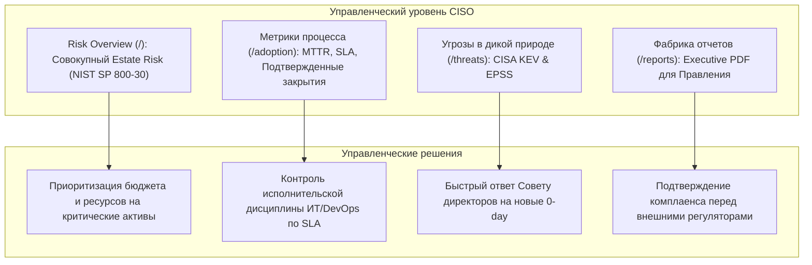

# Сценарии использования: CISO (Директор по информационной безопасности)

Данный документ описывает сценарии работы **CISO** (Chief Information Security Officer), **Директора по информационной безопасности** и **Руководителей подразделений ИБ**. 

Фокус роли CISO — стратегическое управление киберрисками, контроль эффективности процессов ремедиации, прозрачность для совета директоров и обоснование инвестиций в безопасность на базе объективных метрик.

---

## 🎯 Стратегический контур CISO в Shapoclyack



| Приоритет CISO | Инструмент Shapoclyack | Управленческая ценность |
|---|---|---|
| **Уровень защищенности компании** | Дашборд `/` (Risk Overview) | Объективная оценка интегрального риска (Estate Risk) без завышения CVSS |
| **Реагирование на громкие атаки** | Раздел `/threats` (CISA KEV) | Мгновенный ответ руководству: «Уязвимы ли мы перед актуальной угрозой?» |
| **Эффективность команд ИТ и ИБ** | Раздел `/adoption` | Оценка не количества найденных багов, а подтвержденно закрытых |
| **Соблюдение регламентов и SLA** | Метрики SLA и просрочек | Контроль сроков закрытия критических дыр в продуктивных средах |
| **Отчетность для Стейкхолдеров** | Фабрика отчетов (`/reports`) | Брендированные PDF-отчеты с инфографикой и трендами за квартал/год |

---

## Сценарий 1: Стратегический мониторинг киберрисков (Risk Overview)

При открытии консоли CISO попадает на главный экран **Overview** (`/`), объединяющий высокоуровневые метрики компании.

### 1.1. Метрика совокупного риска (Estate Risk)
В отличие от сканеров, показывающих средний балл (где 1000 мелких замечаний создают видимость катастрофы), Shapoclyack применяет стандарт **NIST SP 800-30 Rev. 1**:
* **Estate Risk** отражает наихудший подтвержденный уровень риска на бизнес-критичных системах (`asset_criticality: 4`);
* График **Risk Trend** за 30, 90 и 365 дней демонстрирует реальную динамику: снижается ли риск бизнеса или растет несмотря на закупку средств защиты.

### 1.2. Контроль «слепых зон» и бесхозных активов (Governance Gaps)
На главном экране CISO контролирует индикаторы организационной зрелости:
* **Unowned Assets (Активы без владельца):** хосты, у которых не назначен ответственный в поле `owner_email`. Бесхозный сервер — ключевая точка проникновения злоумышленников, так как за его обновления никто не отвечает;
* **Unassigned Work (Нераспределенные уязвимости):** критические уязвимости, которые еще не взяты в работу инженерами ИБ и не переданы в разработку.

---

## Сценарий 2: Контроль актуальных угроз и атак в «дикой природе» (`/threats`)

Когда в новостях появляется информация о новой критической уязвимости (например, в Apache, Microsoft Exchange или Ivanti VPN), CISO не ждет ручного отчета аналитиков:

1. CISO открывает вкладку **Risk & remediation → Threats** (`/threats`).
2. Раздел автоматически агрегирует уязвимости, входящие в официальный каталог **CISA KEV (Known Exploited Vulnerabilities)**:
   - Если список пуст — инфраструктура организации не подвержена известным активным кампаниям кибератак;
   - Если обнаружены совпадения — CISO видит точный список затронутых бизнес-сервисов, степень их доступности из сети Интернет и текущий статус исправления (взят ли тикет в работу ИТ).
3. **EPSS (Exploit Prediction Scoring System):** платформа отображает перцентиль вероятности атаки в ближайшие 30 дней. CISO может потребовать от ИТ сфокусироваться на уязвимостях с высоким EPSS (>0.5), даже если базовый CVSS не максимален.

---

## Сценарий 3: Оценка эффективности процессов (Adoption Metrics)

Большинство систем безопасности рапортуют о том, «сколько проблем найдено». Вкладка **Insights → Adoption** (`/adoption`) показывает CISO, **насколько эффективно организация устраняет риски**.

```
+-----------------------------------------------------------------------------------------+
| Метрики адаптации и эффективности ИБ (Adoption Dashboard)                              |
+-----------------------------------------------------------------------------------------+
| [ Подтвержденные закрытия ]       [ Соблюдение SLA ]          [ Медианное время (MTTR) ] |
| 142 закрыто за 30 дн.             88.4% в рамках SLA          Критичные: 4.2 дня         |
| (91% Machine Verified!)           (12 просрочено)             Высокие: 11.5 дней         |
+-----------------------------------------------------------------------------------------+
| [ Качество и шум (Noise Block) ]                              [ Покрытие сканированием ]|
| Подавлено False Positive: 18 находок                          Одобренные диапазоны: 96% |
| Активных исключений (Risk Acceptance): 4                       Инвентарь ПО: 1 240 хостов|
+-----------------------------------------------------------------------------------------+
```

### 3.1. Ключевые показатели для CISO
1. **Machine-Verified Closures (Инструментально подтвержденные закрытия):** процент закрытых уязвимостей, где сканер лично убедился в отсутствии проблемы. Если показатель падает ниже 80% — ИТ-отдел злоупотребляет фиктивным закрытием тикетов («закрыли задачу, но патч не накатили»).
2. **SLA Adherence (% соблюдения сроков):** доля уязвимостей, исправленных до дедлайна (по умолчанию: Critical — 7 дней, High — 14 дней, Medium — 30 дней, Low — 90 дней).
3. **Median Time to Remediate (MTTR):** средний темп реагирования в разрезе бизнес-юнитов (`business_unit`). CISO видит, какая команда разработки тормозит выпуск исправлений.
4. **Блок чистоты (Noise & Exceptions):** количество принятых рисков (Risk Acceptance). CISO контролирует, чтобы руководители бизнес-систем не злоупотребляли бессрочным принятием рисков в обход безопасности.

---

## Сценарий 4: Формирование управленческой отчетности (Report Factory)

В разделе **Operations → Reports** (`/reports`) CISO управляет фабрикой отчетов для разных аудиторий:

### 4.1. Типы отчетов
* **Executive Summary (Отчет для руководства и Совета директоров):** высокоуровневый документ в формате PDF. Содержит агрегированные тренды снижения рисков, статус периметра, диаграммы соблюдения SLA, бенчмаркинг по департаментам и ключевые выводы без технического жаргона.
* **Compliance Posture Report (Отчет для аудиторов):** официальный отчет по состоянию контролей стандартов (PCI DSS 4.0, CIS Controls v8, ISO/IEC 27001). Содержит технические доказательства, даты проверок и прозрачный расчет Coverage Score.
* **Technical Remediation Report (Технический отчет для ИТ-руководства):** детальный реестр незакрытых уязвимостей, сгруппированный по хостам, сетевым портам, пакетам ПО и готовым инструкциям по обновлению.

### 4.2. Автоматическая доставка по расписанию
CISO настраивает автоматическую генерацию и отправку отчетов:
* Еженедельный понедельничный дайджест для руководителей разработки по открытым тикетам;
* Ежемесячный отчет для Правления по динамике защищенности активов компании.

---

## Сценарий 5: Управление холдингом / группой компаний (Multi-Tenancy)

Если организация представляет собой группу компаний, холдинг или MSSP-провайдера (Managed Security Service Provider):
1. В разделе **Administration → Tenants** (`/tenants`) CISO видит сводную матрицу защищенности всех дочерних обществ в одном окне.
2. В разделе **Administration → Usage** (`/usage`) отслеживается потребление квот по тенантам: количество просканированных хостов, активных агентов и регулярность запусков.
3. Полная изоляция данных гарантирует, что администратор одного дочернего общества не имеет доступа к данным и отчетам другого тенанта.
