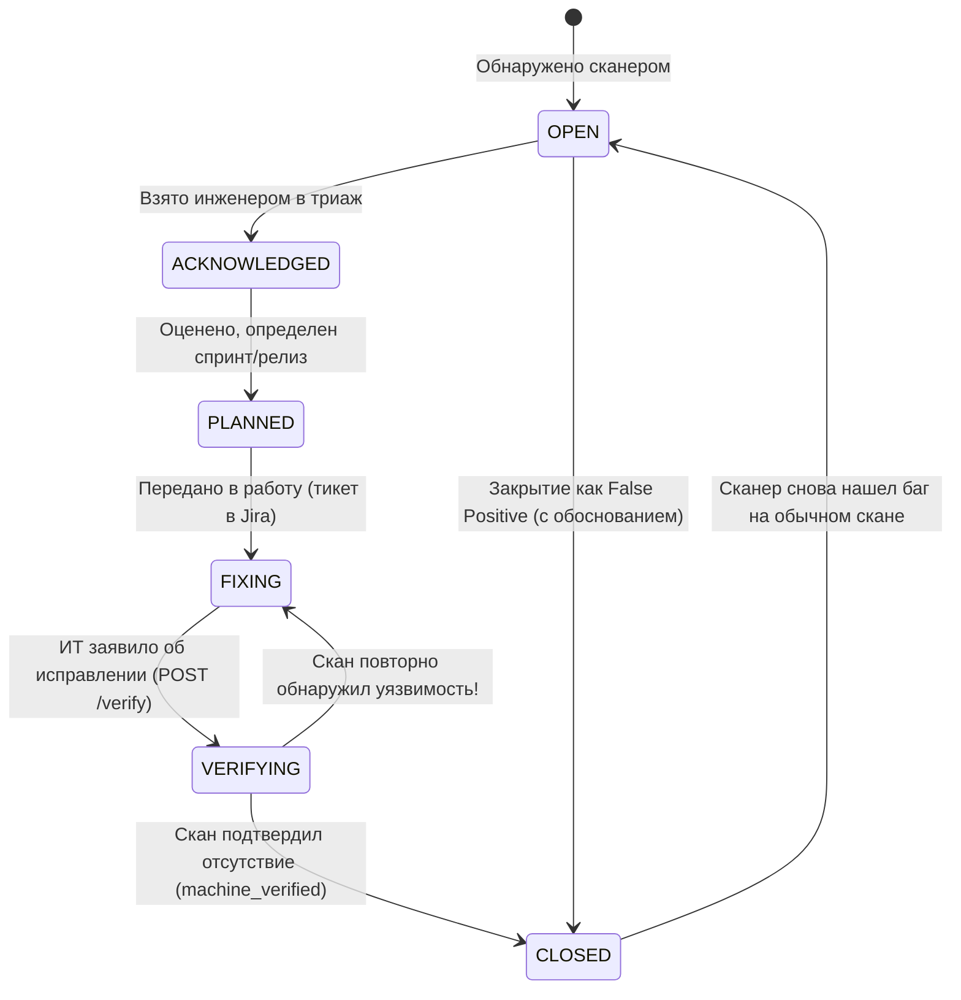

# Сценарии использования: Инженер ИБ (Security Engineer)

Данное руководство описывает ежедневные и периодические сценарии работы **Инженера по информационной безопасности** (Vulnerability Management Engineer / AppSec / SOC Analyst L2-L3) в платформе Shapoclyack.

---

## 📋 Обзор роли и зоны ответственности

| Задача | Инструменты Shapoclyack | Результат |
|---|---|---|
| **Сканирование периметра и инфраструктуры** | `/scans/external`, `/scans/internal`, `/schedules` | Актуальная карта уязвимостей без «слепых зон» |
| **Триаж и приоритизация находок** | `/vulnerabilities`, `/threats`, `/runs/view` | Выделение критических рисков с подтвержденными эксплойтами |
| **Координация устранения (Remediation)** | `/remediation`, интеграция с Jira/DefectDojo | Назначение задач ИТ/DevOps с контролем SLA |
| **Инструментальная перепроверка** | `POST /api/vulnerabilities/{id}/verify` | Подтверждение устранения (`machine_verified = true`) |
| **Анализ патчей хостов (Patch Gaps)** | `/endpoints` | Готовые консольные команды обновления ОС для системных администраторов |
| **Снижение шума (Noise Reduction)** | Закрытие False Positive, исключения (Exceptions) | Чистая доказательная база без лишней нагрузки на ИТ |

---

## Сценарий 1: Конфигурирование и запуск сканирования

Shapoclyack строго разделяет операции по типу сетевой поверхности (`surface`): **External** (публичные FQDN, внешние IP/CIDR) и **Internal** (приватные диапазоны RFC 1918, VPC, сегменты ЦОД).

```mermaid
sequenceDiagram
    autonumber
    actor Eng as Инженер ИБ
    participant UI as Web UI (/scans)
    participant API as FastAPI Control Plane
    participant NATS as NATS JetStream
    participant Sensor as Сенсор (agent/worker.py)
    
    Eng->>UI: Выбор типа поверхности (External / Internal)
    Eng->>UI: Ввод целей, выбор intent (inventory/vuln/full/delta/org_profile) и профиля (mode: safe/balanced/fast)
    UI->>API: POST /api/jobs (с Idempotency-Key)
    API->>NATS: Публикация задачи в очередь тенанта
    NATS->>Sensor: Захват задачи сенсором (claimed_until lease; без NATS — HTTPS-claim POST /api/agent/jobs/claim)
    Sensor->>Sensor: Выполнение пайплайна: Discovery → Ports → Service/NSE/Nuclei → Enrich
    Sensor->>API: Загрузка артефактов и найденных уязвимостей (POST /api/agent/jobs/{id}/results)
    API->>UI: Обновление статуса в UI (succeeded), регистрация находок
```

### 1.1. Сканирование внешней поверхности (`/scans/external`)
1. Перейдите в раздел **External surface → External scans**.
2. Укажите доменные имена компании (например, `example.com`, `api.example.com`) или утвержденные внешние подсети.
3. Включите модуль **Организационный профиль (`org_profile`)**:
   - Автоматически определит регистрационные данные RDAP/WHOIS;
   - Проверит гигиену почты (SPF, DKIM, DMARC) и DNS (DNSSEC, CAA);
   - Соберет субдомены через Certificate Transparency (CT-логи) и активный перебор по словарю.
4. Выберите intent и профиль (`mode`; словарь — `api/services/scan_intents.py`):
   - intent `inventory` — только порты (top 100, без NSE и Nuclei), `vuln` — полный probe и Nuclei critical/high, `full` — пайплайн по умолчанию (Nuclei critical/high/medium), `delta` — как `full` плюс обновление discovery, `org_profile` — `full` плюс стадии организационного профиля;
   - `mode: safe` — щадящий профиль для регулярного мониторинга продуктивного периметра (щадящие таймауты, безопасные NSE-скрипты);
   - `mode: balanced` (по умолчанию) и `mode: fast` — обычный и ускоренный профили; список портов задаётся отдельно (`ports`, `ports_udp`).
5. Нажмите **Launch external scan**. Запрос отправляется с `Idempotency-Key`, исключающим случайный повторный запуск при сбое сети.

### 1.2. Сканирование внутренней инфраструктуры (`/scans/internal`)
1. Перейдите в **Internal surface → Internal scans**.
2. Выберите группу сенсоров (`agent_group`; группы — `/api/agent-groups`, страница «Флот удалённых агентов», маршрут `/agents`), размещённых в целевом сетевом сегменте (DMZ, PCI DSS CDE, внутренний офис). Без группы задание берёт любой сенсор тенанта.
3. Укажите целевые CIDR (например, `10.20.0.0/24`). 
4. Система автоматически валидирует диапазоны и не позволит отправить публичные IP в профиль внутреннего сканирования.

---

## Сценарий 2: Анализ и триаж уязвимостей (Vulnerability Triage)

После завершения сканирования инженер переходит в **Risk & remediation → Vulnerabilities** или открывает детальный отчет о прогоне **Operations → Runs → View Run**.

### 2.1. Оценка двухосевого риска (NIST SP 800-30)
В карточке уязвимости Shapoclyack показывает не абстрактный скор CVSS, а прозрачную формулу риска:

$$\text{Risk Level} = f(\text{Likelihood}, \text{Impact})$$

```
+-------------------------------------------------------------------------+
| Уязвимость: CVE-2023-38606 (Kernel Memory Corruption)                   |
| Риск: CRITICAL (Likelihood: HIGH [85] | Impact: VERY HIGH [100])        |
+-------------------------------------------------------------------------+
| Факторы вероятности (Likelihood):                                       |
| - Сетевая доступность (Reachability): Network (AV:N)                    |
| - EPSS (Exploitation Prediction): 0.742 (Far-tail high)                 |
| - Зрелость эксплойта (Exploit Maturity): ATTACKED (В каталоге CISA KEV) |
| - Сетевая экспозиция: External (прямой доступ из Интернет)              |
|                                                                         |
| Факторы ущерба (Impact):                                                |
| - Критичность актива (Asset Criticality): 4 (Production Billing API)    |
| - Классификация данных: Restricted                                      |
+-------------------------------------------------------------------------+
```

### 2.2. Изучение доказательной базы (Evidence Trail)
Shapoclyack сохраняет полные технические доказательства:
1. **Raw Evidence:** точный вывод команды Nmap NSE или сопоставление Nuclei:
   - Отправленный HTTP-запрос (URI, заголовки, payload);
   - Полученный HTTP-ответ сервера (статус-код, тело ответа с маркером уязвимости);
   - Баннеры сервисов и версии библиотек.
2. **Скриншоты веб-интерфейсов:** вкладка **Screenshots** в карточке прогона позволяет визуально подтвердить наличие открытой админ-панели, страницы трассировки стека или отладочной консоли.

### 2.3. Проверка каталога активных атак (`/threats`)
Вкладка **Risk & remediation → Threats** фильтрует открытые уязвимости, которые прямо сейчас внесены в каталог **CISA KEV (Known Exploited Vulnerabilities)**:
* Такие уязвимости имеют наивысший приоритет триажа: для них существует работающий эксплойт, используемый киберпреступниками;
* Инженер обязан взять их в работу немедленно в рамках регламента экстренного реагирования.

---

## Сценарий 3: Управление процессом исправления (Remediation Kanban)

Управление процессом устранения происходит на канбан-доске **Risk & remediation → Remediation** (`/remediation`).



### 3.1. Перевод по статусам жизненного цикла
1. **`OPEN → ACKNOWLEDGED`**: Инженер подтверждает, что находка валидна и не является артефактом сканирования.
2. **`ACKNOWLEDGED → PLANNED`**: Определен срок исправления в соответствии с SLA тенанта.
3. **`PLANNED → FIXING`**:
   - Назначается ответственный сотрудник (`assignee`);
   - В поле **Ticket Ref** указывается ключ задачи (например, `SEC-1042`);
   - При настроенной интеграции (`/integrations`) тикет создается в Jira/ServiceNow автоматически, сохраняя ссылку на карточку Shapoclyack.

### 3.2. Оформление временного исключения (Risk Acceptance)
Если устранение невозможно в нормативные сроки (например, вендор еще не выпустил патч или требуется архитектурный рефакторинг):
1. В карточке уязвимости запросите принятие риска — `POST /api/vulnerabilities/{id}/exception` (роль `admin` тенанта).
2. Укажите оба обязательных поля запроса:
   - **Срок действия исключения (`until`)** — дата, до которой риск принят;
   - **Обоснование (`reason`)** — описание компенсирующих мер (например, «Доступ ограничен через IP-белый список на шлюзе, включено правило WAF #8042»).
3. Решение принимает **другой человек** — роль `risk-approver` (`POST .../exception/approve` или `/exception/reject`, миграция `0050`, [#348](https://github.com/onixus/Shapoclyack/issues/348)); утверждающий не может изменить срок и обоснование, только оставить `note`. Заявитель и утверждающий сохраняются в реестре (`exception_requested_by`, `exception_by`).
4. После утверждения уязвимость временно перестает влиять на нарушение SLA и комплаенс-контроли, но отображается со специальным бейджем (`accepted_open` в `/adoption`).
5. **Автоматическое снятие исключения:** как только наступает `exception_until`, воркер SLA переводит исключение в `exception_expired`, уязвимость возвращается в статус активной и вновь учитывается в метриках просрочки.

---

## Сценарий 4: Инструментальная верификация закрытия (Mechanical Re-verification)

> [!IMPORTANT]
> **Ключевое правило платформы:** Закрытие сетевой уязвимости инженером вручную («потому что ИТ сказали, что починили») считается невалидным (`machine_verified = false`) и отображается в отчетах как не верифицированное.

### 4.1. Процедура запуска проверки
Когда ИТ-отдел рапортует об установке патча или изменении конфигурации:
1. Откройте карточку уязвимости (`/vulnerabilities/view?vulnId=...`).
2. Нажмите кнопку **Verify remediation** или выполните API-запрос:
   ```bash
   curl -X POST https://shapoclyack.company.local/api/vulnerabilities/vuln_abc123/verify \
     -H "Authorization: Bearer $OPERATOR_TOKEN"
   ```
3. **Что делает платформа под капотом:**
   - Формирует изолированную таргетированную задачу сканирования (`intent: vuln`);
   - Сканирует **строго целевой хост, целевой порт и запускает скрипт проверки** конкретной уязвимости;
   - Переводит уязвимость в статус `VERIFYING` с фиксацией `verification_job_id`.

### 4.2. Результаты верификации
* **Случай А: Уязвимость не обнаружена (Успех)**
  - Уязвимость переводится в статус `CLOSED`;
  - Атрибут `closure_reason` = `verified_remediated`;
  - Атрибут `machine_verified` = `true`;
  - В аудит-логе `vulnerability_events` создается событие `verification_passed`.
* **Случай Б: Уязвимость все еще на месте (Отказ)**
  - Уязвимость автоматически возвращается в статус `FIXING`;
  - В аудит-лог пишется событие `verification_failed` со ссылкой на номер прогона перепроверки;
  - Задача в Jira возвращается разработчикам с прикрепленным свежим выводом сканера.

---

## Сценарий 5: Анализ обновлений ПО хостов (Endpoint Patch Gaps)

Для серверов и рабочих станций с установленным легковесным агентом инвентаризации Lariska доступен раздел **Internal surface → Endpoints** (`/endpoints`).

### 5.1. Анализ сопоставления ПО с бюллетенями вендоров
Shapoclyack исключает ложные срабатывания, вызванные бэкпортированием исправлений в дистрибутивах (Debian, Ubuntu, RHEL):
1. Агент собирает точную версию установленного пакета (EVR — Epoch-Version-Release).
2. Платформа сверяет пакет с официальными трекерами безопасности дистрибутива (Ubuntu Security Notices, Debian Security Tracker).
3. Формируется статус:
   - `vulnerable` — установленная версия пакета меньше версии, в которой вендор выпустил фикс;
   - `fixed` — хост уже обновлен до безопасной подверсии дистрибутива;
   - `not_applicable` — архитектура или компонент не уязвимы;
   - `unknown` — оценить нельзя (нет провайдера для дистрибутива, пакет не из репозитория дистрибутива и т.п.) с машиночитаемой причиной; это не «чисто».

### 5.2. Панель Patch Gaps и генерация команд обновления
В интерфейсе `/endpoints` во вкладке **Patch gaps**:
1. Уязвимости агрегируются по конкретному системному пакету (например, 14 различных CVE закрываются одним обновлением пакета `nginx`).
2. Для каждого хоста генерируется точная консольная команда:
   ```bash
   sudo apt-get update && sudo apt-get install --only-upgrade nginx
   ```
   (шаблоны команд — `api/services/patch_gap.py`: `apt-get` для deb, `dnf upgrade` для rpm).
3. Инженер ИБ передает готовый набор команд администраторам Linux-систем.
4. **Верификация:** закрытие программных уязвимостей (`source = endpoint_software`) происходит автоматически: после каждого принятого снапшота воркер `api/services/software_match_worker.py` (`OCTO_SOFTWARE_MATCH_INTERVAL_SECONDS`, по умолчанию 900 с) заново сопоставляет пакеты, и находка закрывается, когда в инвентаре зафиксирована обновленная версия пакета.

---

## Сценарий 6: Подавление шума и работа с ложными срабатываниями (Noise Reduction)

Для поддержания высокого доверия со стороны команд разработки инженер ИБ оперативно обрабатывает подтвержденные ложные срабатывания.

1. Если проверка показала, что сервис возвращает фальшивый баннер или функционал отключен на уровне WAF:
   - В карточке находки выберите действие **Close as False Positive**;
   - Укажите причину и доказательство (например: «Фиктивный заголовок Server, модуль mod_proxy отключен в конфиге»);
   - Находка закрывается с причиной `false_positive`.
2. **Влияние на комплаенс и отчетность:**
   - Находка мгновенно исключается из базы негативных свидетельств комплаенс-контролей (PCI DSS / ISO 27001);
   - В метриках тенанта увеличивается счетчик `suppressed_findings` (подавленные свидетельства). Это позволяет аудитору видеть, какие пункты прошли проверку физически, а какие закрыты экспертным вердиктом инженера;
   - Все решения сохраняются в неизменяемом журнале аудита `vulnerability_events`.
