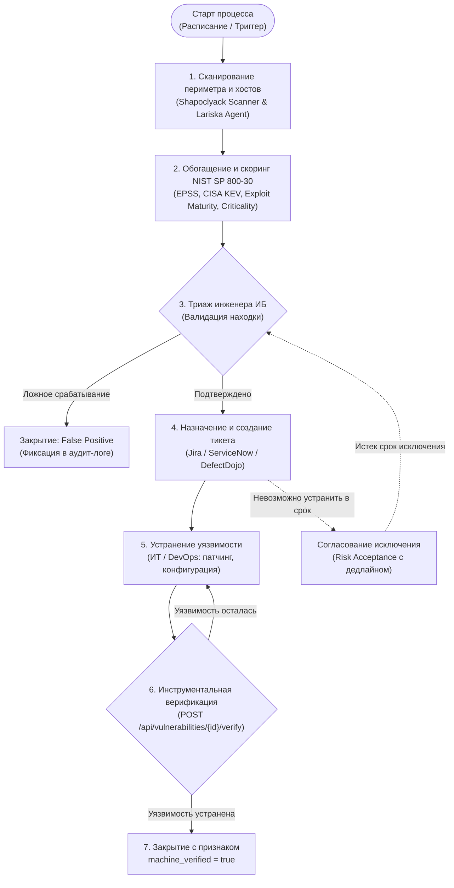
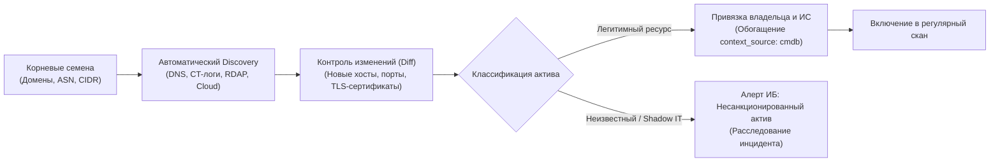
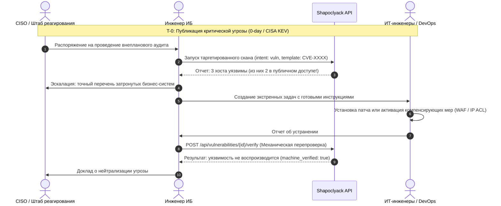

# Регламент операционных процессов информационной безопасности

Данный документ содержит формализованное описание четырех ключевых процессов ИБ, реализуемых с использованием платформы **Shapoclyack**:
1. **Процесс управления уязвимостями (Vulnerability Management Lifecycle)**;
2. **Процесс непрерывного управления поверхностью атаки (EASM)**;
3. **Процесс экстренного реагирования на 0-day и активные угрозы (Emergency Response)**;
4. **Регламент взаимодействия служб ИБ и ИТ/DevOps (Remediation Workflow)**.

---

## 🔄 Процесс 1: Управление уязвимостями (Vulnerability Management)

Цель процесса — систематическое выявление, приоритизация, устранение и контроль закрытия уязвимостей в инфраструктуре компании с минимизацией операционных издержек.

### 1.1. Фазы жизненного цикла
1. **Обнаружение (Discovery):** регулярное сканирование портов, баннеров, скриптов NSE, шаблонов Nuclei и сбор инвентаря ПО агентом Lariska.
2. **Обогащение (Enrichment):** платформа сопоставляет находки с NVD, EPSS, CISA KEV, PoC-репозиториями и базой USN/Debian.
3. **Триаж (Triage):** первичный разбор инженером ИБ находок в статусе `OPEN`. Перевод в `ACKNOWLEDGED` или `PLANNED`.
4. **Устранение (Remediation):** перевод в статус `FIXING`, автоматическое создание задачи в таск-трекере ответственной команды.
5. **Верификация (Verification):** перевод в статус `VERIFYING` и автоматический запуск таргетированного пересканирования.
6. **Закрытие (Closure):** перевод в `CLOSED` только при получении отрицательного результата проверки (`closure_reason = verified_remediated`).

### 1.2. Матрица SLA по устранению уязвимостей
Сроки устранения отсчитываются с момента первой регистрации находки платформой (`first_seen_at`) и зависят от контекстного уровня риска NIST:

| Уровень риска NIST | Нормативный срок (SLA) | Срок взятия в триаж | Предупреждение о просрочке |
|---|---|---|---|
| **Critical** | **7 календарных дней** | 4 часа | За 48 часов до дедлайна |
| **High** | **14 календарных дней** | 24 часа | За 72 часа до дедлайна |
| **Moderate (Medium)** | **30 календарных дней** | 3 рабочих дня | За 5 дней до дедлайна |
| **Low / Info** | **90 календарных дней** | 5 рабочих дней | За 10 дней до дедлайна |

*При несоблюдении SLA уязвимость переходит в состояние `breached`, что фиксируется в отчетах для CISO.*

---

## 🌐 Процесс 2: Непрерывное управление поверхностью атаки (EASM)

Цель процесса — поддержание 100% видимости всех цифровых активов компании, исключение появления «теневых» серверов (Shadow IT) и предотвращение захвата поддоменов.

### 2.1. Регламентные действия
1. **Еженедельный запуск модуля `org_profile`:**
   - Мониторинг появления новых связанных доменов (`related_domains`);
   - Аудит DNS-записей на наличие Dangling CNAME (висячих ссылок на отключенные S3/облака);
   - Проверка срока действия TLS-сертификатов (уведомление при остатке < 21 дня);
   - Контроль записей SPF, DKIM и строгой политики DMARC (`p=reject`).
2. **Обработка новых обнаруженных хостов:**
   - Любой новый IP/FQDN автоматически помечается как `unowned_asset`;
   - Инженер ИБ направляет запрос в ИТ-подразделение для идентификации системы;
   - Хосту назначаются атрибуты `owner_email`, `business_service`, `environment`, `asset_criticality`.

---

## 🚨 Процесс 3: Экстренное реагирование на 0-day и KEV (Emergency Response)

Процесс активируется при публичном раскрытии критической уязвимости «нулевого дня» (0-day) или включении уязвимости в каталог активных атак CISA KEV.

### 3.1. Нормативы времени реагирования (SLA 0-day)
* **T+0 ... T+2 часа:** идентификация сигнатуры угрозы (Nuclei-шаблон / CVE ID).
* **T+2 ... T+6 часов:** запуск экспресс-сканирования всей внешней и внутренней инфраструктуры (`intent: vuln`). Оценка достижимости сервиса.
* **T+6 ... T+12 часов:** внедрение компенсирующих мер (блокировка правила на WAF, ограничение доступа сетевыми экранами, изоляция сервиса).
* **T+12 ... T+48 часов:** установка официального вендорного патча, запуск повторного верификационного скана и закрытие инцидента.

---

## 🤝 Процесс 4: Взаимодействие ИБ и ИТ/DevOps (Remediation Workflow)

Для обеспечения конструктивного взаимодействия и исключения конфликтов между ИБ и разработкой регламентируются строгие правила обмена задачами.

### 4.1. Формат задачи на устранение уязвимости
Любая задача, передаваемая из Shapoclyack в Jira/ServiceNow, обязана содержать исчерпывающий технический контекст:
1. **Точный адрес и компонент:** IP, FQDN, сетевой порт, название сервиса или имя установленного Linux-пакета.
2. **Доказательство (Evidence):** точный вывод сетевого сканера (HTTP-запрос, ответ с уязвимым фрагментом, скриншот).
3. **Рекомендация по устранению:** 
   - Ссылка на бюллетень безопасности;
   - Готовая консольная команда (для пакетов ОС, например: `apt-get install --only-upgrade <package>`);
   - Либо параметры конфигурационного файла.
4. **Контрольный срок (SLA):** точная дата дедлайна.

### 4.2. Правила закрытия задач и обратной связи
* **Двусторонняя синхронизация работает в обе стороны без ручных действий**
  ([#347](https://github.com/onixus/Shapoclyack/issues/347)): смена статуса
  находки отражается в трекере сразу, а статус тикета вычитывается фоновым
  воркером с частотой, заданной на подписке (по умолчанию 15 минут). Кнопка
  **Sync** на карточке находки делает то же самое немедленно.
* **Закрытие тикета закрывает находку, но не как проверенную.** Перевод задачи
  в «Решено» на стороне ИТ переводит находку в `CLOSED` с
  `closure_reason = ticket_resolved` и `machine_verified = false`. Трекер может
  утверждать, что работа выполнена, но не может утверждать, что уязвимости
  больше нет — это говорит только пересканирование. Поэтому метрики принятия
  (`/adoption`) считают такие закрытия отдельно от `verified_remediated`.
* Регламент ИБ, а не поведение платформы: если процесс требует, чтобы закрытие
  подтверждалось сканом, инженер ИБ инициирует перепроверку через
  `POST /verify` — она переводит находку в `VERIFYING` и закрывает её как
  `verified_remediated`, только если целевой скан больше не видит уязвимость.
  Ни один трекер не может выставить `VERIFYING` сам.
* Если перепроверка не подтвердила исправление, находка возвращается в `FIXING`
  с событием `verification_failed`. Обратный транзишн в трекере при этом **не**
  выполняется: исход скана записывается путём ингеста результатов, а не
  операторским переходом, и наружу он пока не отражается — ответственная
  команда узнаёт об этом из карточки находки или из вебхука.
* Если тикет переоткрыли на стороне ИТ, находка тоже переоткрывается: SLA
  считается заново от момента переоткрытия, а вердикт «ложное срабатывание», если
  он был, снимается.

### 4.3. Регламент согласования исключений (Risk Acceptance)
Если патч не может быть установлен в установленный SLA срок:
1. Владелец бизнес-системы оформляет заявку на принятие риска через карточку в Shapoclyack.
2. Обязательные условия согласования:
   - Наличие компенсирующей меры (WAF, VPN, сегментация, мониторинг SIEM);
   - Указание конечного срока действия (не более 90 дней);
   - Согласование с CISO для уязвимостей уровня Critical/High.
3. По истечении срока исключение автоматически аннулируется системой, возобновляя начисление штрафных баллов за просрочку.
