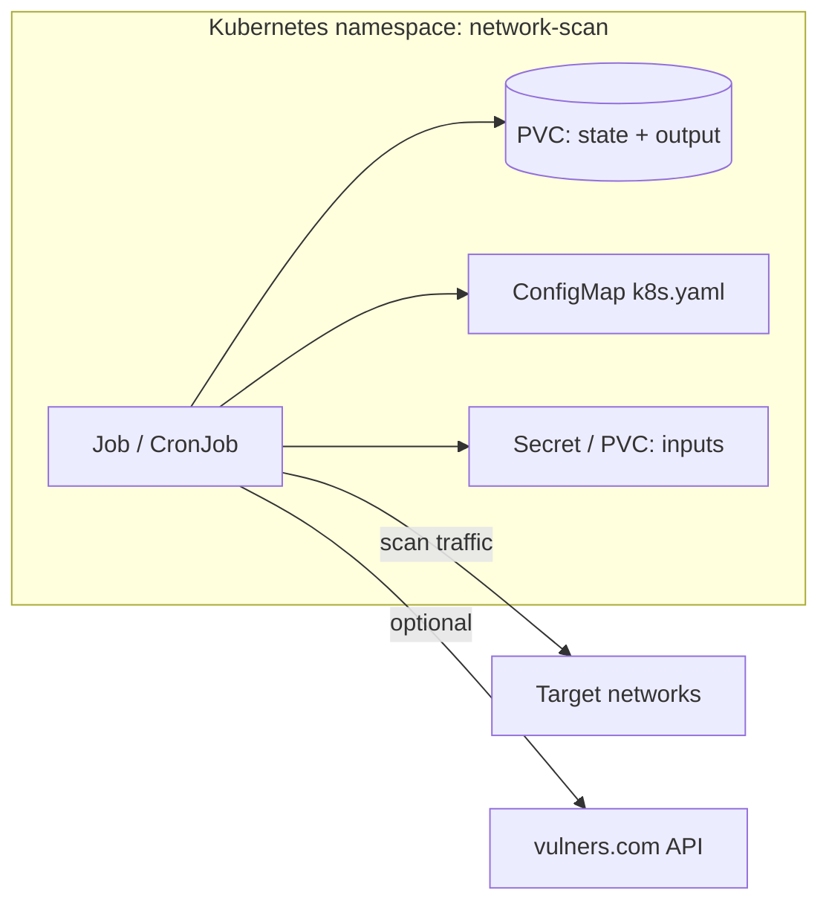

# План: Network Scan CLI в Kubernetes

**Статус:** черновик / к согласованию  
**Дата:** 2026-06-26  
**Исходный проект:** [onixus/Octo-man](https://github.com/onixus/Octo-man) (локально: `/Users/onixus/Git/network-scan-cli`)  
**Образ:** `ghcr.io/onixus/octo-man`

---

## Контекст

Network Scan CLI — контейнеризированный batch-пайплайн сетевого сканирования:

- вход: CIDR / IP / FQDN;
- этапы: `resolve → discovery → fast ports → Nmap NSE` (версии, ОС, CVE);
- выход: JSON / JSONL / CSV + Markdown/HTML;
- stateful: checkpoint, `per_run_output`, `--resume`.

Сейчас эталон запуска — **Docker Compose** (`docker-compose.yml`): `NET_RAW`/`NET_ADMIN`, 8 CPU / 8 GiB, volumes для `inputs`, `config`, `output`, `state`.  
В Octo-man **нет** готовых k8s-манифестов — их нужно добавить по этому плану.

---

## Цель

Выполнить требование «сканер работает в Kubernetes» так, чтобы:

1. Сохранились SYN/ICMP discovery и OS detection (`naabu`, `nmap -O`).
2. Работали батчинг и `--resume` после падения pod / eviction.
3. Артефакты и отчёты можно было забрать из кластера.
4. Было проверяемое приёмочное тестирование (kind/k3s в CI).

---

## Архитектура (рекомендация)



**Модель workload:** `Job` (разовый скан) и `CronJob` (по расписанию).  
**Не использовать** `Deployment` — сканер не long-running сервис.

**Изоляция:**

- отдельный namespace `network-scan`;
- dedicated node pool с taint `scanner=true:NoSchedule`;
- RBAC: создавать Job/CronJob только у CI/CD или scan-operator SA.

---

## Выбор сетевого паттерна

### Вариант A (рекомендуется для внешних / корпоративных сетей)

| Параметр | Значение |
|----------|----------|
| Node pool | label `workload=scanner`, taint `scanner=true` |
| Pod | `hostNetwork: true` |
| DNS | `dnsPolicy: ClusterFirstWithHostNet` |
| Capabilities | `NET_RAW`, `NET_ADMIN` |
| privileged | не требуется, если file capabilities в образе работают |

Плюсы: предсказуемый source IP (нода), маршруты к целевым подсетям как у выделенного сканер-хоста.  
Минусы: повышенный blast radius — только на изолированных нодах.

### Вариант B (скан внутри кластера / overlay)

- Обычная pod-сеть + `capabilities.add: [NET_RAW, NET_ADMIN]`.
- Подходит для целей в той же CNI-сети; для «внешних» CIDR часто не работает без доп. маршрутизации.

**Решение для MVP:** зафиксировать в требованиях целевые сети и выбрать A или B до написания манифестов.

---

## Структура артефактов в Octo-man

Добавить в исходный репозиторий:

```
k8s/
  base/
    namespace.yaml
    serviceaccount.yaml
    pvc.yaml
    configmap.yaml          # пример; production — через overlay
    job.yaml
    cronjob.yaml
  overlays/
    dev/                    # меньше ресурсов, vuln-offline
    prod/                   # hostNetwork, nodeSelector, taints
scanner/config/k8s.yaml     # консервативный профиль для кластера
```

Документация: раздел в `README.md` / `README.ru.md` + ссылка на этот план в Shapoclyack.

---

## Job (эталон)

```yaml
apiVersion: batch/v1
kind: Job
metadata:
  name: network-scan
  namespace: network-scan
spec:
  backoffLimit: 0
  ttlSecondsAfterFinished: 86400
  activeDeadlineSeconds: 14400   # подогнать под объём скана
  template:
    spec:
      restartPolicy: Never
      serviceAccountName: scanner
      nodeSelector:
        workload: scanner
      tolerations:
        - key: scanner
          operator: Equal
          value: "true"
          effect: NoSchedule
      hostNetwork: true              # вариант A
      dnsPolicy: ClusterFirstWithHostNet
      securityContext:
        runAsNonRoot: true
        runAsUser: 1000
        fsGroup: 1000
      containers:
        - name: scanner
          image: ghcr.io/onixus/octo-man:latest
          args:
            - --config
            - /app/scanner/config/k8s.yaml
            - --mode
            - balanced
          resources:
            requests:
              cpu: "4"
              memory: 4Gi
            limits:
              cpu: "8"
              memory: 8Gi
          securityContext:
            capabilities:
              add: ["NET_RAW", "NET_ADMIN"]
            allowPrivilegeEscalation: true
          volumeMounts:
            - name: data
              mountPath: /app/scanner/output
              subPath: output
            - name: data
              mountPath: /app/scanner/state
              subPath: state
            - name: inputs
              mountPath: /app/scanner/inputs
            - name: config
              mountPath: /app/scanner/config
      volumes:
        - name: data
          persistentVolumeClaim:
            claimName: scanner-data
        - name: inputs
          secret:
            secretName: scan-targets
        - name: config
          configMap:
            name: scanner-config
```

**Resume после сбоя:** новый Job с `--resume` и тем же `--run-id` (или без него, если на PVC есть `scanner/state/latest_run.json`).

---

## Хранение

| Путь в контейнере | Назначение | K8s |
|-------------------|------------|-----|
| `scanner/state/` | checkpoint, latest_run | PVC (обязательно) |
| `scanner/output/` | отчёты, JSON, логи | PVC + sync в S3 после Job |
| `scanner/inputs/` | ranges, domains, ports | Secret или PVC (большие файлы — не ConfigMap) |
| `scanner/config/` | YAML | ConfigMap |

**PVC:**

- `ReadWriteOnce` — pod привязан к ноде; resume на другой ноде без тома не поднимется.
- `ReadWriteMany` (NFS, EFS, CephFS) — если нужен resume после смены ноды.

---

## Конфиг `scanner/config/k8s.yaml`

На базе `default.yaml`, но консервативнее для shared-инфраструктуры:

```yaml
runtime:
  mode: balanced
  discover_concurrency: 2
  ports_concurrency: 2
  nse_concurrency: 2
  per_run_output: true
  timeout_seconds: 7200

profiles:
  balanced:
    discover_rate: 2000
    port_rate: 2000
    nse_max_rate: 1500
```

- Профиль `vuln` (vulners API) — только при разрешённом egress.
- В locked-down кластерах: `vuln-offline` / профиль `nse_profiles.vuln-offline`.

---

## Риски и митигация

| Риск | Митигация |
|------|-----------|
| PSA / managed K8s запрещают NET_RAW, hostNetwork | dedicated pool + exemption; не Autopilot/Fargate |
| Нет маршрута к целевым CIDR из pod | вариант A (hostNetwork на scanner-нодах) |
| OOM / CPU throttle ломает тайминги | requests/limits по профилю; снизить concurrency в k8s.yaml |
| Потеря state при eviction | PVC + `--resume`; RWX при multi-node |
| Высокий PPS → алерты IDS / деградация сети | `safe`/`balanced` по умолчанию; согласовать rate с сетевиками |
| Логи только в файле на PVC | дублировать в stdout (доработка в Octo-man) |
| GHCR private | `imagePullSecrets` в namespace |

---

## Безопасность

1. Namespace без посторонних workload'ов.
2. Минимальный RBAC на SA scanner (без лишних cluster-admin).
3. NetworkPolicy: egress DNS + целевые CIDR + опционально vulners.com.
4. Сканировать только сети с письменным разрешением.
5. Не запускать scanner Job в общем production pool без taints.

---

## Наблюдаемость

- [ ] Логи в stdout для `kubectl logs` / Loki
- [ ] Annotations на Job: `run_id`, `mode`, размер targets
- [ ] Алерты по exit code (0–4, 130 — уже в коде)
- [ ] Post-job sync артефактов: sidecar или отдельный Job → object storage

---

## CI / приёмка

Добавить в Octo-man workflow `k8s-e2e.yml`:

1. kind или k3s в GitHub Actions.
2. nginx-мишени (аналог `tests/e2e/run.sh`).
3. Job → проверка: живой хост, порт 80, артефакты на PVC, exit 0.
4. Тест resume: kill pod → Job с `--resume` → успех.

Критерий готовности: **зелёный k8s-e2e на PR** + документированный runbook.

---

## Чеклист согласования со стейкхолдерами

- [ ] Какие CIDR/FQDN сканируем (внутри кластера / DMZ / вся сеть)?
- [ ] Допустимы ли `hostNetwork` и выделенные ноды?
- [ ] Платформа: GKE / EKS / AKS / k3s? (Autopilot = блокер)
- [ ] vulners (egress) или только offline CVE?
- [ ] RWO vs RWX для PVC?
- [ ] Лимиты PPS и режим по умолчанию в prod?
- [ ] Кто забирает отчёты и retention PVC?

---

## Этапы внедрения (roadmap)

| # | Этап | Репозиторий | Результат |
|---|------|-------------|-----------|
| 1 | Согласовать сетевой паттерн (A/B) и платформу | Shapoclyack | зафиксированные требования |
| 2 | `scanner/config/k8s.yaml` | Octo-man | конфиг для кластера |
| 3 | `k8s/base` + overlays | Octo-man | манифесты |
| 4 | kind e2e в CI | Octo-man | автоматическая приёмка |
| 5 | Runbook (запуск / resume / артефакты) | Octo-man README | эксплуатация |
| 6 | Пилот на dev-кластере | инфра | smoke на реальном /24 |
| 7 | Prod CronJob + мониторинг | инфра | регулярные сканы |

---

## Операционные сценарии

| Сценарий | Действие |
|----------|----------|
| Разовый скан | `kubectl create -f k8s/job.yaml` или Helm с параметрами |
| По расписанию | CronJob |
| Прерванный скан | Job с `--resume [--run-id <id>]` |
| Большой `/16` | один Job; батчинг уже в коде |
| Артефакты | sync PVC → S3 после успешного Job |

---

## Ссылки

- Исходники: https://github.com/onixus/Octo-man
- Пометки для AI-агента: [AGENTS.md](../AGENTS.md)
- Docker-эталон: `docker-compose.yml` в Octo-man
- Образ: `ghcr.io/onixus/octo-man`
